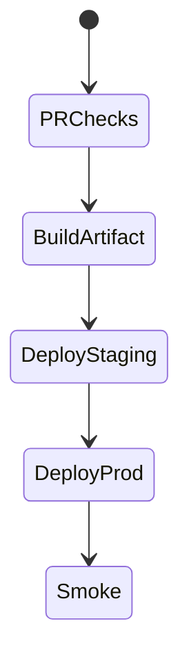
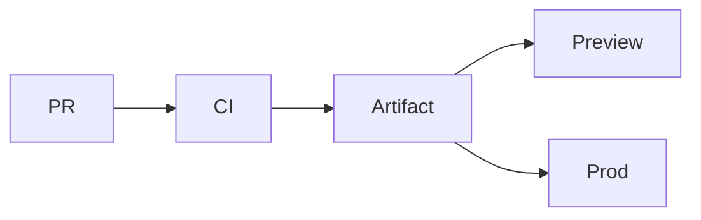

# CI/CD

<TopicMeta />

<Prerequisites />

::: tip Published
This page meets the handbook **published** bar: deep explanation, ≥10 common mistakes, and official references. Further engine-level errata welcome via PR.
:::

## Introduction

**CI/CD** automates build/test on every change (**CI**) and promotes artifacts to environments (**CD**). For frontends: install → lint/typecheck/test → build → deploy previews → deploy prod with approvals/rollbacks.

## Why does it exist?

Manual FTP deploys don’t scale and aren’t auditable. Pipelines encode quality gates.

## Historical Background

From Jenkins rooms to GitHub Actions/GitLab CI; preview deployments changed frontend workflows.

## Mental Model

Pipeline as product: fast feedback on PR, protected prod, reproducible artifacts, secrets least-privilege.

## Internal Workflow

1. PR runs verify.
2. Merge builds artifact.
3. Auto deploy to staging/preview.
4. Prod deploy gated.
5. Smoke test + rollback plan.

## Lifecycle



## Browser Perspective

Smoke E2E after deploy.

## JavaScript Engine Perspective

Not applicable.

## React Perspective

Not applicable.

## Next.js Perspective

Build cache matters for Next.

## Server Perspective

Not applicable.

## Network Perspective

Deploy tokens and OIDC to clouds.

## Memory Perspective

Not applicable.

## Performance

Cache pnpm/store and build outputs; parallelize jobs.

## Production Example

Required checks: typecheck, unit, e2e-smoke; staging auto; prod needs approval + canary.

## Code Examples

```yaml
# conceptual stages
stages: [install, verify, build, deploy]
```

## Diagrams



## Common Mistakes

1. Deploying without build on CI
2. Shared mutable credentials
3. No artifact immutability
4. Flaky tests ignored
5. Prod sync from laptop
6. Missing a production edge case for 19-deployment.ci-cd (#1)
7. Missing a production edge case for 19-deployment.ci-cd (#2)
8. Missing a production edge case for 19-deployment.ci-cd (#3)
9. Missing a production edge case for 19-deployment.ci-cd (#4)
10. Missing a production edge case for 19-deployment.ci-cd (#5)


## Best Practices

- Immutable artifacts
- OIDC over long-lived keys
- Preview envs for PRs

## Anti-patterns

- Skipping checks with admin force
- One giant serial pipeline of 60 minutes without cache

## Comparison

| CI | CD |
| --- | --- |
| Verify change | Release change |

## Interview Questions

### Easy

**Q:** What is CI?

**A:** Automatically building and testing every change to catch integration failures early.

### Medium

**Q:** Why deploy the CI artifact rather than rebuilding on the server?

**A:** So what you tested is exactly what you ship—reproducible immutable artifacts.

### Hard

**Q:** Design CD for a frontend monorepo.

**A:** Affected-only builds, per-app artifacts, preview deploys, prod promotion with approvals, and shared caches.

## Summary

- CI verifies; CD releases
- Immutable artifacts
- Gate production

## References

- [GitHub Actions docs](https://docs.github.com/en/actions)
- [Twelve-Factor — Build Release Run](https://12factor.net/build-release-run/)

<RelatedTopics />


Prev: [`19-deployment.cdn-deployment`](/19-deployment/cdn-deployment/) · Next: [`19-deployment.github-actions`](/19-deployment/github-actions/)
