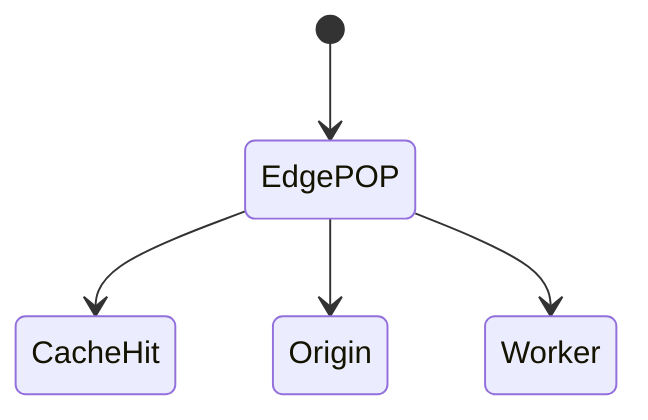
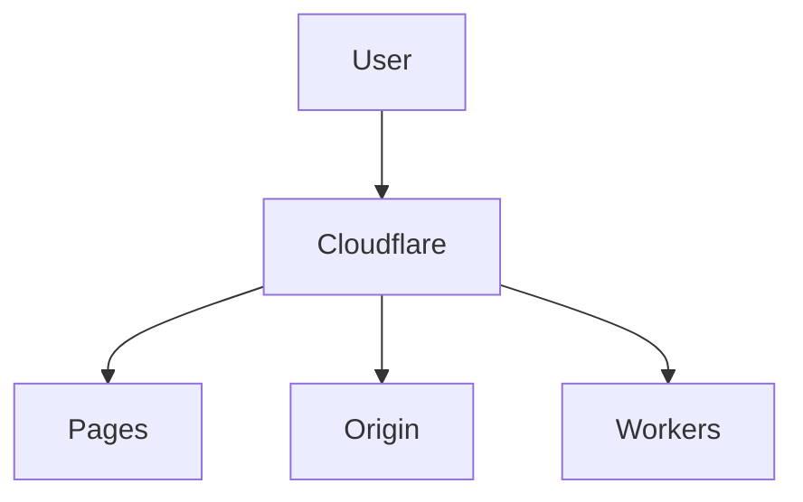

# Cloudflare

<TopicMeta />

<Prerequisites />

::: tip Published
This page meets the handbook **published** bar: deep explanation, ≥10 common mistakes, and official references. Further engine-level errata welcome via PR.
:::

## Introduction

**Cloudflare** provides DNS, CDN, WAF, DDoS protection, and **Workers/Pages** for edge compute and git deploys. Frontends use it for caching, TLS, security headers, and sometimes SSR at the edge.

## Why does it exist?

Global edge + security features with strong DX (Pages) and programmable Workers.

## Historical Background

From CDN/WAF to developer platform (Workers, Pages, R2).

## Mental Model

Traffic hits Cloudflare POP first. Cache rules decide hit/miss. Workers can rewrite/respond at edge. Pages binds git to deployments.

## Internal Workflow

1. Point DNS.
2. Configure cache rules for assets.
3. Pages/Workers deploy.
4. WAF/bot rules as needed.
5. Observe analytics/RUM.

## Lifecycle



## Browser Perspective

Users hit edge; cookies/SameSite still apply.

## JavaScript Engine Perspective

Not applicable.

## React Perspective

Not applicable.

## Next.js Perspective

Check adapter support for Pages/Workers.

## Server Perspective

Not applicable.

## Network Perspective

TLS and HTTP/3 at edge.

## Memory Perspective

Not applicable.

## Performance

Cache everything safe; Smart Tiered Cache; avoid bypassing cache unintentionally.

## Production Example

Pages project for marketing; Workers for auth-aware edge routing; cache HTML carefully.

## Code Examples

```js
export default {
  async fetch(request, env) {
    const url = new URL(request.url)
    if (url.pathname.startsWith('/assets/')) {
      return env.ASSETS.fetch(request)
    }
    return fetch(request)
  },
}
```

## Diagrams



## Common Mistakes

1. Caching personalized HTML globally
2. Orange-cloud proxy mistakes for certain APIs
3. Workers CPU limits ignored
4. Turning off security features to debug forever
5. Mixed cache settings across environments
6. Missing a production edge case for 19-deployment.cloudflare (#1)
7. Missing a production edge case for 19-deployment.cloudflare (#2)
8. Missing a production edge case for 19-deployment.cloudflare (#3)
9. Missing a production edge case for 19-deployment.cloudflare (#4)
10. Missing a production edge case for 19-deployment.cloudflare (#5)


## Best Practices

- Cache rules by path
- Pages for git frontends
- WAF in front of origins

## Anti-patterns

- Development Mode left on
- Bypassing cache with random query strings

## Comparison

| Pages | Workers |
| --- | --- |
| Git static/SSR adapters | Programmable edge |

## Interview Questions

### Easy

**Q:** What does Cloudflare commonly provide frontends?

**A:** CDN caching, TLS, DNS, security (WAF), and optional edge compute/deploy (Pages/Workers).

### Medium

**Q:** Risk of caching HTML at the edge?

**A:** Personalized or auth-specific HTML can leak across users if cached shared—vary/bypass appropriately.

### Hard

**Q:** Design cache rules for SPA + API on Cloudflare.

**A:** Long-cache fingerprinted assets; bypass or short-cache HTML; never cache authenticated API responses at shared edge without care.

## Summary

- Cloudflare = edge CDN + security + compute
- Cache rules are critical
- Pages/Workers for deploys

## References

- [Cloudflare Docs](https://developers.cloudflare.com/)
- [Cloudflare Pages](https://developers.cloudflare.com/pages/)
- [Cloudflare Workers](https://developers.cloudflare.com/workers/)

<RelatedTopics />


Prev: [`19-deployment.aws-frontend`](/19-deployment/aws-frontend/) · Next: [`19-deployment.environment-config`](/19-deployment/environment-config/)
