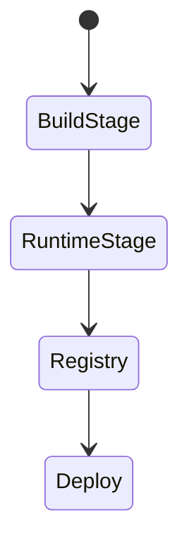
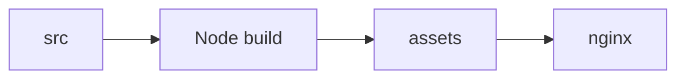

# Docker

<TopicMeta />

<Prerequisites />

::: tip Published
This page meets the handbook **published** bar: deep explanation, ≥10 common mistakes, and official references. Further engine-level errata welcome via PR.
:::

## Introduction

**Docker** packages an app and its runtime into an image. For frontends, common patterns are: multi-stage builds (Node build → nginx/Caddy static serve) or containerizing a Next.js Node server. Images give reproducible artifacts across environments.

## Why does it exist?

“Works on my machine” dies when CI builds the same Dockerfile ops runs. Containers also isolate runtime versions.

## Historical Background

Containers became standard for services; frontends adopted them for self-hosted and Kubernetes setups even when many use Vercel/Netlify.

## Mental Model

Build stage compiles assets; runtime stage is minimal (nginx or node). Layers cache dependencies. Don’t ship secrets or devDependencies into final images.

## Internal Workflow

1. Multi-stage Dockerfile.
2. Build in CI → push registry.
3. Run with env config at runtime (not bake secrets).
4. Scan images.
5. Tag by git SHA.

## Lifecycle



## Browser Perspective

Not applicable.

## JavaScript Engine Perspective

Not applicable.

## React Perspective

Not applicable.

## Next.js Perspective

Standalone output helps slim Node images.

## Server Perspective

Process model differs for static nginx vs node server.

## Network Perspective

Containers still sit behind TLS terminators.

## Memory Perspective

Not applicable.

## Performance

Smaller images = faster pulls; use alpine/distroless carefully with libc needs.

## Production Example

CI builds `web:sha`, scans with Trivy, deploys to K8s; nginx serves `/` with SPA fallback.

## Code Examples

```dockerfile
FROM node:22-alpine AS build
WORKDIR /app
COPY package.json pnpm-lock.yaml ./
RUN corepack enable && pnpm i --frozen-lockfile
COPY . .
RUN pnpm build

FROM nginx:1.27-alpine
COPY --from=build /app/dist /usr/share/nginx/html
COPY nginx.conf /etc/nginx/conf.d/default.conf
```

## Diagrams



## Common Mistakes

1. Running as root unnecessarily
2. Baking .env secrets into images
3. No multi-stage (shipping node_modules to prod nginx)
4. Latest tags only
5. Huge context (copying node_modules into build)
6. Missing a production edge case for 19-deployment.docker (#1)
7. Missing a production edge case for 19-deployment.docker (#2)
8. Missing a production edge case for 19-deployment.docker (#3)
9. Missing a production edge case for 19-deployment.docker (#4)
10. Missing a production edge case for 19-deployment.docker (#5)


## Best Practices

- Multi-stage builds
- Tag with git SHA
- Scan images in CI

## Anti-patterns

- docker attach debugging in prod as process
- Mutable latest in production deploys

## Comparison

| Static nginx image | Node server image |
| --- | --- |
| SPA/static | SSR/Next standalone |

## Interview Questions

### Easy

**Q:** Why multi-stage Docker builds for frontends?

**A:** Compile with Node tooling then copy only artifacts into a tiny runtime image without build tools or secrets.

### Medium

**Q:** How should frontend config reach the container?

**A:** Runtime env or config endpoint—not secrets baked at build—unless they are public compile-time values.

### Hard

**Q:** Dockerize Next.js for Kubernetes.

**A:** Use output standalone, non-root user, healthchecks, read-only FS where possible, SHA tags, and externalize secrets.

## Summary

- Docker makes deploy artifacts reproducible
- Multi-stage for frontend
- SHA tags + scans

## References

- [Docker docs](https://docs.docker.com/)
- [Next.js — Standalone output](https://nextjs.org/docs/app/api-reference/config/next-config-js/output)

<RelatedTopics />


Next: [`19-deployment.nginx`](/19-deployment/nginx/)
