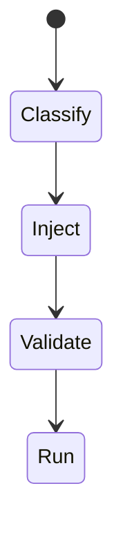
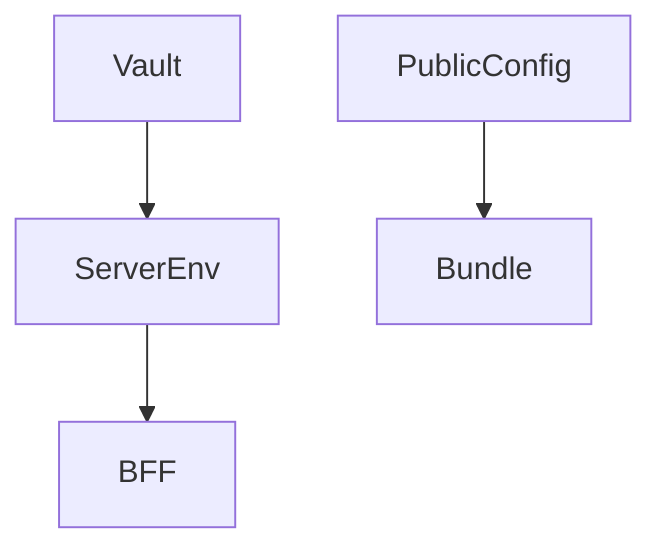

# Environment Config

<TopicMeta />

<Prerequisites />

::: tip Published
This page meets the handbook **published** bar: deep explanation, ≥10 common mistakes, and official references. Further engine-level errata welcome via PR.
:::

## Introduction

**Environment config** separates values for local/staging/prod: API base URLs, feature flags, public keys. Secrets stay server-side. Client config must be assumed public.

## Why does it exist?

Hard-coded prod URLs and leaked secrets are classic deploy bugs. Explicit env strategy prevents them.

## Historical Background

Twelve-Factor config via env vars; frontend bundlers added `VITE_`/`NEXT_PUBLIC_` conventions—often misunderstood.

## Mental Model

Build-time public config vs runtime server config. Prefer runtime injection for ops flexibility when possible (especially Docker).

## Internal Workflow

1. Classify public vs secret.
2. Define per-env files/vault.
3. Inject at build or runtime intentionally.
4. Validate required vars at startup.
5. Never commit secrets.

## Lifecycle



## Browser Perspective

Not applicable.

## JavaScript Engine Perspective

Not applicable.

## React Perspective

Not applicable.

## Next.js Perspective

Server env vs NEXT_PUBLIC_.

## Server Perspective

Not applicable.

## Network Perspective

Not applicable.

## Memory Perspective

Not applicable.

## Performance

Rebuilds for bake-time config can slow CD—runtime config helps.

## Production Example

Server reads `API_URL` at runtime; client gets `/config.json` with public values only generated at deploy.

## Code Examples

```ts
const required = ['API_URL'] as const
for (const k of required) {
  if (!process.env[k]) throw new Error(`Missing ${k}`)
}
```

## Diagrams



## Common Mistakes

1. Secrets in client env prefixes
2. Committing .env.production.local with tokens
3. Same API keys across envs
4. No validation of required config
5. Manual dashboard edits undocumented
6. Missing a production edge case for 19-deployment.environment-config (#1)
7. Missing a production edge case for 19-deployment.environment-config (#2)
8. Missing a production edge case for 19-deployment.environment-config (#3)
9. Missing a production edge case for 19-deployment.environment-config (#4)
10. Missing a production edge case for 19-deployment.environment-config (#5)


## Best Practices

- Classify keys
- Fail fast on missing config
- Document every var

## Anti-patterns

- Emailing env files
- Prod values in unit test fixtures

## Comparison

| Build-time | Runtime |
| --- | --- |
| Baked into bundle | Flexible ops |

## Interview Questions

### Easy

**Q:** Are Vite env variables secret?

**A:** Those exposed to the client are public. Only server-side env stays private.

### Medium

**Q:** Build-time vs runtime config trade-off?

**A:** Build-time is simple but needs rebuilds; runtime allows one artifact across envs with injection.

### Hard

**Q:** Config strategy for Dockerized SPA + BFF.

**A:** One frontend artifact; BFF reads secrets at runtime; SPA loads public config from BFF or templated window.__CONFIG__ at serve time.

## Summary

- Public vs secret classification
- Validate config early
- Prefer runtime for server secrets

## References

- [12-Factor Config](https://12factor.net/config/)
- [Vite env](https://vitejs.dev/guide/env-and-mode.html)
- [Next.js env](https://nextjs.org/docs/app/building-your-application/configuring/environment-variables)

<RelatedTopics />


Prev: [`19-deployment.cloudflare`](/19-deployment/cloudflare/) · Next: [`19-deployment.preview-deployments`](/19-deployment/preview-deployments/)
