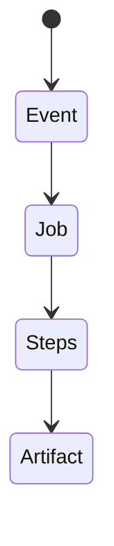
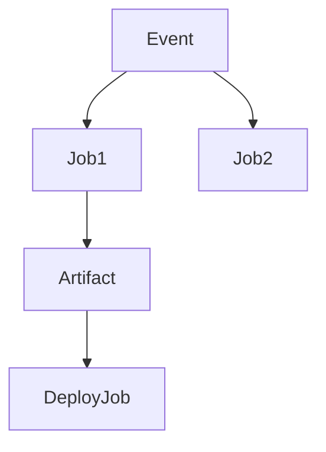

# GitHub Actions

<TopicMeta />

<Prerequisites />

::: tip Published
This page meets the handbook **published** bar: deep explanation, ≥10 common mistakes, and official references. Further engine-level errata welcome via PR.
:::

## Introduction

**GitHub Actions** defines workflows in YAML under `.github/workflows`. Jobs run on runners (GitHub-hosted or self-hosted) with actions composition. Frontends use it for verify, build, preview, and deploy.

## Why does it exist?

Tight GitHub integration, matrix builds, and marketplace actions accelerate pipelines—while requiring security hygiene (pinning, secrets).

## Historical Background

GA launched to replace many external CI setups for GitHub-centric teams.

## Mental Model

Workflow → jobs → steps. Events trigger runs. Artifacts/caches persist outputs. Permissions should be least privilege.

## Internal Workflow

1. Trigger verify on pull_request events.
2. Cache pnpm.
3. Upload build artifact.
4. Deploy with OIDC.
5. Pin actions by SHA.

## Lifecycle



## Browser Perspective

Not applicable.

## JavaScript Engine Perspective

Not applicable.

## React Perspective

Not applicable.

## Next.js Perspective

Build caching critical.

## Server Perspective

Not applicable.

## Network Perspective

OIDC to cloud avoids static keys.

## Memory Perspective

Not applicable.

## Performance

Concurrency groups; cache node_modules/.pnpm-store; matrix sparingly.

## Production Example

verify.yml on PR; deploy.yml on main with environment protection rules.

## Code Examples

```yaml
name: verify
on: pull_request
jobs:
  test:
    runs-on: ubuntu-latest
    steps:
      - uses: actions/checkout@v4
      - uses: pnpm/action-setup@v4
      - run: pnpm i --frozen-lockfile
      - run: pnpm verify
```

## Diagrams



## Common Mistakes

1. Actions pinned to mutable tags only
2. pull_request_target misuse with secrets
3. Overbroad GITHUB_TOKEN permissions
4. No concurrency cancel-in-progress
5. Committing secrets to logs
6. Missing a production edge case for 19-deployment.github-actions (#1)
7. Missing a production edge case for 19-deployment.github-actions (#2)
8. Missing a production edge case for 19-deployment.github-actions (#3)
9. Missing a production edge case for 19-deployment.github-actions (#4)
10. Missing a production edge case for 19-deployment.github-actions (#5)


## Best Practices

- Pin actions by SHA
- Least privilege permissions
- OIDC deploys

## Anti-patterns

- curl | bash in workflows
- Shared admin PAT forever

## Comparison

| GitHub Actions | External CI |
| --- | --- |
| Native PR UX | Sometimes more flexible runners |

## Interview Questions

### Easy

**Q:** Where do Actions workflows live?

**A:** In `.github/workflows/*.yml` in the repository.

### Medium

**Q:** Why pin actions by commit SHA?

**A:** Tags can move; SHAs reduce supply-chain risk of a compromised action version.

### Hard

**Q:** How do you safely CI fork PRs?

**A:** Don’t expose secrets to untrusted code; use carefully separated workflows; prefer OIDC for trusted branches only.

## Summary

- Actions automate verify/deploy
- Harden permissions and pins
- Cache for speed

## References

- [GitHub Actions documentation](https://docs.github.com/en/actions)
- [Security hardening for GitHub Actions](https://docs.github.com/en/actions/security-guides/security-hardening-for-github-actions)

<RelatedTopics />


Prev: [`19-deployment.ci-cd`](/19-deployment/ci-cd/) · Next: [`19-deployment.vercel`](/19-deployment/vercel/)
