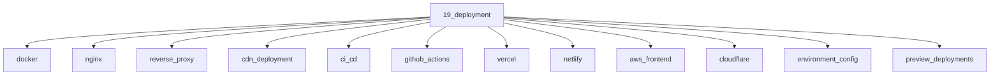

# Deployment

## Scope

Containers, proxies, CDNs, CI/CD, and hosting platforms

## Prerequisites

See the learning paths and each topic's prerequisites in the registry.

## Topics in order

- [Docker](/19-deployment/docker/) — mid, ~40 min
- [Nginx](/19-deployment/nginx/) — mid, ~35 min
- [Reverse Proxy](/19-deployment/reverse-proxy/) — mid, ~30 min
- [CDN Deployment](/19-deployment/cdn-deployment/) — junior, ~25 min
- [CI/CD](/19-deployment/ci-cd/) — junior, ~30 min
- [GitHub Actions](/19-deployment/github-actions/) — junior, ~35 min
- [Vercel](/19-deployment/vercel/) — junior, ~25 min
- [Netlify](/19-deployment/netlify/) — junior, ~20 min
- [AWS for Frontend](/19-deployment/aws-frontend/) — mid, ~40 min
- [Cloudflare](/19-deployment/cloudflare/) — mid, ~35 min
- [Environment Config](/19-deployment/environment-config/) — junior, ~25 min
- [Preview Deployments](/19-deployment/preview-deployments/) — junior, ~20 min
- [Rollback Strategies](/19-deployment/rollback-strategies/) — mid, ~25 min

## Module knowledge graph

## Suggested learning paths

Browse [Learning Paths](/learning-paths/).
