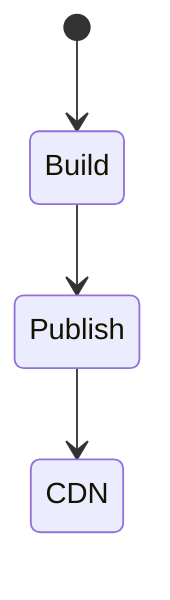

# Netlify

<TopicMeta />

<Prerequisites />

::: tip Published
This page meets the handbook **published** bar: deep explanation, ≥10 common mistakes, and official references. Further engine-level errata welcome via PR.
:::

## Introduction

**Netlify** popularized JAMstack deploys: connect a repo, build static output, publish to CDN, with redirects/headers, forms/functions, and deploy previews. Excellent for static sites and many SPA/SSR adapters.

## Why does it exist?

Simple DX for content sites and frontends with edge CDN and PR previews.

## Historical Background

JAMstack wave; competed with Vercel/Cloudflare Pages; strong in content + static ecosystems.

## Mental Model

Build command → publish directory → CDN. `netlify.toml` configures redirects, headers, plugins.

## Internal Workflow

1. Set build/publish.
2. Configure redirects for SPA.
3. Env vars per context.
4. Deploy previews on PR.
5. Atomic publishes.

## Lifecycle



## Browser Perspective

Redirect rules affect routing.

## JavaScript Engine Perspective

Not applicable.

## React Perspective

Not applicable.

## Next.js Perspective

Use official adapters/runtime guidance when SSR.

## Server Perspective

Not applicable.

## Network Perspective

CDN + HTTPS by default.

## Memory Perspective

Not applicable.

## Performance

Static by default is fast; functions have cold starts.

## Production Example

Docs site on Netlify with branch deploys; `_headers` CSP; SPA fallback redirect.

## Code Examples

```toml
[build]
  command = "pnpm build"
  publish = "dist"

[[redirects]]
  from = "/*"
  to = "/index.html"
  status = 200
```

## Diagrams


## Common Mistakes

1. Wrong publish directory
2. Missing SPA redirect
3. Leaking drafts via open previews
4. Huge functions for what should be static
5. Forgetting headers for security
6. Missing a production edge case for 19-deployment.netlify (#1)
7. Missing a production edge case for 19-deployment.netlify (#2)
8. Missing a production edge case for 19-deployment.netlify (#3)
9. Missing a production edge case for 19-deployment.netlify (#4)
10. Missing a production edge case for 19-deployment.netlify (#5)


## Best Practices

- netlify.toml as source of truth
- Deploy previews
- Security headers

## Anti-patterns

- FTP mental model with manual dashboard edits only
- No lock on production branch

## Comparison

| Netlify | Vercel |
| --- | --- |
| Strong static/JAMstack | Strong Next.js |

## Interview Questions

### Easy

**Q:** What does Netlify publish?

**A:** The build output directory to its CDN, typically static assets (plus functions if used).

### Medium

**Q:** How do you support SPA routing on Netlify?

**A:** A rewrite/redirect of /* to /index.html with 200 so client routes work.

### Hard

**Q:** When choose Netlify vs Cloudflare Pages?

**A:** Ecosystem features, functions model, pricing, and team familiarity—prototype build+preview needs.

## Summary

- Netlify simplifies static/git deploys
- Redirects/headers in config
- Previews for PRs

## References

- [Netlify docs](https://docs.netlify.com/)
- [Netlify redirects](https://docs.netlify.com/routing/redirects/)

<RelatedTopics />


Prev: [`19-deployment.vercel`](/19-deployment/vercel/) · Next: [`19-deployment.aws-frontend`](/19-deployment/aws-frontend/)
