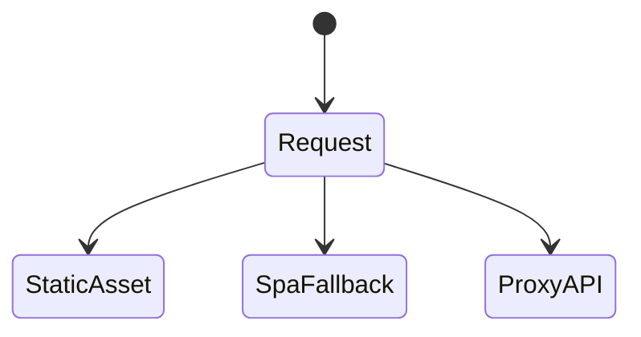
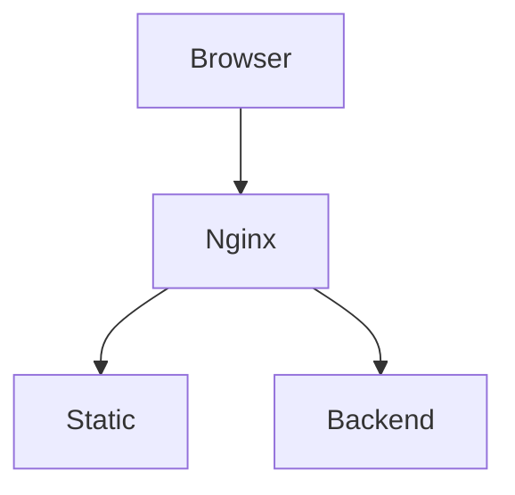

# Nginx

<TopicMeta />

<Prerequisites />

::: tip Published
This page meets the handbook **published** bar: deep explanation, ≥10 common mistakes, and official references. Further engine-level errata welcome via PR.
:::

## Introduction

**Nginx** commonly serves static frontend assets and reverse-proxies APIs. For SPAs it must fallback to `index.html` for client routes, set cache headers for hashed assets, and terminate or forward TLS.

## Why does it exist?

Battle-tested, fast at static I/O, flexible for headers/compression/proxying when you self-host.

## Historical Background

Long-standing web server; still ubiquitous beside Caddy and cloud CDNs.

## Mental Model

location blocks match URLs → try_files for SPA → proxy_pass for APIs → add_header for security/cache.

## Internal Workflow

1. Serve /assets with long cache.
2. Use try_files to index.html for HTML routes.
3. Proxy /api to backend.
4. Add security headers.
5. Reload gracefully.

## Lifecycle



## Browser Perspective

Cache-Control and CSP headers often set here.

## JavaScript Engine Perspective

Not applicable.

## React Perspective

Not applicable.

## Next.js Perspective

Not applicable.

## Server Perspective

Worker process model; tune for file descriptors.

## Network Perspective

Often first hop after LB/CDN.

## Memory Perspective

Not applicable.

## Performance

sendfile, gzip/brotli, caching—huge for static.

## Production Example

Hashed JS/CSS `Cache-Control: public,max-age=31536000,immutable`; `index.html` no-cache; API proxied.

## Code Examples

```nginx
server {
  root /usr/share/nginx/html;
  location /assets/ {
    add_header Cache-Control "public,max-age=31536000,immutable";
  }
  location / {
    try_files $uri $uri/ /index.html;
  }
  location /api/ {
    proxy_pass http://backend:3000/;
  }
}
```

## Diagrams



## Common Mistakes

1. No SPA fallback (refresh 404)
2. Caching index.html forever
3. Not compressing text assets
4. Missing security headers
5. Proxy without timeouts
6. Missing a production edge case for 19-deployment.nginx (#1)
7. Missing a production edge case for 19-deployment.nginx (#2)
8. Missing a production edge case for 19-deployment.nginx (#3)
9. Missing a production edge case for 19-deployment.nginx (#4)
10. Missing a production edge case for 19-deployment.nginx (#5)


## Best Practices

- Immutable cache for hashed assets
- No-cache HTML
- Explicit proxy timeouts

## Anti-patterns

- Serving source maps publicly forever without intent
- Wildcard CORS from nginx “to make it work”

## Comparison

| Nginx | CDN-only |
| --- | --- |
| Self-host control | Less ops |

## Interview Questions

### Easy

**Q:** Why try_files to index.html?

**A:** So client-side routes don’t 404 on refresh when the path isn’t a real file.

### Medium

**Q:** How should hashed assets be cached?

**A:** Long-term immutable caching; HTML should revalidate so new hashes are discovered.

### Hard

**Q:** Nginx + API cookies across paths.

**A:** Align cookie Path/SameSite, proxy headers (X-Forwarded-*), and HTTPS; avoid accidental cookie scope bugs.

## Summary

- Nginx serves static + proxy
- SPA fallback + correct cache headers
- Security headers at the edge

## References

- [Nginx docs](https://nginx.org/en/docs/)
- [Mozilla — HTTP cache headers](https://developer.mozilla.org/en-US/docs/Web/HTTP/Caching)

<RelatedTopics />


Prev: [`19-deployment.docker`](/19-deployment/docker/) · Next: [`19-deployment.reverse-proxy`](/19-deployment/reverse-proxy/)
