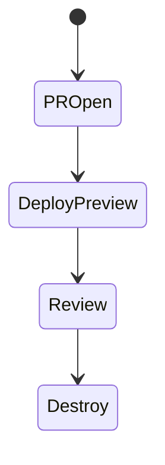
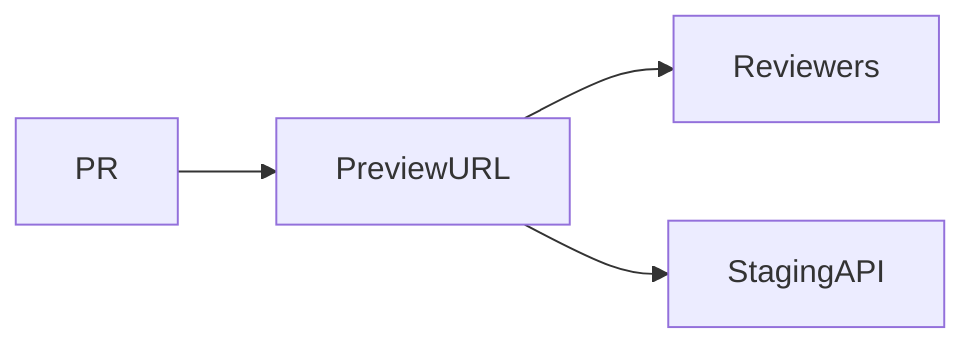

# Preview Deployments

<TopicMeta />

<Prerequisites />

::: tip Published
This page meets the handbook **published** bar: deep explanation, ≥10 common mistakes, and official references. Further engine-level errata welcome via PR.
:::

## Introduction

**Preview deployments** create unique URLs for each pull request/branch so reviewers test real builds—not only screenshots. Platforms (Vercel/Netlify/Cloudflare Pages) popularized them; DIY uses Kubernetes namespaces or ephemeral stacks.

## Why does it exist?

Catch visual/integration bugs early; improve design review; enable QA on unfinished work safely.

## Historical Background

Became mainstream with JAMstack hosts; now expected DX for frontend teams.

## Mental Model

Ephemeral app + usually shared staging backend (or ephemeral backend). Auth and data isolation matter so previews aren’t an open side door to prod data.

## Internal Workflow

1. Build PR artifact.
2. Deploy unique URL.
3. Point at staging APIs.
4. Protect with SSO if sensitive.
5. Tear down on merge/close.

## Lifecycle



## Browser Perspective

Not applicable.

## JavaScript Engine Perspective

Not applicable.

## React Perspective

Not applicable.

## Next.js Perspective

Platform previews first-class.

## Server Perspective

Not applicable.

## Network Perspective

CORS allow preview URL patterns carefully.

## Memory Perspective

Not applicable.

## Performance

Reuse build caches; expire old previews.

## Production Example

Vercel previews behind GitHub SSO; API allows `*.vercel.app` origin only for staging credentials.

## Code Examples

```ts
const preview = process.env.VERCEL_URL
export const appUrl = preview ? `https://${preview}` : 'http://localhost:3000'
```

## Diagrams



## Common Mistakes

1. Previews hitting prod APIs with write access
2. Public previews of private apps
3. No cleanup → cost explosion
4. CORS `*` for convenience
5. Assuming preview ≈ prod performance
6. Missing a production edge case for 19-deployment.preview-deployments (#1)
7. Missing a production edge case for 19-deployment.preview-deployments (#2)
8. Missing a production edge case for 19-deployment.preview-deployments (#3)
9. Missing a production edge case for 19-deployment.preview-deployments (#4)
10. Missing a production edge case for 19-deployment.preview-deployments (#5)


## Best Practices

- Staging backends
- Access control on previews
- Auto teardown

## Anti-patterns

- One shared “dev” server everyone SSHes into instead of previews
- Manual preview URLs posted without auth

## Comparison

| Preview | Staging |
| --- | --- |
| Per PR | Long-lived shared |

## Interview Questions

### Easy

**Q:** What is a preview deployment?

**A:** An automatically deployed environment for a branch/PR with its own URL for testing.

### Medium

**Q:** Security concern with previews?

**A:** They may expose unreleased code or connect to sensitive APIs—require auth and non-prod credentials.

### Hard

**Q:** DIY previews in Kubernetes.

**A:** Namespace per PR, ingress host rule, seeded data, TTL controllers, resource quotas, and CI deploy/destroy jobs.

## Summary

- Previews accelerate review
- Isolate data and access
- Auto create/destroy

## References

- [Vercel — Preview Deployments](https://vercel.com/docs/deployments/environments)
- [Netlify — Deploy Previews](https://docs.netlify.com/site-deploys/deploy-previews/)

<RelatedTopics />


Prev: [`19-deployment.environment-config`](/19-deployment/environment-config/) · Next: [`19-deployment.rollback-strategies`](/19-deployment/rollback-strategies/)
