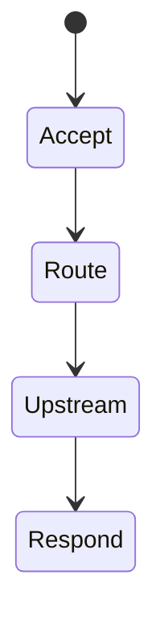
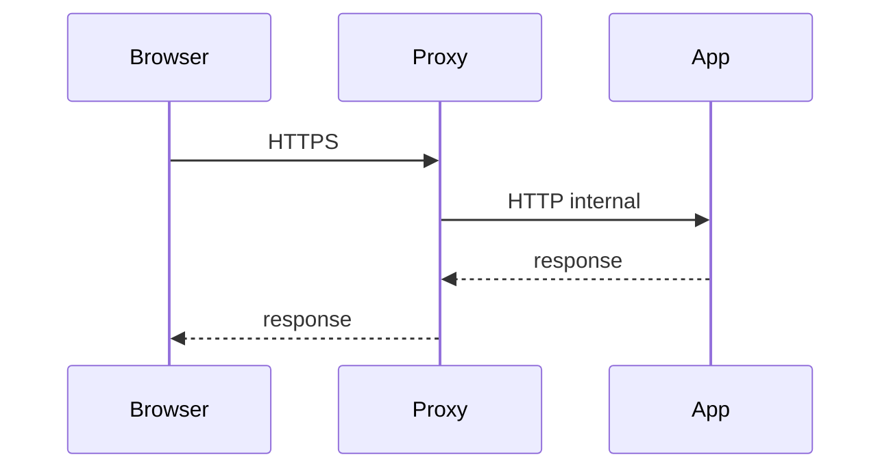

# Reverse Proxy

<TopicMeta />

<Prerequisites />

::: tip Published
This page meets the handbook **published** bar: deep explanation, ≥10 common mistakes, and official references. Further engine-level errata welcome via PR.
:::

## Introduction

A **reverse proxy** sits in front of app servers (nginx, Envoy, Cloudflare, ALB). Clients talk to the proxy; the proxy routes to upstreams, often handling TLS, compression, auth gates, and path routing.

## Why does it exist?

Frontends and APIs rarely expose Node directly to the internet. Proxies centralize cross-cutting concerns.

## Historical Background

From classic nginx/Apache to cloud L7 load balancers and service meshes.

## Mental Model

Client → proxy (public) → upstream (private). Forwarded headers preserve original client IP/proto. Path-based or host-based routing splits apps.

## Internal Workflow

1. Terminate TLS at proxy/CDN.
2. Route / vs /api.
3. Set security headers.
4. Configure timeouts/retries carefully.
5. Health-check upstreams.

## Lifecycle



## Browser Perspective

Sees proxy as the origin.

## JavaScript Engine Perspective

Not applicable.

## React Perspective

Not applicable.

## Next.js Perspective

Host/proto headers affect URL generation.

## Server Perspective

Must trust X-Forwarded-* only from proxy.

## Network Perspective

HTTP/2/3 often terminated at proxy.

## Memory Perspective

Not applicable.

## Performance

Connection reuse to upstreams; avoid retrying non-idempotent POSTs blindly.

## Production Example

Edge CDN → reverse proxy → web and api services; WebSocket upgrade configured for `/ws`.

## Code Examples

```nginx
location /api/ {
  proxy_set_header Host $host;
  proxy_set_header X-Forwarded-For $proxy_add_x_forwarded_for;
  proxy_set_header X-Forwarded-Proto $scheme;
  proxy_pass http://api:8080/;
}
```

## Diagrams



## Common Mistakes

1. Trusting X-Forwarded-For from the open internet
2. No WebSocket upgrade config when needed
3. Retrying POST on upstream blips
4. Buffering breaking SSE
5. Wrong Host headers breaking redirects
6. Missing a production edge case for 19-deployment.reverse-proxy (#1)
7. Missing a production edge case for 19-deployment.reverse-proxy (#2)
8. Missing a production edge case for 19-deployment.reverse-proxy (#3)
9. Missing a production edge case for 19-deployment.reverse-proxy (#4)
10. Missing a production edge case for 19-deployment.reverse-proxy (#5)


## Best Practices

- Terminate TLS at edge
- Forward proto/host correctly
- Health checks + sane timeouts

## Anti-patterns

- Exposing Node directly without proxy in prod
- Double-gzip compression surprises

## Comparison

| Reverse proxy | Forward proxy |
| --- | --- |
| Protects servers | Protects clients |

## Interview Questions

### Easy

**Q:** What is a reverse proxy?

**A:** A server that accepts client requests and forwards them to upstream backend servers on their behalf.

### Medium

**Q:** Why set X-Forwarded-Proto?

**A:** So apps know the original client used HTTPS when TLS terminated upstream—important for secure cookies and redirects.

### Hard

**Q:** How do proxies interact with SSE/WebSockets?

**A:** Need upgrade headers for WS; disable/adjust buffering and long timeouts for SSE; sticky sessions sometimes required.

## Summary

- Reverse proxies front origins
- TLS, routing, headers
- Configure streaming upgrades carefully

## References

- [MDN — Proxy servers](https://developer.mozilla.org/en-US/docs/Web/HTTP/Proxy_servers_and_tunneling)
- [Nginx reverse proxy](https://docs.nginx.com/nginx/admin-guide/web-server/reverse-proxy/)

<RelatedTopics />


Prev: [`19-deployment.nginx`](/19-deployment/nginx/) · Next: [`19-deployment.cdn-deployment`](/19-deployment/cdn-deployment/)
