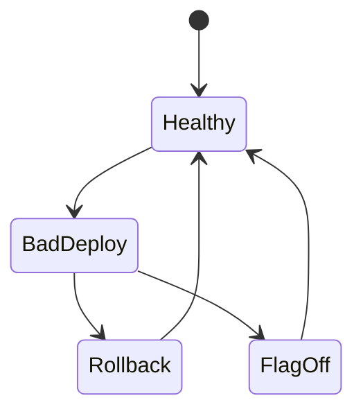
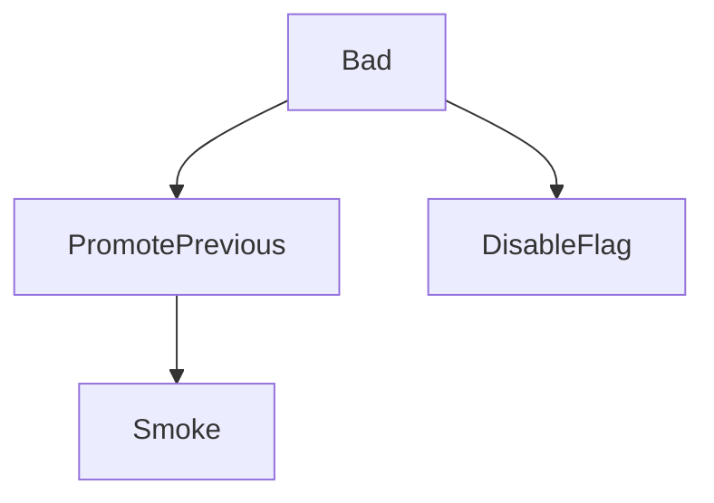

# Rollback Strategies

<TopicMeta />

<Prerequisites />

::: tip Published
This page meets the handbook **published** bar: deep explanation, ≥10 common mistakes, and official references. Further engine-level errata welcome via PR.
:::

## Introduction

A **rollback strategy** is the rehearsed path to undo a bad deploy: redeploy previous immutable artifact, flip traffic, or disable via feature flag. Frontends must also consider **cached assets** and **API compatibility**.

## Why does it exist?

Failures happen. Mean time to recovery matters more than never failing.

## Historical Background

From “FTP the old folder back” to immutable deployments and instant promotion of prior releases on modern hosts.

## Mental Model

Artifacts are immutable and addressable (SHA). Rollback = point traffic at last known good. Flags reduce need for full rollback when changes are gated.

## Internal Workflow

1. Keep N prior artifacts.
2. One-click promote previous.
3. Invalidate HTML caches if needed.
4. Confirm smoke tests.
5. Postmortem + forward fix.

## Lifecycle



## Browser Perspective

Users may hold old tabs; APIs need backward compatibility.

## JavaScript Engine Perspective

Not applicable.

## React Perspective

Not applicable.

## Next.js Perspective

Server/client skew on partial rollouts—careful.

## Server Perspective

Not applicable.

## Network Perspective

CDN may cache bad HTML—purge plan required.

## Memory Perspective

Not applicable.

## Performance

Fast rollback > perfect root-cause during the outage.

## Production Example

Vercel promote previous deployment in 30s; feature flags kill switch for risky UI; API remains backward compatible for one version.

## Code Examples

```bash
# Conceptual: redeploy previous SHA artifact
deploy --artifact web@${PREV_SHA}
```

## Diagrams



## Common Mistakes

1. No retained artifacts
2. Migrations that break old clients without expand/contract
3. Manual-only rollback nobody practiced
4. Assuming CDN instantly drops HTML
5. Rolling forward only with no timebox
6. Missing a production edge case for 19-deployment.rollback-strategies (#1)
7. Missing a production edge case for 19-deployment.rollback-strategies (#2)
8. Missing a production edge case for 19-deployment.rollback-strategies (#3)
9. Missing a production edge case for 19-deployment.rollback-strategies (#4)
10. Missing a production edge case for 19-deployment.rollback-strategies (#5)


## Best Practices

- Immutable versioned deploys
- Rehearse rollback
- Feature flags for risky changes

## Anti-patterns

- Hotfix prod by hand during panic without artifact trail
- Deleting old images immediately

## Comparison

| Rollback | Roll forward |
| --- | --- |
| Restore last good | Ship fix fast |
| Best for unknown breakage | Best when fix is ready |

## Interview Questions

### Easy

**Q:** What is a rollback?

**A:** Reverting production to a previous known-good release artifact or configuration.

### Medium

**Q:** Why do immutable artifacts help rollback?

**A:** You can redeploy the exact prior bits without rebuilding from an uncertain git state under pressure.

### Hard

**Q:** Frontend rollback when API already migrated?

**A:** Use expand/contract migrations and compatible APIs; flags; or coordinated multi-service rollback plan—never assume UI-only rollback is always safe.

## Summary

- Keep prior artifacts ready
- Practice rollback + CDN HTML purge
- Flags reduce blast radius

## References

- [12-Factor — Build Release Run](https://12factor.net/build-release-run/)
- [Vercel — Instant Rollback](https://vercel.com/docs/instant-rollback)

<RelatedTopics />


Prev: [`19-deployment.preview-deployments`](/19-deployment/preview-deployments/)
