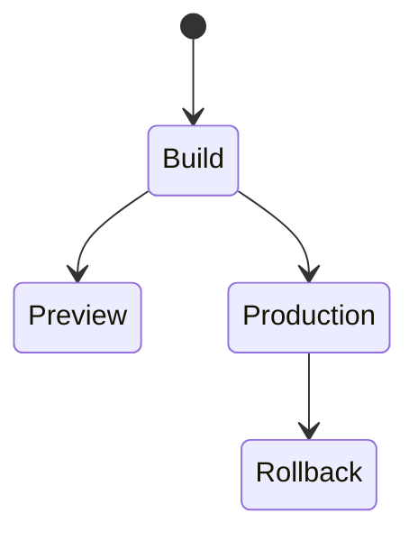

# Vercel

<TopicMeta />

<Prerequisites />

::: tip Published
This page meets the handbook **published** bar: deep explanation, ≥10 common mistakes, and official references. Further engine-level errata welcome via PR.
:::

## Introduction

**Vercel** is a deployment platform optimized for Next.js and static frontends: git push → build → global CDN/edge, with **preview deployments** per PR. Abstractions cover routing, serverless/edge functions, and env vars.

## Why does it exist?

Removes much infra toil for web apps; previews improve review quality. Trade-offs: platform constraints and cost at scale.

## Historical Background

Created by the Next.js team’s company; became a default Next host.

## Mental Model

Git integration builds immutable deployments; domains point to them; env scoped to Preview/Production; rollbacks promote prior deployments.

## Internal Workflow

1. Connect repo.
2. Configure build/output.
3. Set envs.
4. PR → preview URL.
5. Merge → production.

## Lifecycle



## Browser Perspective

Not applicable.

## JavaScript Engine Perspective

Not applicable.

## React Perspective

Not applicable.

## Next.js Perspective

First-class support for App Router features.

## Server Perspective

Not applicable.

## Network Perspective

Edge network for static and some compute.

## Memory Perspective

Not applicable.

## Performance

ISR/edge caching features matter; measure cold starts for functions.

## Production Example

Monorepo filtered build for `apps/web`; preview envs for API URLs; prod protected with checks.

## Code Examples

```json
{
  "buildCommand": "pnpm --filter web build",
  "outputDirectory": "apps/web/.next"
}
```

## Diagrams


## Common Mistakes

1. Secrets in NEXT_PUBLIC_
2. Unbounded preview deployments with open auth to internal data
3. Ignoring build cache / monorepo filters
4. No production protection
5. Assuming Node APIs work on Edge runtime
6. Missing a production edge case for 19-deployment.vercel (#1)
7. Missing a production edge case for 19-deployment.vercel (#2)
8. Missing a production edge case for 19-deployment.vercel (#3)
9. Missing a production edge case for 19-deployment.vercel (#4)
10. Missing a production edge case for 19-deployment.vercel (#5)


## Best Practices

- Preview deployments for PRs
- Scoped env vars
- Rollback via prior deployment

## Anti-patterns

- Manual prod uploads bypassing git
- One huge serverless function doing everything without limits thinking

## Comparison

| Vercel | DIY Docker/K8s |
| --- | --- |
| Fast DX | More control/ops |

## Interview Questions

### Easy

**Q:** What is a Vercel preview deployment?

**A:** An automatically built deploy for a git branch/PR with a unique URL for testing.

### Medium

**Q:** How do environment variables differ across Preview vs Production?

**A:** Vercel scopes env values per environment so previews can point at staging APIs while production uses prod secrets.

### Hard

**Q:** When might you outgrow Vercel?

**A:** Strict compliance/network needs, cost at scale, or custom runtime requirements—then hybrid or self-host Next standalone.

## Summary

- Vercel = git-linked frontend deploys
- Previews + edge CDN
- Mind runtimes and public env

## References

- [Vercel docs](https://vercel.com/docs)
- [Next.js deployment](https://nextjs.org/docs/app/building-your-application/deploying)

<RelatedTopics />


Prev: [`19-deployment.github-actions`](/19-deployment/github-actions/) · Next: [`19-deployment.netlify`](/19-deployment/netlify/)
