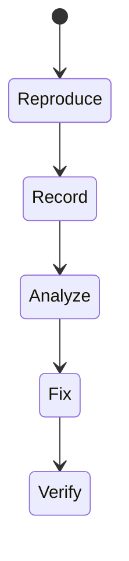
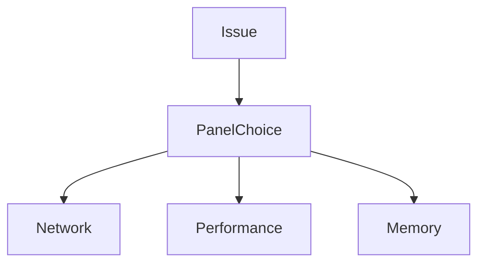

# Chrome DevTools

<TopicMeta />

<Prerequisites />

::: tip Published
This page meets the handbook **published** bar: deep explanation, ≥10 common mistakes, and official references. Further engine-level errata welcome via PR.
:::

## Introduction

**Chrome DevTools** is the primary lab toolkit for frontend engineers: Elements, Console, Network, Performance, Memory, Application, and more. Mastering it turns guesses into measurements.

## Why does it exist?

You cannot fix what you cannot see. DevTools exposes the browser’s view of your page—layout, requests, main-thread work, storage.

## Historical Background

Evolved with Chromium; many workflows (Performance panel, Coverage, Lighthouse) became industry standard.

## Mental Model

Each panel answers a question: What DOM/CSS? What requests? Why jank? What’s retained in memory? What’s in storage?

## Internal Workflow

1. Reproduce issue.
2. Pick panel (Network/Performance/Memory).
3. Record with narrow scope.
4. Attribute cost to stacks/URLs.
5. Change one variable; remeasure.

## Lifecycle



## Browser Perspective

DevTools talks to the renderer/debugging protocols.

## JavaScript Engine Perspective

Not applicable.

## React Perspective

Components profiler complements Performance panel.

## Next.js Perspective

Not applicable.

## Server Perspective

Not applicable.

## Network Perspective

Waterfall + initiator stacks explain waterfalls.

## Memory Perspective

Not applicable.

## Performance

Recording itself has overhead—prefer short traces.

## Production Example

Perf regression: Performance panel shows long task from JSON.parse on huge payload; fixed by streaming/pagination.

## Code Examples

```js
// Quick lab helpers
performance.mark('start')
// ... work
performance.mark('end')
performance.measure('work', 'start', 'end')
console.table(performance.getEntriesByType('measure'))
```

## Diagrams



## Common Mistakes

1. Profiling production minified code without source maps
2. Looking only at FPS without main-thread attribution
3. Ignoring throttling presets for mobile realism
4. Leaving breakpoints that alter timing
5. Network filter hiding the failing call
6. Missing a production edge case for 20-observability.chrome-devtools (#1)
7. Missing a production edge case for 20-observability.chrome-devtools (#2)
8. Missing a production edge case for 20-observability.chrome-devtools (#3)
9. Missing a production edge case for 20-observability.chrome-devtools (#4)
10. Missing a production edge case for 20-observability.chrome-devtools (#5)


## Best Practices

- Throttle CPU/network for mobile issues
- Use source maps
- Short targeted recordings

## Anti-patterns

- Fixing without recording a baseline
- Only Lighthouse score chasing

## Comparison

| Panel | Question |
| --- | --- |
| Network | What loaded? |
| Performance | Why jank? |
| Memory | What’s retained? |

## Interview Questions

### Easy

**Q:** Which panel inspects HTTP requests?

**A:** The Network panel.

### Medium

**Q:** How do you find a long task cause?

**A:** Record Performance, find long tasks, inspect call stacks/bottom-up to attribute JS/layout work.

### Hard

**Q:** Debug a memory leak with DevTools.

**A:** Take heap snapshots over interactions, compare retained objects, look for detached DOM / listeners; confirm with allocation timelines.

## Summary

- DevTools is the lab workbench
- Pick panel by question
- Measure → change → remeasure

## References

- [Chrome DevTools docs](https://developer.chrome.com/docs/devtools/)
- [Performance panel overview](https://developer.chrome.com/docs/devtools/performance/)

<RelatedTopics />


Next: [`20-observability.debugging-javascript`](/20-observability/debugging-javascript/)
