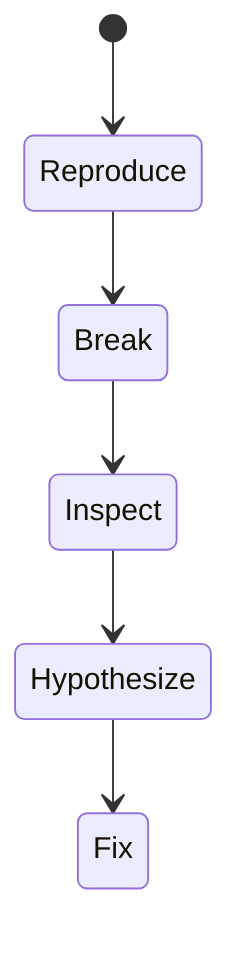
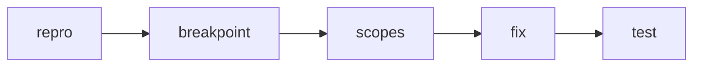

# Debugging JavaScript

<TopicMeta />

<Prerequisites />

::: tip Published
This page meets the handbook **published** bar: deep explanation, ≥10 common mistakes, and official references. Further engine-level errata welcome via PR.
:::

## Introduction

**Debugging JavaScript** is a disciplined loop: reproduce, isolate, inspect state, form a hypothesis, verify. DevTools breakpoints (including conditional/XHR/event) beat `console.log` spam for complex bugs.

## Why does it exist?

Async code, minification, and frameworks obscure causes. Structured debugging shortens MTTR.

## Historical Background

From alert-debugging to source-mapped modern DevTools with async stack traces.

## Mental Model

Pause on the line where reality diverges from expectation. Inspect call stack, scope, and async causality.

## Internal Workflow

1. Reliable reproduction.
2. Source maps on.
3. Breakpoint at suspect; use conditional breakpoints.
4. Step; watch expressions.
5. Write a regression test when fixed.

## Lifecycle



## Browser Perspective

Event listener breakpoints for click/scroll bugs.

## JavaScript Engine Perspective

Debuggers hook the JS runtime; breakpoints deoptimize temporarily.

## React Perspective

Use Component Stack + hooks inspection carefully.

## Next.js Perspective

Not applicable.

## Server Perspective

Not applicable.

## Network Perspective

Not applicable.

## Memory Perspective

Not applicable.

## Performance

Heavy logging changes timing—prefer breakpoints for races.

## Production Example

Bug only in Safari: reproduced with WebKit, conditional breakpoint on bad assumption about `crypto.randomUUID`.

## Code Examples

```js
// Conditional breakpoint expression example:
user.id === '123' && cart.items.length === 0
```

## Diagrams



## Common Mistakes

1. Logging in hot loops only
2. Debugging without source maps
3. Ignoring async stack traces
4. Fixing without regression tests
5. Cannot reproduce but “randomly” changing code
6. Missing a production edge case for 20-observability.debugging-javascript (#1)
7. Missing a production edge case for 20-observability.debugging-javascript (#2)
8. Missing a production edge case for 20-observability.debugging-javascript (#3)
9. Missing a production edge case for 20-observability.debugging-javascript (#4)
10. Missing a production edge case for 20-observability.debugging-javascript (#5)


## Best Practices

- Deterministic repro first
- Conditional breakpoints
- Regression tests

## Anti-patterns

- debugger left in production bundles
- Catch-all try/catch that swallows evidence

## Comparison

| console.log | breakpoint |
| --- | --- |
| Easy | Precise pause + inspection |

## Interview Questions

### Easy

**Q:** What is a breakpoint?

**A:** A point where the debugger pauses execution so you can inspect program state.

### Medium

**Q:** What helps with async bugs?

**A:** Async stack traces, breakpoints in promise handlers, and tracing network timing races.

### Hard

**Q:** Debug a race between two fetches.

**A:** Log/AbortController correlate; breakpoints on response handlers; ensure latest-wins or cancellation; add tests with mocked timing.

## Summary

- Reproduce then pause
- Source maps + async stacks
- Lock fix with tests

## References

- [Chrome DevTools — Debug JavaScript](https://developer.chrome.com/docs/devtools/javascript/)
- [MDN — Debugging](https://developer.mozilla.org/en-US/docs/Learn/JavaScript/First_steps/What_went_wrong)

<RelatedTopics />


Prev: [`20-observability.chrome-devtools`](/20-observability/chrome-devtools/) · Next: [`20-observability.debugging-network`](/20-observability/debugging-network/)
