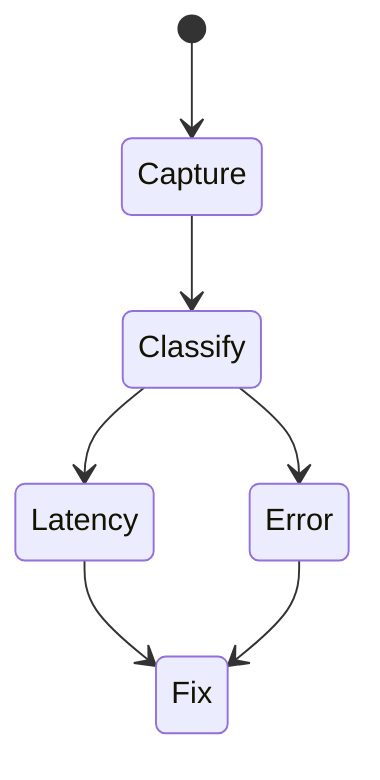
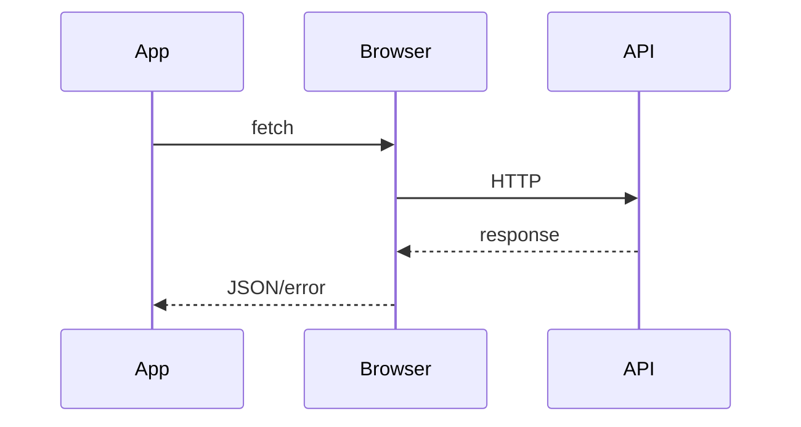

# Debugging Network

<TopicMeta />

<Prerequisites />

::: tip Published
This page meets the handbook **published** bar: deep explanation, ≥10 common mistakes, and official references. Further engine-level errata welcome via PR.
:::

## Introduction

**Network debugging** inspects requests: status, timing (DNS/TCP/TLS/TTFB/download), headers, payloads, caching, and CORS failures. The Network panel waterfall is the map.

## Why does it exist?

Many “UI bugs” are API/contract/cache bugs. Frontends must read the wire.

## Historical Background

DevTools Network + HAR export became standard for support escalations.

## Mental Model

Waterfall timing phases explain slowness; status/body explain failure; initiator shows who triggered the call; size/cache explain repeats.

## Internal Workflow

1. Preserve log + disable cache when needed.
2. Find failing/slow request.
3. Inspect headers/body.
4. Check CORS/preflight.
5. Correlate with backend traces.

## Lifecycle



## Browser Perspective

CORS/mixed content appear as client failures.

## JavaScript Engine Perspective

Not applicable.

## React Perspective

Duplicate calls from Strict Mode/effects—verify before blaming API.

## Next.js Perspective

Not applicable.

## Server Perspective

Not applicable.

## Network Perspective

HTTP/2 multiplexing changes waterfall shapes.

## Memory Perspective

Not applicable.

## Performance

Reduce waterfalls; prefetch; cache correctly; compress.

## Production Example

Checkout slow: TTFB 1.8s on `/quote`; initiator was render path calling it serially—parallelized and cached.

## Code Examples

```bash
curl -sI https://api.example.com/health | sed -n '1,20p'
```

## Diagrams



## Common Mistakes

1. Not looking at preflight failures
2. Blaming API when request never sent
3. Ignoring cache hits (304/disk)
4. Huge payloads unnoticed
5. Comparing prod issues without matching auth cookies
6. Missing a production edge case for 20-observability.debugging-network (#1)
7. Missing a production edge case for 20-observability.debugging-network (#2)
8. Missing a production edge case for 20-observability.debugging-network (#3)
9. Missing a production edge case for 20-observability.debugging-network (#4)
10. Missing a production edge case for 20-observability.debugging-network (#5)


## Best Practices

- HAR for escalations
- Check timing phases
- Correlate with trace ids

## Anti-patterns

- Disabling CORS in browser to “fix” prod
- Retry storms without backoff

## Comparison

| Status | Typical meaning |
| --- | --- |
| 4xx | Client/contract |
| 5xx | Server |
| CORS error | Browser blocked read |

## Interview Questions

### Easy

**Q:** What does TTFB measure?

**A:** Time to first byte—roughly until the server starts responding after the request is sent.

### Medium

**Q:** How do you debug a CORS failure?

**A:** Inspect the failed request/preflight in Network, check ACAO/ACAC/requested headers, and fix server allowlist—not the browser.

### Hard

**Q:** Explain a waterfall with many blocked requests.

**A:** Connection limits, HTTP/1.1 six-per-host, dependency chains, or main-thread contention delaying request starts—verify protocol and priorities.

## Summary

- Network panel tells truth about HTTP
- Timing vs error classification
- Correlate with backend

## References

- [Chrome DevTools — Network](https://developer.chrome.com/docs/devtools/network/)
- [MDN — CORS errors](https://developer.mozilla.org/en-US/docs/Web/HTTP/CORS/Errors)

<RelatedTopics />


Prev: [`20-observability.debugging-javascript`](/20-observability/debugging-javascript/) · Next: [`20-observability.debugging-performance`](/20-observability/debugging-performance/)
