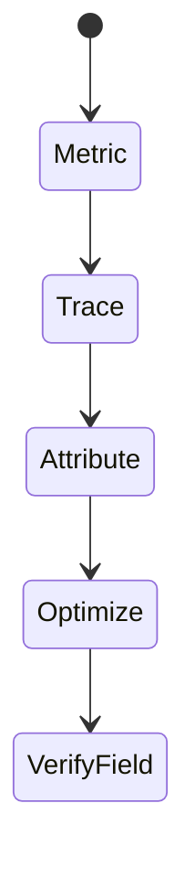
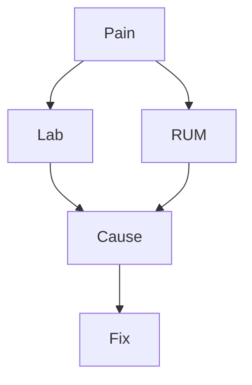

# Debugging Performance

<TopicMeta />

<Prerequisites />

::: tip Published
This page meets the handbook **published** bar: deep explanation, ≥10 common mistakes, and official references. Further engine-level errata welcome via PR.
:::

## Introduction

**Performance debugging** attributes slow UX to causes: long tasks, layout thrash, huge scripts, network waterfalls, or hydration. Use Performance panel + Web Vitals + React Profiler together.

## Why does it exist?

Users feel latency as brokenness. Optimizing without attribution wastes time.

## Historical Background

RAIL model → Core Web Vitals made field metrics mainstream; lab tools improved attribution.

## Mental Model

Lab (DevTools/Lighthouse) vs field (RUM). Fix the metric that matches the user pain: LCP, INP, CLS, TTFB.

## Internal Workflow

1. Identify painful metric.
2. Lab reproduce with throttling.
3. Attribute (script, render, network).
4. Change one thing.
5. Verify lab + field.

## Lifecycle



## Browser Perspective

Main thread contention blocks input/paint.

## JavaScript Engine Perspective

Not applicable.

## React Perspective

Unnecessary rerenders and hydration costs.

## Next.js Perspective

Not applicable.

## Server Perspective

Not applicable.

## Network Perspective

LCP often image/TTFB bound.

## Memory Perspective

Not applicable.

## Performance

This topic is the practice of performance work.

## Production Example

INP regression: Performance shows long handler on search input; debounced and moved work off critical path.

## Code Examples

```js
new PerformanceObserver((list) => {
  for (const e of list.getEntries()) console.log(e.name, e.startTime, e.duration)
}).observe({ type: 'longtask', buffered: true })
```

## Diagrams



## Common Mistakes

1. Optimizing without a metric
2. Desktop-only profiles for mobile issues
3. Micro-optimizing while LCP image ignored
4. Ignoring third-party scripts
5. Shipping perf “fixes” without field verification
6. Missing a production edge case for 20-observability.debugging-performance (#1)
7. Missing a production edge case for 20-observability.debugging-performance (#2)
8. Missing a production edge case for 20-observability.debugging-performance (#3)
9. Missing a production edge case for 20-observability.debugging-performance (#4)
10. Missing a production edge case for 20-observability.debugging-performance (#5)


## Best Practices

- Throttle for mobile
- Attribute before optimizing
- Validate with RUM

## Anti-patterns

- Premature memoization everywhere
- Chasing Lighthouse score with hacks hurting a11y

## Comparison

| Lab | Field |
| --- | --- |
| Controlled | Real users |
| Debug deep | Prioritize |

## Interview Questions

### Easy

**Q:** Name Core Web Vitals.

**A:** LCP, INP, and CLS (as of current Core Web Vitals set).

### Medium

**Q:** What is a long task?

**A:** Main-thread work exceeding ~50ms that can delay input/paint.

### Hard

**Q:** Debug poor LCP on a Next app.

**A:** Check TTFB, LCP element type, image priority/sizes, render-blocking resources, and field breakdowns; fix the dominant factor.

## Summary

- Attribute then optimize
- Lab + field together
- Match metric to user pain

## References

- [web.dev — Performance](https://web.dev/performance/)
- [Chrome — Performance features](https://developer.chrome.com/docs/devtools/performance/)
- [Web Vitals](https://web.dev/articles/vitals)

<RelatedTopics />


Prev: [`20-observability.debugging-network`](/20-observability/debugging-network/) · Next: [`20-observability.source-maps-debugging`](/20-observability/source-maps-debugging/)
