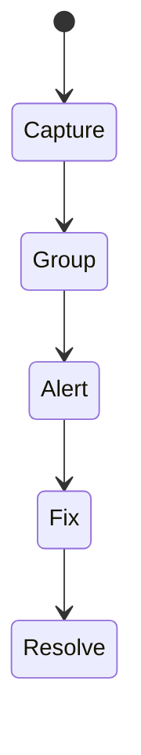
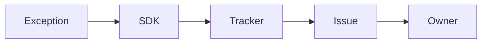

# Error Tracking

<TopicMeta />

<Prerequisites />

::: tip Published
This page meets the handbook **published** bar: deep explanation, ≥10 common mistakes, and official references. Further engine-level errata welcome via PR.
:::

## Introduction

**Error tracking** services (Sentry, etc.) collect runtime exceptions and unhandled rejections, group them, attach releases/source maps, and alert. They turn unknown prod failures into actionable issues.

## Why does it exist?

Users won’t always report bugs. Field errors reveal what lab tests missed.

## Historical Background

Window.onerror → robust SDKs with Session Replay debates, fingerprinting, and privacy controls.

## Mental Model

SDK hooks global handlers + framework integrations → events with stack → grouped issues → triage. Sampling and ignore rules control noise.

## Internal Workflow

1. Install SDK with release.
2. Upload source maps.
3. Set sample rates / ignores.
4. Alert on regressions.
5. Triage with owners.

## Lifecycle



## Browser Perspective

Cross-origin script errors may be “Script error” without CORS on scripts.

## JavaScript Engine Perspective

Not applicable.

## React Perspective

Error boundaries report to tracker; still catch async separately.

## Next.js Perspective

Not applicable.

## Server Perspective

Not applicable.

## Network Perspective

Not applicable.

## Memory Perspective

Not applicable.

## Performance

SDKs add bytes/CPU—sample; defer load carefully without missing early errors.

## Production Example

Sentry release per git SHA; alert if new issue spikes; PII scrubbing; no replay on payment pages.

## Code Examples

```ts
window.addEventListener('unhandledrejection', (e) => {
  reportError(e.reason)
})
```

## Diagrams



## Common Mistakes

1. No source maps
2. Alerting on every noise error
3. Sending PII in extras
4. Ignoring error boundaries’ reporting
5. One giant catch that reports and swallows without UX
6. Missing a production edge case for 20-observability.error-tracking (#1)
7. Missing a production edge case for 20-observability.error-tracking (#2)
8. Missing a production edge case for 20-observability.error-tracking (#3)
9. Missing a production edge case for 20-observability.error-tracking (#4)
10. Missing a production edge case for 20-observability.error-tracking (#5)


## Best Practices

- Release + maps
- Fingerprint thoughtfully
- Own issues like bugs

## Anti-patterns

- Turning off tracking in prod to “improve privacy” without alternative
- Sampling 0% on the riskiest app

## Comparison

| Error tracking | Logs |
| --- | --- |
| Exception-centric | Event narrative |

## Interview Questions

### Easy

**Q:** What does an error tracker capture?

**A:** Runtime exceptions/rejections with stacks, context, and often release/environment metadata.

### Medium

**Q:** Why upload source maps to the tracker?

**A:** So minified stacks resolve to original files/lines for humans.

### Hard

**Q:** Reduce noisy third-party errors.

**A:** Ignore rules, inbound filters, separate script ownership, sample rates, and fix or sandbox third parties.

## Summary

- Track field exceptions with releases
- Maps + scrubbing
- Triage as product work

## References

- [Sentry for JavaScript](https://docs.sentry.io/platforms/javascript/)
- [MDN — Window:error event](https://developer.mozilla.org/en-US/docs/Web/API/Window/error_event)

<RelatedTopics />


Prev: [`20-observability.logging`](/20-observability/logging/) · Next: [`20-observability.rum`](/20-observability/rum/)
