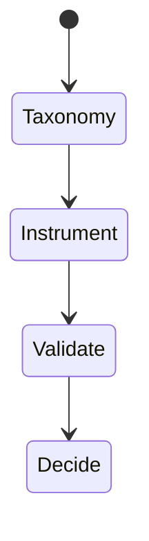
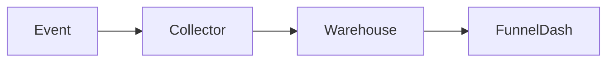

# Feature Telemetry

<TopicMeta />

<Prerequisites />

::: tip Published
This page meets the handbook **published** bar: deep explanation, ≥10 common mistakes, and official references. Further engine-level errata welcome via PR.
:::

## Introduction

**Feature telemetry** measures whether users discover and complete product flows: events, funnels, retention, and experiment exposures. Distinct from error/performance monitoring, but shares piping and privacy rules.

## Why does it exist?

Shipping features without usage data is flying blind. Telemetry informs prioritization and detects broken funnels.

## Historical Background

Analytics.js-era tools → privacy-first designs, consent modes, and first-party collection patterns.

## Mental Model

Define a taxonomy: event name + properties + user/anon id strategy. Instrument once per meaningful action—not every render. Consent gates collection.

## Internal Workflow

1. Design event taxonomy.
2. Implement with consent.
3. Validate in debug tools.
4. Build funnels/dashboards.
5. Review drift quarterly.

## Lifecycle



## Browser Perspective

Respect Do Not Track/consent; prefer first-party beacons.

## JavaScript Engine Perspective

Not applicable.

## React Perspective

Fire on user intent handlers, not useEffect spam.

## Next.js Perspective

Not applicable.

## Server Perspective

Not applicable.

## Network Perspective

Batch events; retry carefully.

## Memory Perspective

Not applicable.

## Performance

Async/batched; never block UI on analytics.

## Production Example

Funnel: view_item → add_to_cart → begin_checkout → purchase; alert if drop exceeds threshold after release.

## Code Examples

```ts
track('add_to_cart', { sku, price, currency: 'USD' })
```

## Diagrams



## Common Mistakes

1. No taxonomy (random event names)
2. PII in properties
3. Tracking without consent where required
4. Duplicate events from Strict Mode effects
5. Vanity metrics without decisions
6. Missing a production edge case for 20-observability.feature-telemetry (#1)
7. Missing a production edge case for 20-observability.feature-telemetry (#2)
8. Missing a production edge case for 20-observability.feature-telemetry (#3)
9. Missing a production edge case for 20-observability.feature-telemetry (#4)
10. Missing a production edge case for 20-observability.feature-telemetry (#5)


## Best Practices

- Documented taxonomy
- Consent-aware
- Instrument user intent

## Anti-patterns

- Session replay on sensitive pages without review
- Auto-track every click forever

## Comparison

| Feature telemetry | RUM/errors |
| --- | --- |
| Product usage | Reliability/perf |

## Interview Questions

### Easy

**Q:** What is feature telemetry for?

**A:** Measuring how users interact with product features to inform decisions and detect broken flows.

### Medium

**Q:** Why a taxonomy?

**A:** Consistent event names/properties enable reliable funnels and prevent analysis chaos.

### Hard

**Q:** Privacy-safe telemetry design in the EU context.

**A:** Consent mode, data minimization, first-party collection, scrubbing, retention limits, and legal review—no covert cross-site tracking.

## Summary

- Taxonomy + consent + intent events
- Separate from pure error monitoring
- Drive decisions, not vanity

## References

- [W3C — Privacy principles](https://www.w3.org/TR/privacy-principles/)
- [MDN — Navigator.sendBeacon](https://developer.mozilla.org/en-US/docs/Web/API/Navigator/sendBeacon)
- [Google Analytics — Measurement Protocol / events concepts](https://developers.google.com/analytics)

<RelatedTopics />


Prev: [`20-observability.tracing-frontend`](/20-observability/tracing-frontend/)
