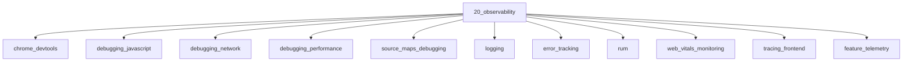

# Observability

## Scope

DevTools, debugging, RUM, logging, and frontend telemetry

## Prerequisites

See the learning paths and each topic's prerequisites in the registry.

## Topics in order

- [Chrome DevTools](/20-observability/chrome-devtools/) — junior, ~40 min
- [Debugging JavaScript](/20-observability/debugging-javascript/) — junior, ~30 min
- [Debugging Network](/20-observability/debugging-network/) — junior, ~30 min
- [Debugging Performance](/20-observability/debugging-performance/) — mid, ~35 min
- [Source Maps Debugging](/20-observability/source-maps-debugging/) — mid, ~25 min
- [Logging](/20-observability/logging/) — junior, ~25 min
- [Error Tracking](/20-observability/error-tracking/) — mid, ~30 min
- [Real User Monitoring](/20-observability/rum/) — mid, ~30 min
- [Web Vitals Monitoring](/20-observability/web-vitals-monitoring/) — mid, ~25 min
- [Frontend Tracing](/20-observability/tracing-frontend/) — senior, ~30 min
- [Feature Telemetry](/20-observability/feature-telemetry/) — mid, ~25 min

## Module knowledge graph

## Suggested learning paths

Browse [Learning Paths](/learning-paths/).
