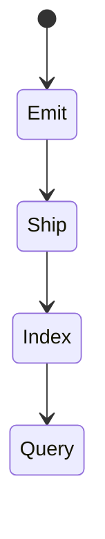
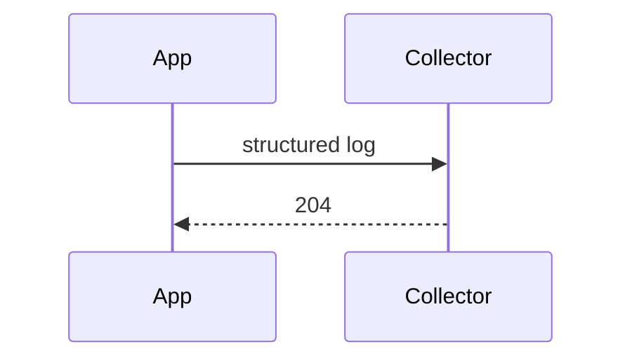

# Logging

<TopicMeta />

<Prerequisites />

::: tip Published
This page meets the handbook **published** bar: deep explanation, ≥10 common mistakes, and official references. Further engine-level errata welcome via PR.
:::

## Introduction

**Logging** records discrete events for diagnostics. In browsers, prefer **structured logs** (JSON) sent to a collector with levels, request/user context (non-PII), and sampling—not unbounded `console.log` in prod.

## Why does it exist?

Errors alone miss narrative (“user clicked pay → 3 retries → timeout”). Logs provide sequence.

## Historical Background

Server logging culture migrated to browsers via RUM/analytics pipelines; privacy regs constrained what can be logged.

## Mental Model

Log for operators, not for vanity. Include correlation ids. Scrub PII/tokens. Sample high-volume debug.

## Internal Workflow

1. Define log schema.
2. Wrap console in logger.
3. Attach correlation ids from backend.
4. Ship via beacon/OTLP.
5. Set retention + scrubbing.

## Lifecycle



## Browser Perspective

sendBeacon/fetch keepalive on unload.

## JavaScript Engine Perspective

Not applicable.

## React Perspective

Log feature-level events sparingly.

## Next.js Perspective

Not applicable.

## Server Perspective

Not applicable.

## Network Perspective

Batch to reduce overhead.

## Memory Perspective

Not applicable.

## Performance

Logging can become a hot path—sample and batch.

## Production Example

Logger sends `{level,msg,route,release,corrId}`; PII scrubbers strip emails; debug only in staging.

## Code Examples

```ts
type Log = { level: 'info' | 'warn' | 'error'; msg: string; corrId?: string }
export function log(entry: Log) {
  if (entry.level === 'error') navigator.sendBeacon('/log', JSON.stringify(entry))
}
```

## Diagrams



## Common Mistakes

1. Logging access tokens
2. console.log left in hot renders
3. Unstructured strings only
4. No correlation with backend
5. Infinite log loops on log failure
6. Missing a production edge case for 20-observability.logging (#1)
7. Missing a production edge case for 20-observability.logging (#2)
8. Missing a production edge case for 20-observability.logging (#3)
9. Missing a production edge case for 20-observability.logging (#4)
10. Missing a production edge case for 20-observability.logging (#5)


## Best Practices

- Structured fields
- Scrub PII
- Sample debug

## Anti-patterns

- Log every mouse move
- Different formats per team with no schema

## Comparison

| console | structured pipeline |
| --- | --- |
| Local only | Searchable centrally |

## Interview Questions

### Easy

**Q:** Why structured logs?

**A:** Fields are queryable and aggregatable compared to free-text console strings.

### Medium

**Q:** What must never be logged from a frontend?

**A:** Secrets, session tokens, passwords, and unnecessary PII—apply scrubbing.

### Hard

**Q:** Design logging for a checkout funnel.

**A:** Sparse milestone events with corrId, no card data, error logs with safe codes, sampling for high-volume noise, dashboards by step conversion.

## Summary

- Structured, scrubbed, correlated
- Sample high volume
- Useful narrative without PII

## References

- [MDN — sendBeacon](https://developer.mozilla.org/en-US/docs/Web/API/Navigator/sendBeacon)
- [OpenTelemetry — Logs](https://opentelemetry.io/docs/concepts/signals/logs/)

<RelatedTopics />


Prev: [`20-observability.source-maps-debugging`](/20-observability/source-maps-debugging/) · Next: [`20-observability.error-tracking`](/20-observability/error-tracking/)
