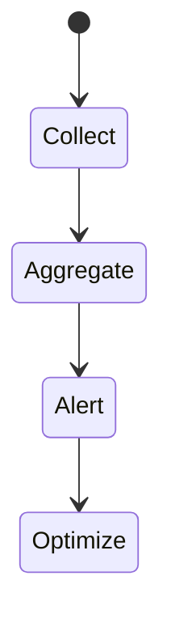
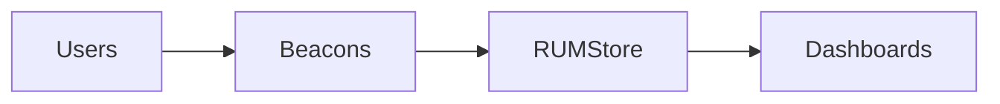

# Real User Monitoring

<TopicMeta />

<Prerequisites />

::: tip Published
This page meets the handbook **published** bar: deep explanation, ≥10 common mistakes, and official references. Further engine-level errata welcome via PR.
:::

## Introduction

**RUM (Real User Monitoring)** collects performance/UX metrics from real sessions—Core Web Vitals, navigation timing, geographic/network slices—not just lab Lighthouse runs.

## Why does it exist?

Lab is a simulation. Real devices, caches, and networks differ. RUM prioritizes what users actually experience.

## Historical Background

Navigation Timing / Paint Timing / Web Vitals APIs enabled standardized field metrics; vendors productized dashboards.

## Mental Model

Beacon selected metrics with attribution (LCP element, INP event) + dimensions (route, device, country). Privacy-safe sampling.

## Internal Workflow

1. Instrument Web Vitals.
2. Attach route/release dimensions.
3. Sample.
4. Dashboard percentiles (p75).
5. Alert on regressions.

## Lifecycle



## Browser Perspective

PerformanceObserver-based collection.

## JavaScript Engine Perspective

Not applicable.

## React Perspective

Map metrics to routes/components.

## Next.js Perspective

Route transitions need SPA-aware vitals.

## Server Perspective

Not applicable.

## Network Perspective

Beacons must not harm page perf.

## Memory Perspective

Not applicable.

## Performance

Keep collectors tiny; prefer `web-vitals` library patterns.

## Production Example

p75 LCP dashboard by route; regression alert after deploy; mobile 4G segment watched.

## Code Examples

```ts
import { onLCP, onINP, onCLS } from 'web-vitals'
function send(metric: { name: string; value: number }) {
  navigator.sendBeacon('/rum', JSON.stringify(metric))
}
onLCP(send); onINP(send); onCLS(send)
```

## Diagrams



## Common Mistakes

1. Only watching averages not percentiles
2. No route dimension
3. Lab-only culture
4. Over-collecting PII
5. Alerting on tiny sample noise
6. Missing a production edge case for 20-observability.rum (#1)
7. Missing a production edge case for 20-observability.rum (#2)
8. Missing a production edge case for 20-observability.rum (#3)
9. Missing a production edge case for 20-observability.rum (#4)
10. Missing a production edge case for 20-observability.rum (#5)


## Best Practices

- p75 Core Web Vitals
- Dimensions: route/device
- Sample thoughtfully

## Anti-patterns

- RUM SDK heavier than the app
- Ignoring field regressions after “Lighthouse green”

## Comparison

| RUM | Synthetic |
| --- | --- |
| Real users | Controlled lab |

## Interview Questions

### Easy

**Q:** What is RUM?

**A:** Collecting performance/UX metrics from real user sessions in the field.

### Medium

**Q:** Why p75 for Web Vitals?

**A:** Google’s CWV thresholds use the 75th percentile to represent a large share of user visits, not just the median.

### Hard

**Q:** How do you attribute an LCP regression via RUM?

**A:** Slice by route/device/release, inspect LCP element types/URLs, correlate with deploy, then confirm in lab traces.

## Summary

- RUM = field truth
- Percentiles + dimensions
- Complement lab tools

## References

- [web.dev — Vital metrics](https://web.dev/articles/vitals)
- [web-vitals library](https://github.com/GoogleChrome/web-vitals)
- [MDN — Performance APIs](https://developer.mozilla.org/en-US/docs/Web/API/Performance_API)

<RelatedTopics />


Prev: [`20-observability.error-tracking`](/20-observability/error-tracking/) · Next: [`20-observability.web-vitals-monitoring`](/20-observability/web-vitals-monitoring/)
