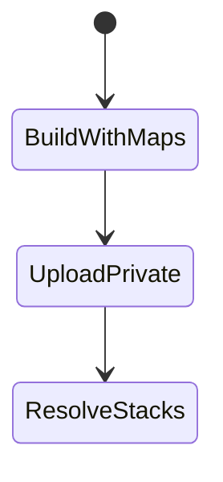
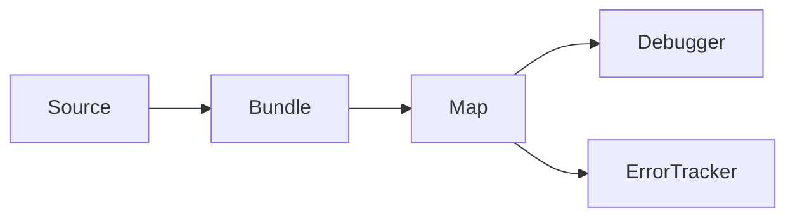

# Source Maps Debugging

<TopicMeta />

<Prerequisites />

::: tip Published
This page meets the handbook **published** bar: deep explanation, ≥10 common mistakes, and official references. Further engine-level errata welcome via PR.
:::

## Introduction

**Source maps** translate positions in transformed/minified bundles back to original source files. They power readable DevTools debugging and readable error-tracker stack traces—when uploaded securely.

## Why does it exist?

Production bundles are unreadable. Without maps, debugging prod is guesswork.

## Historical Background

Source map format evolved with bundlers (webpack/vite/etc.) and error tools (Sentry) standardized upload.

## Mental Model

Map file links generated code ↔ source. Publicly serving maps exposes source; prefer private upload to error trackers.

## Internal Workflow

1. Generate maps in prod builds.
2. Decide publish vs private upload.
3. Configure tracker release + maps.
4. Verify stack traces resolve.
5. Retain maps for active releases.

## Lifecycle



## Browser Perspective

DevTools fetches maps when available.

## JavaScript Engine Perspective

Not applicable.

## React Perspective

Not applicable.

## Next.js Perspective

Configure production browser source maps carefully.

## Server Perspective

Not applicable.

## Network Perspective

Not applicable.

## Memory Perspective

Not applicable.

## Performance

Generating maps costs build time; serving them to all users costs bandwidth—prefer private.

## Production Example

CI uploads maps to Sentry with release SHA; maps not on public CDN.

## Code Examples

```js
// vite.config.js
export default { build: { sourcemap: true } }
```

## Diagrams



## Common Mistakes

1. Public maps unintentionally
2. Maps not uploaded matching release
3. Hidden-source-map misconfigured
4. Deleting maps immediately after deploy
5. Debug with wrong map version
6. Missing a production edge case for 20-observability.source-maps-debugging (#1)
7. Missing a production edge case for 20-observability.source-maps-debugging (#2)
8. Missing a production edge case for 20-observability.source-maps-debugging (#3)
9. Missing a production edge case for 20-observability.source-maps-debugging (#4)
10. Missing a production edge case for 20-observability.source-maps-debugging (#5)


## Best Practices

- Private upload to trackers
- Tie maps to release IDs
- Test one forced error

## Anti-patterns

- Disabling maps forever because of one leak scare without private option
- Commit maps to git

## Comparison

| Public maps | Private upload |
| --- | --- |
| Easy local debug | Safer for IP |

## Interview Questions

### Easy

**Q:** What is a source map?

**A:** A file that maps minified/transformed code positions back to original source locations.

### Medium

**Q:** Why not host source maps publicly?

**A:** They can expose original source code and comments to anyone.

### Hard

**Q:** Stacks still unreadable after upload—why?

**A:** Release mismatch, missing map for a chunk, incorrect URL/protocol, or truncated stacks from cross-origin without CORS on maps.

## Summary

- Maps make prod debuggable
- Prefer private uploads
- Match release versions

## References

- [Source Map spec / MDN](https://developer.mozilla.org/en-US/docs/Glossary/Source_map)
- [Sentry — Source maps](https://docs.sentry.io/platforms/javascript/sourcemaps/)
- [Chrome — Source maps](https://developer.chrome.com/docs/devtools/javascript/source-maps/)

<RelatedTopics />


Prev: [`20-observability.debugging-performance`](/20-observability/debugging-performance/) · Next: [`20-observability.logging`](/20-observability/logging/)
