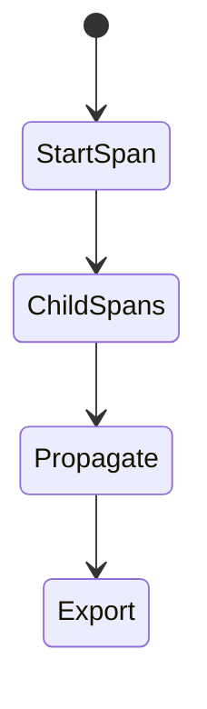
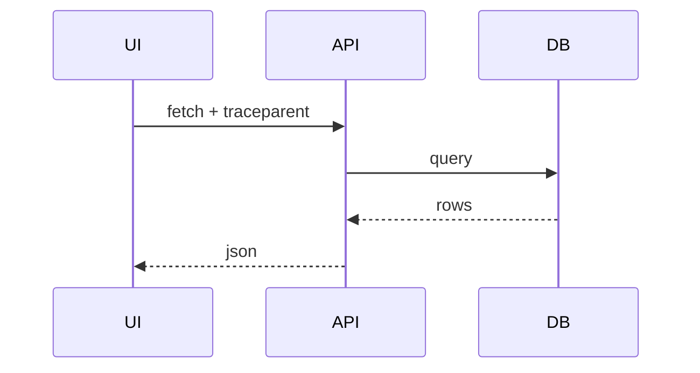

# Frontend Tracing

<TopicMeta />

<Prerequisites />

::: tip Published
This page meets the handbook **published** bar: deep explanation, ≥10 common mistakes, and official references. Further engine-level errata welcome via PR.
:::

## Introduction

**Frontend tracing** creates spans for key UX operations (navigation, API calls) and propagates **trace context** (`traceparent`) to backends so one trace shows browser→API→DB latency.

## Why does it exist?

Logs/metrics alone don’t show causality across services. Traces stitch the journey.

## Historical Background

OpenTelemetry standardized traces/context propagation; browser SDKs matured more recently than server ones.

## Mental Model

Trace = tree/DAG of spans. Browser root span → child fetch spans with propagated headers → server continues. Sample to control volume.

## Internal Workflow

1. Add OTel (or vendor) browser SDK.
2. Instrument fetch/XHR.
3. Propagate context to APIs (CORS expose headers as needed).
4. Sample.
5. Query traces for slow journeys.

## Lifecycle



## Browser Perspective

Keep instrumentation light.

## JavaScript Engine Perspective

Not applicable.

## React Perspective

Custom spans around heavy interactions.

## Next.js Perspective

Not applicable.

## Server Perspective

Must continue the same trace id.

## Network Perspective

traceparent on requests; CORS must allow.

## Memory Perspective

Not applicable.

## Performance

Export batches async; aggressive tracing can hurt—sample.

## Production Example

Checkout button span parents the quote+pay fetches; backend spans show pay service as bottleneck.

## Code Examples

```http
traceparent: 00-4bf92f3577b34da6a3ce929d0e0e4736-00f067aa0ba902b7-01
```

## Diagrams



## Common Mistakes

1. No sampling plan
2. Breaking CORS with custom headers
3. Tracing PII in span attributes
4. Only frontend traces without backend join
5. Mega-spans with no useful names
6. Missing a production edge case for 20-observability.tracing-frontend (#1)
7. Missing a production edge case for 20-observability.tracing-frontend (#2)
8. Missing a production edge case for 20-observability.tracing-frontend (#3)
9. Missing a production edge case for 20-observability.tracing-frontend (#4)
10. Missing a production edge case for 20-observability.tracing-frontend (#5)


## Best Practices

- W3C tracecontext
- Sample + scrub
- Name spans by UX intent

## Anti-patterns

- 100% trace everything in prod forever
- Manual ids that don’t follow the standard

## Comparison

| Traces | Metrics |
| --- | --- |
| Causal path | Aggregates |

## Interview Questions

### Easy

**Q:** What is a span?

**A:** A timed unit of work within a distributed trace, with a name and timestamps.

### Medium

**Q:** What does traceparent do?

**A:** It propagates trace and parent span identifiers across service boundaries so backends can join the same trace.

### Hard

**Q:** Implement tracing across SPA + API with CORS.

**A:** Browser adds traceparent; API allows/exposes headers; sampler configured; scrub attributes; verify end-to-end in collector UI.

## Summary

- Traces connect browser to backend
- Propagate W3C context
- Sample and scrub

## References

- [OpenTelemetry JS](https://opentelemetry.io/docs/languages/js/)
- [W3C Trace Context](https://www.w3.org/TR/trace-context/)
- [OpenTelemetry — Browser](https://opentelemetry.io/docs/languages/js/getting-started/browser/)

<RelatedTopics />


Prev: [`20-observability.web-vitals-monitoring`](/20-observability/web-vitals-monitoring/) · Next: [`20-observability.feature-telemetry`](/20-observability/feature-telemetry/)
