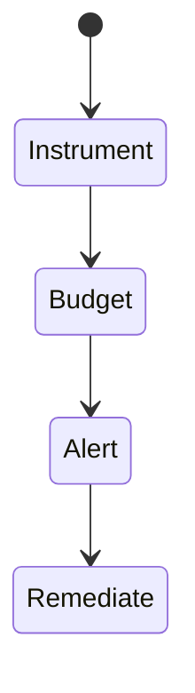
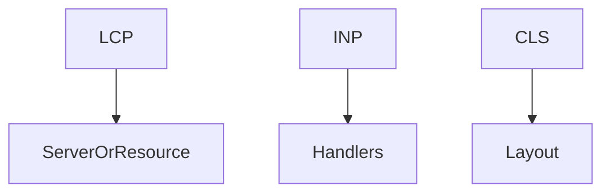

# Web Vitals Monitoring

<TopicMeta />

<Prerequisites />

::: tip Published
This page meets the handbook **published** bar: deep explanation, ≥10 common mistakes, and official references. Further engine-level errata welcome via PR.
:::

## Introduction

**Web Vitals monitoring** focuses on **LCP**, **INP**, and **CLS**—the Core Web Vitals—plus supporting metrics (TTFB, FCP). You collect, attribute, budget, and alert so UX quality is measurable.

## Why does it exist?

These metrics correlate with user experience and are used in SEO/Chrome UX Report ecosystems. Monitoring makes them engineering KPIs.

## Historical Background

FID → replaced by INP as the interactivity vital; tooling evolved attribution APIs.

## Mental Model

Each vital has a primary cause class: LCP (server/resource/render), INP (input delay/processing/presentation), CLS (layout shifts). Attribution tells which.

## Internal Workflow

1. Instrument onXXX from web-vitals.
2. Add attribution where available.
3. Set budgets per route.
4. Watch CrUX/RUM p75.
5. Fix top regressions each sprint.

## Lifecycle



## Browser Perspective

PerformanceObserver under the hood.

## JavaScript Engine Perspective

Not applicable.

## React Perspective

Hydration and handlers affect INP.

## Next.js Perspective

Image/font/script choices heavily affect LCP/CLS.

## Server Perspective

Not applicable.

## Network Perspective

Not applicable.

## Memory Perspective

Not applicable.

## Performance

The point of the topic—optimize based on vitals.

## Production Example

Budget: LCP p75 < 2.5s on `/` and `/product/*`; CI lab check + RUM alert.

## Code Examples

```ts
import { onLCP } from 'web-vitals/attribution'
onLCP((m) => {
  console.log(m.value, m.attribution)
})
```

## Diagrams



## Common Mistakes

1. Optimizing FID forever after INP switch
2. No budgets
3. Ignoring mobile field data
4. CLS from injected ads without slots
5. Celebrating lab-only wins
6. Missing a production edge case for 20-observability.web-vitals-monitoring (#1)
7. Missing a production edge case for 20-observability.web-vitals-monitoring (#2)
8. Missing a production edge case for 20-observability.web-vitals-monitoring (#3)
9. Missing a production edge case for 20-observability.web-vitals-monitoring (#4)
10. Missing a production edge case for 20-observability.web-vitals-monitoring (#5)


## Best Practices

- Track p75 by route
- Use attribution builds
- Pair RUM + lab

## Anti-patterns

- Fake vitals by delaying metric beacons
- Huge third parties with no owner

## Comparison

| Vital | User experience |
| --- | --- |
| LCP | Loading | 
| INP | Responsiveness |
| CLS | Visual stability |

## Interview Questions

### Easy

**Q:** Name the three Core Web Vitals.

**A:** Largest Contentful Paint (LCP), Interaction to Next Paint (INP), Cumulative Layout Shift (CLS).

### Medium

**Q:** What commonly hurts CLS?

**A:** Images/ads without dimensions, late-injected content, webfonts swapping late.

### Hard

**Q:** Improve INP for a complex UI.

**A:** Break up long handlers, defer non-critical work, avoid sync layout, use transitions carefully, profile input delay vs processing time.

## Summary

- Monitor LCP/INP/CLS with budgets
- Attribution guides fixes
- Field p75 is the scoreboard

## References

- [web.dev — Core Web Vitals](https://web.dev/articles/vitals)
- [web.dev — INP](https://web.dev/articles/inp)
- [Chrome UX Report](https://developer.chrome.com/docs/crux/)

<RelatedTopics />


Prev: [`20-observability.rum`](/20-observability/rum/) · Next: [`20-observability.tracing-frontend`](/20-observability/tracing-frontend/)
