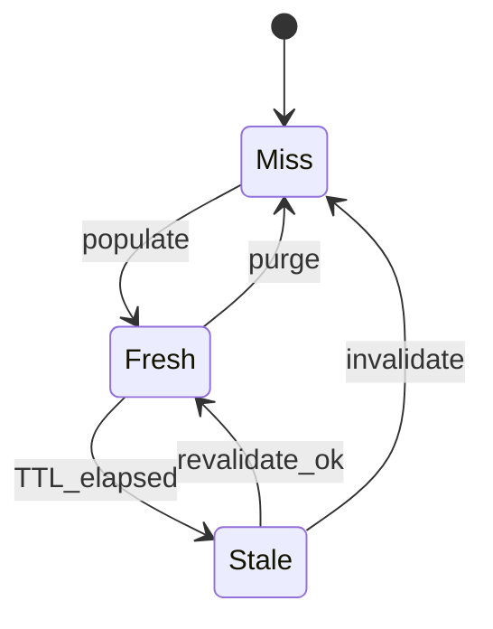
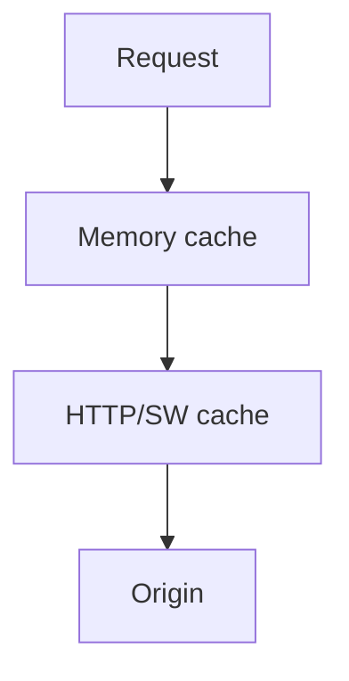
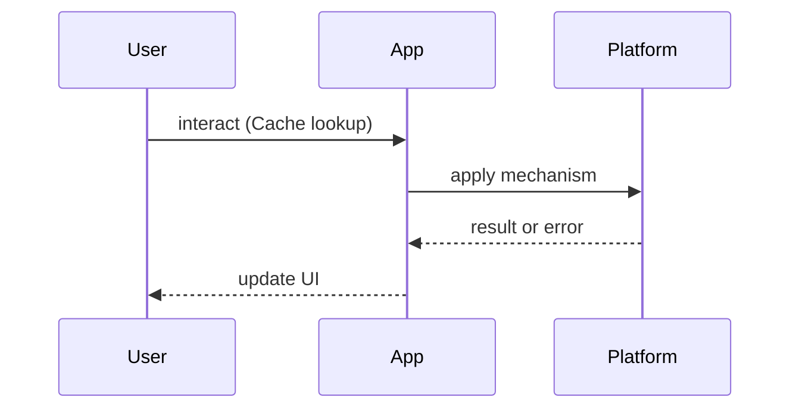

# Caching Strategies

<TopicMeta />

<Prerequisites />

::: tip Published
This page meets the handbook **published** bar: deep explanation, ≥10 common mistakes, and official references. Further engine-level errata welcome via PR.
:::

## Introduction

**Caching Strategies** decide which bytes you reuse, for how long, and how you prove they are still valid. Frontend engineers touch HTTP caches, CDN edges, in-memory/query caches, `Cache Storage` via service workers, and sometimes local persistence.

Canonical network caching: [/02-internet/http-caching/](/02-internet/http-caching/). SW strategies: [/23-pwa-and-offline/caching-strategies-sw/](/23-pwa-and-offline/caching-strategies-sw/).

## Why does it exist?

Users feel latency; origins feel load. Caching is the main lever for both — but a wrong cache creates ghost bugs: stale prices, logged-out UI showing private data, or “hard refresh fixed it.”

You need an explicit policy per resource class (immutable assets, personalized HTML, list APIs, mutations).

## Historical Background

HTTP caching evolved through `Expires`, `Cache-Control`, validators (`ETag`/`Last-Modified`), and CDN surrogates. SPAs added client memory caches; PWAs added Cache API; modern data libraries (React Query / TanStack Query) standardized stale-while-revalidate in application memory.

## Mental Model

Caches are **layered lies with TTLs**:

| Layer | Typical contents | Invalidation |
| --- | --- | --- |
| CDN / browser HTTP | hashed assets, some HTML/API | TTL, purge, validators |
| App memory (Query) | normalized API data | mutation, focus, TTL |
| Service Worker | offline shells, GETs | activate + versioning |
| Persistent (IDB) | offline drafts | sync protocols |

Ask: who may see this entry, and what is the blast radius if it is wrong?

## Internal Workflow

1. Classify resources (public immutable / public fresh / private / realtime)  
2. Assign headers or app-cache policies  
3. Define mutation → invalidation edges  
4. Add observability (cache hit ratio, stale serves)  
5. Test “user while offline / multi-tab / deploy” scenarios

## Lifecycle



## Browser Perspective

Disk/memory HTTP cache + Cache API. DevTools Network “Disable cache” and Application → Cache Storage are daily tools. Private mode and Clear Site Data reset assumptions.

## JavaScript Engine Perspective

In-memory structures (Maps of queries) live on the heap; unbounded caches cause GC pressure.

## React Perspective

Libraries expose `staleTime`/`gcTime`. Tie invalidation to mutations; avoid refetch storms on every mount without need.

## Next.js Perspective

Full Route Cache, Data Cache, and Router Cache are distinct. Misreading which layer served a response is the #1 Next caching bug.

## Server Perspective

Origins should emit correct `Cache-Control`/`Vary`. Personalized responses must `Vary` on the right headers or use `private`.

## Network Perspective

CDN hit ratio and revalidation RTTs dominate perceived performance for static and semi-static content.

## Memory Perspective

Cap client caches; prefer keyed eviction. Do not cache secrets in `localStorage` “because it’s easy.”

## Performance

Immutable hashed assets → long `max-age` + `immutable`. HTML/API → short TTL or SWR. Measure TTFB vs cache hit, not only Lighthouse once.

## Production Example

A news site serves HTML at the edge with 60s SWR, images immutable, and article JSON with ETag revalidation. Breaking news uses surrogate purge keys. Client query cache TTL is shorter than CDN for personalization widgets.

## Code Examples

```http
# Immutable build asset
Cache-Control: public, max-age=31536000, immutable

# Personalized API
Cache-Control: private, no-store
```

```ts
// App-level SWR sketch
queryClient.setQueryDefaults(['catalog'], {
  staleTime: 60_000,
  gcTime: 15 * 60_000,
})
```

## Diagrams





## Common Mistakes

1. Caching personalized HTML at a shared CDN key
2. Using `localStorage` as a general HTTP cache
3. Never invalidating after mutations
4. Treating Next.js caches as one blob
5. Long-lived SW caches without versioning
6. Ignoring `Vary` and serving wrong language/user
7. Missing a production edge case for 21-frontend-system-design.caching-strategies (#1)
8. Missing a production edge case for 21-frontend-system-design.caching-strategies (#2)
9. Missing a production edge case for 21-frontend-system-design.caching-strategies (#3)
10. Missing a production edge case for 21-frontend-system-design.caching-strategies (#4)


## Best Practices

- Hash filenames for static assets
- Document TTL + invalidation per resource class
- Prefer validators for semi-static APIs
- Separate public vs private caches

## Anti-patterns

- “Cache everything” with a week TTL
- Manual cache busting via random query strings on every request
- Silent fallback to stale private data after logout

## Comparison

| Strategy | Freshness | Latency | Complexity |
| --- | --- | --- | --- |
| Network-only | High | High | Low |
| Cache-first | Risk stale | Low | Medium |
| SWR | Balanced | Low+bg | Medium |
| Mutable + invalidate | High after write | Medium | Higher |

## Interview Questions

### Easy

**Q:** Name three frontend-relevant cache layers.

**A:** Browser/CDN HTTP cache, application memory (e.g. TanStack Query), and service worker Cache Storage. Details in [/02-internet/http-caching/](/02-internet/http-caching/).

### Medium

**Q:** How does stale-while-revalidate behave for users?

**A:** Serve cached value immediately, refresh in background, update UI when new data arrives. Great for feeds; dangerous for balances without reconciliation.

### Hard

**Q:** Design caching for a multi-tenant SaaS dashboard.

**A:** Private, tenant-scoped keys; short TTL or no-store for authz-sensitive data; immutable assets public; purge on permission changes; never share CDN entries across tenants.

## Summary

- Classify resources before choosing TTLs
- Invalidation is the hard part
- Layers compose; know which served you
- Private data needs private caches

## References

- [MDN — HTTP caching](https://developer.mozilla.org/en-US/docs/Web/HTTP/Caching)
- [RFC 9111 — HTTP Caching](https://www.rfc-editor.org/rfc/rfc9111)
- [web.dev — HTTP Cache](https://web.dev/articles/http-cache)

<RelatedTopics />


Prev: [`21-frontend-system-design.scaling-react-applications`](/21-frontend-system-design/scaling-react-applications/) · Next: [`21-frontend-system-design.optimistic-ui`](/21-frontend-system-design/optimistic-ui/)
