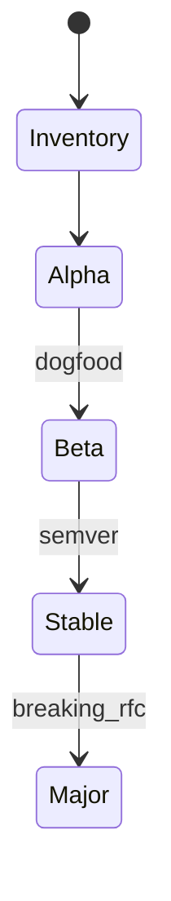
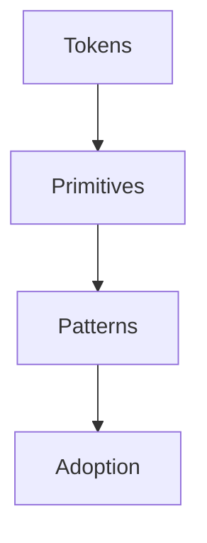
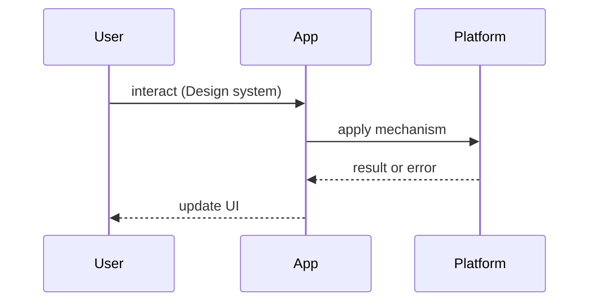

# Designing Design Systems

<TopicMeta />

<Prerequisites />

::: tip Published
This page meets the handbook **published** bar: deep explanation, ≥10 common mistakes, and official references. Further engine-level errata welcome via PR.
:::

## Introduction

**Designing Design Systems** is the product-and-platform practice of creating shared UI language (tokens, components, patterns) that multiple teams ship from. It overlaps [/15-architecture/design-systems/](/15-architecture/design-systems/) with org process and system-design trade-offs.

## Why does it exist?

Without a system, every squad reinvents buttons, spacing, and a11y bugs. With a poorly governed system, teams fork and the “system” becomes museumware. Design systems exist to raise the quality floor and speed delivery — not to freeze UI forever.

## Historical Background

Style guides → pattern libraries → tokenized design systems (Salesforce Lightning, Material, Spectrum) → code+Figma parity pipelines. Today: CSS variables/tokens, typed component APIs, and adoption metrics.

## Mental Model

**Tokens → primitives → patterns → products**:

- Tokens: color, space, type, elevation  
- Primitives: Button, Input, Dialog  
- Patterns: forms, empty states, data tables  
- Governance: versioning, RFC, contribution path

## Internal Workflow

1. Inventory UI duplication  
2. Define tokens  
3. Build accessible primitives  
4. Document usage + do/don’t  
5. Version & migrate  
6. Measure adoption

## Lifecycle



## Browser Perspective

Prefer native semantics; components wrap platform behavior, not replace it carelessly.

## JavaScript Engine Perspective

Not applicable.

## React Perspective

Composable APIs (slots/compound components) beat boolean prop explosion — [/22-design-patterns/compound-components/](/22-design-patterns/compound-components/).

## Next.js Perspective

Ship RSC-friendly presentational components; isolate client interactivity.

## Server Perspective

Not applicable.

## Network Perspective

Tree-shakeable packages; avoid mega barrel imports.

## Memory Perspective

Not applicable.

## Performance

Icons and heavy editors should be lazy. Theme switching via CSS variables avoids runtime restyles of every node in JS.

## Production Example

A platform team publishes `@acme/ui` with tokens as CSS variables, Chromatic visual tests, and a quarterly deprecation train. Product squads contribute via RFC, not silent forks.

## Code Examples

```css
:root {
  --space-2: 0.5rem;
  --color-fg: #111;
  --focus-ring: 0 0 0 3px Highlight;
}
```

```tsx
export function Button({ variant = 'primary', ...props }: ButtonProps) {
  return <button className={cx('btn', variant)} {...props} />
}
```

## Diagrams





## Common Mistakes

1. Building 120 components before three product use cases
2. No accessibility acceptance criteria
3. Boolean prop explosion instead of composition
4. Zero migration path on breaking changes
5. Design tokens that only exist in Figma
6. Measuring vanity “components count” instead of adoption
7. Missing a production edge case for 21-frontend-system-design.designing-design-systems (#1)
8. Missing a production edge case for 21-frontend-system-design.designing-design-systems (#2)
9. Missing a production edge case for 21-frontend-system-design.designing-design-systems (#3)
10. Missing a production edge case for 21-frontend-system-design.designing-design-systems (#4)


## Best Practices

- Start from real product screens
- Semver + changelogs
- A11y as exit criteria
- Contribution RFC process

## Anti-patterns

- Forking the library per product
- Wrapping Material/Chakra without an escape hatch and calling it done

## Comparison

| Strategy | Speed now | Speed later |
| --- | --- | --- |
| No system | Fast | Slow |
| Rigid mega-kit | Slow | Medium |
| Tokenized evolving system | Medium | Fast |

## Interview Questions

### Easy

**Q:** What belongs in a design system vs an app?

**A:** Reusable primitives/patterns/tokens in the system; domain workflows in the app.

### Medium

**Q:** How do you version breaking visual changes?

**A:** Semver majors, codemods when possible, dual-run deprecation windows, visual regression tests.

### Hard

**Q:** Design governance for 8 squads and one platform team.

**A:** RFC intake, office hours, adoption metrics, clear ownership of tokens vs product patterns, kill vanity components.

## Summary

- Tokens then primitives then patterns
- Governance beats galleries
- A11y and semver are mandatory
- Adoption is the success metric

## References

- [Design Tokens Community Group](https://design-tokens.github.io/community-group/)
- [WCAG 2.2](https://www.w3.org/TR/WCAG22/)
- [React Aria / APG patterns](https://www.w3.org/WAI/ARIA/apg/)

<RelatedTopics />


Prev: [`21-frontend-system-design.internationalized-apps`](/21-frontend-system-design/internationalized-apps/)
