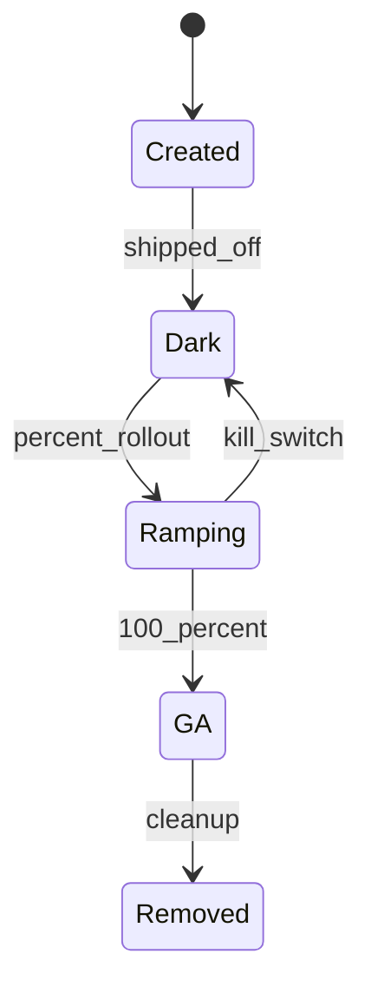
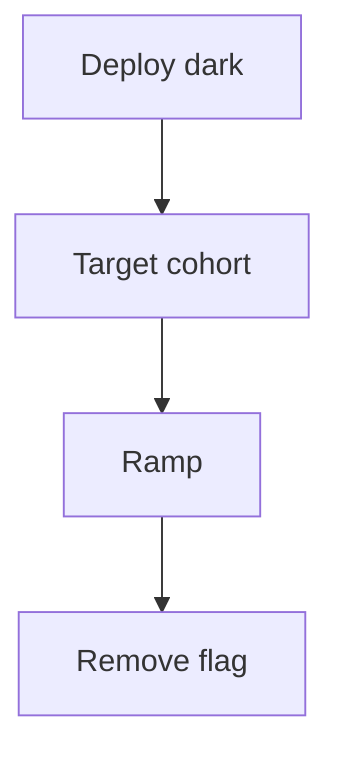
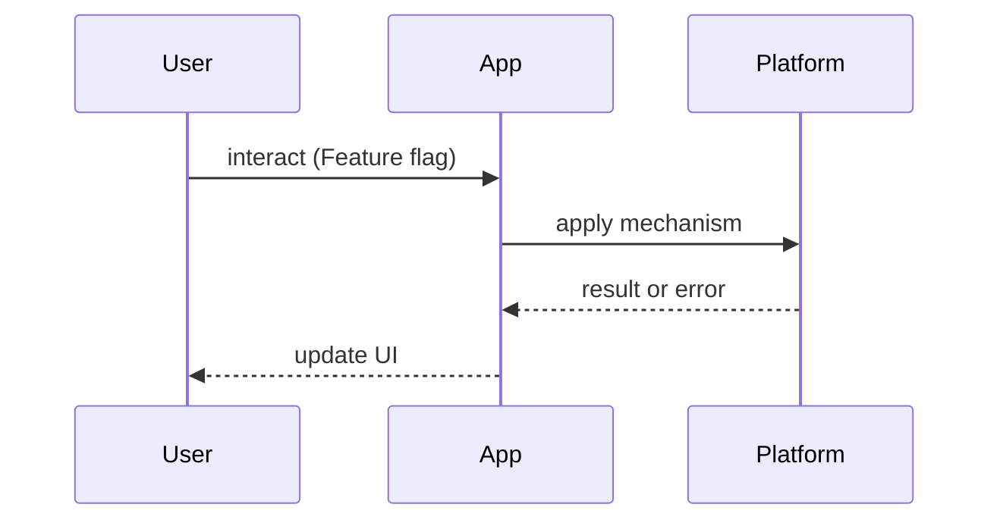

# Feature Flags

<TopicMeta />

<Prerequisites />

::: tip Published
This page meets the handbook **published** bar: deep explanation, ≥10 common mistakes, and official references. Further engine-level errata welcome via PR.
:::

## Introduction

**Feature Flags** (toggles) let you ship code dark and turn behavior on per user, cohort, or percentage. They are an operational control plane for frontend and backend alike.

Related: [/19-deployment/rollback-strategies/](/19-deployment/rollback-strategies/), [/16-testing/](/16-testing/).

## Why does it exist?

Deploying should be boring; releasing is risky. Flags enable progressive delivery, experiments, kill switches, and trunk-based development without long-lived feature branches.

## Historical Background

Popularized by continuous delivery culture (ThoughtWorks toggles, LaunchDarkly-era SaaS). Frontend flags expanded with experimentation platforms and edge config.

## Mental Model

A flag is a **named decision function**: `evaluate(flagKey, context) → variation`. Treat flags as temporary product inventory with owners and expiry dates — not permanent `if` spaghetti.

## Internal Workflow

1. Create flag + default  
2. Gate UI/API paths  
3. Release progressively  
4. Monitor metrics/errors  
5. Remove flag + dead code

## Lifecycle



## Browser Perspective

Client-side evaluation is visible to users — never use client flags as authorization.

## JavaScript Engine Perspective

Not applicable.

## React Perspective

Avoid thrashing by loading flag bootstrap before painting gated UI; use stable context.

## Next.js Perspective

Evaluate sensitive flags on the server; bootstraps can hydrate client SDKs.

## Server Perspective

Source of truth for entitlements; frontend flags are UX convenience.

## Network Perspective

Flag config fetch is on the critical path — cache and timeout safely.

## Memory Perspective

SDKs should not retain huge targeting rules unused.

## Performance

Bootstrap flags early to avoid flicker. Bundle both sides of a flag briefly; delete promptly to reclaim bytes.

## Production Example

A checkout redesign ramps 5% → 25% → 100% with a kill switch tied to error budgets. After GA, a scheduled issue removes the flag within two weeks.

## Code Examples

```tsx
function Checkout() {
  const enabled = useFlag('checkout_v2')
  return enabled ? <CheckoutV2 /> : <CheckoutLegacy />
}
```

```ts
// Defaults must be safe if the flag service is down
const defaults = { checkout_v2: false }
```

## Diagrams





## Common Mistakes

1. Using flags as security controls in the client
2. Never deleting old flags
3. Flickering UI while flags load
4. One mega-flag for unrelated changes
5. No owner/expiry on flags
6. Testing only the flag-on path
7. Missing a production edge case for 21-frontend-system-design.feature-flags (#1)
8. Missing a production edge case for 21-frontend-system-design.feature-flags (#2)
9. Missing a production edge case for 21-frontend-system-design.feature-flags (#3)
10. Missing a production edge case for 21-frontend-system-design.feature-flags (#4)


## Best Practices

- Safe defaults on outage
- Server-side checks for entitlements
- Flag cleanup sprints
- Observability per variation

## Anti-patterns

- Config-as-codebase with hundreds of permanent toggles
- Coupling experiments to long-lived technical debt flags

## Comparison

| Mechanism | Decouples deploy? | Complexity |
| --- | --- | --- |
| Feature branch | No | Merge pain |
| Feature flag | Yes | Cleanup debt |
| Separate app | Yes | Ops heavy |

## Interview Questions

### Easy

**Q:** Why use feature flags?

**A:** Ship code without releasing behavior; enable progressive delivery and fast kill switches.

### Medium

**Q:** Why must authz not rely on client-evaluated flags?

**A:** Clients can be modified; flags are visible. Enforce permissions on the server. See [/17-security/](/17-security/) topics.

### Hard

**Q:** How do flags interact with SSR/hydration?

**A:** Evaluate consistently on server and client for the first paint; mismatch causes hydration errors or flicker. Bootstrap the same snapshot.

## Summary

- Decouple deploy from release
- Safe defaults + cleanup
- Never as sole authorization
- Avoid UI flicker

## References

- [MariaDB/Martin Fowler — Feature Toggles](https://martinfowler.com/articles/feature-toggles.html)
- [OpenFeature](https://openfeature.dev/)

<RelatedTopics />


Prev: [`21-frontend-system-design.pagination`](/21-frontend-system-design/pagination/) · Next: [`21-frontend-system-design.realtime-applications`](/21-frontend-system-design/realtime-applications/)
