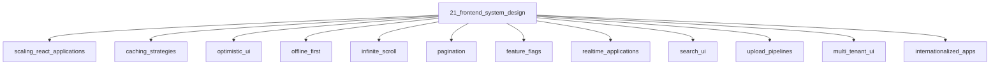

# Frontend System Design

## Scope

Product-scale frontend design problems and trade-offs

## Prerequisites

See the learning paths and each topic's prerequisites in the registry.

## Topics in order

- [Scaling React Applications](/21-frontend-system-design/scaling-react-applications/) — senior, ~45 min
- [Caching Strategies](/21-frontend-system-design/caching-strategies/) — mid, ~40 min
- [Optimistic UI](/21-frontend-system-design/optimistic-ui/) — mid, ~30 min
- [Offline First](/21-frontend-system-design/offline-first/) — mid, ~30 min
- [Infinite Scroll](/21-frontend-system-design/infinite-scroll/) — mid, ~30 min
- [Pagination](/21-frontend-system-design/pagination/) — junior, ~25 min
- [Feature Flags](/21-frontend-system-design/feature-flags/) — mid, ~30 min
- [Realtime Applications](/21-frontend-system-design/realtime-applications/) — senior, ~40 min
- [Search UI](/21-frontend-system-design/search-ui/) — mid, ~30 min
- [Upload Pipelines](/21-frontend-system-design/upload-pipelines/) — mid, ~30 min
- [Multi-Tenant UI](/21-frontend-system-design/multi-tenant-ui/) — senior, ~35 min
- [Internationalized Apps](/21-frontend-system-design/internationalized-apps/) — mid, ~35 min
- [Designing Design Systems](/21-frontend-system-design/designing-design-systems/) — senior, ~40 min

## Module knowledge graph

## Suggested learning paths

Browse [Learning Paths](/learning-paths/).
