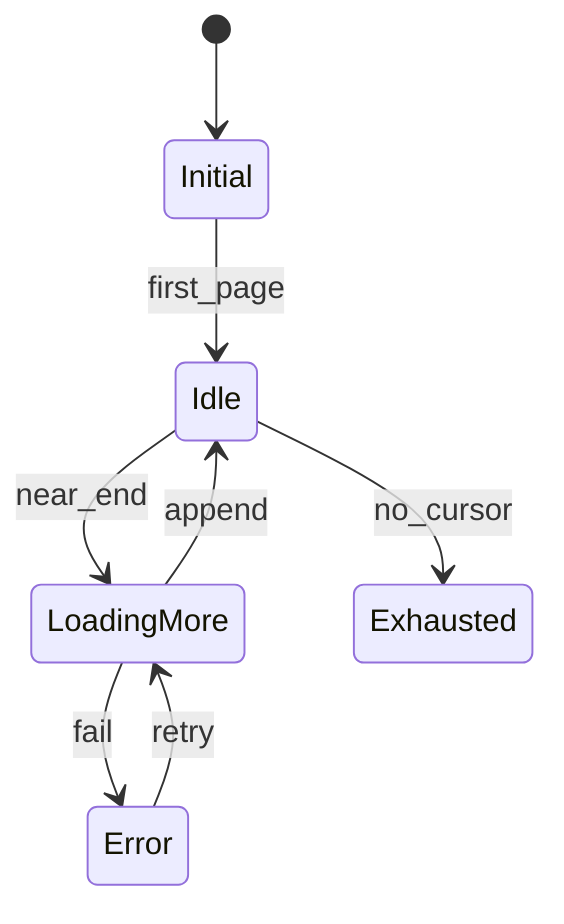
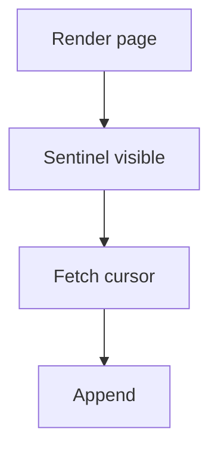
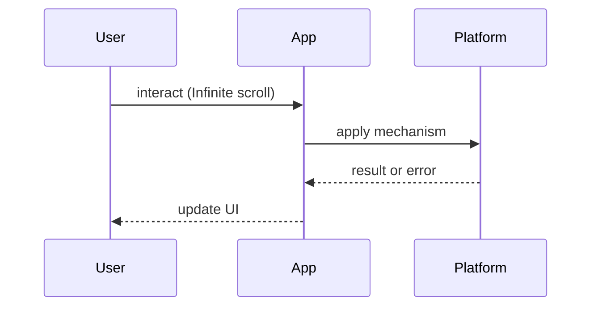

# Infinite Scroll

<TopicMeta />

<Prerequisites />

::: tip Published
This page meets the handbook **published** bar: deep explanation, ≥10 common mistakes, and official references. Further engine-level errata welcome via PR.
:::

## Introduction

**Infinite Scroll** loads the next page of content as the user approaches the end of a list. It is a UX pattern on top of pagination APIs, with serious implications for accessibility, performance, and shareable positions.

Pair with [/21-frontend-system-design/pagination/](/21-frontend-system-design/pagination/) and [/09-browser-apis/intersection-observer/](/09-browser-apis/intersection-observer/).

## Why does it exist?

Feeds and catalogs want uninterrupted browsing. Page numbers interrupt flow but help orientation. Infinite scroll maximizes engagement for homogenous streams — and harms users who need “footer” content or a sense of place if designed naively.

## Historical Background

Popularized by social feeds; criticized for accessibility and SEO. Modern practice: cursor pagination + virtualization + “jump to top,” landmarks, and sometimes hybrid page restoration via URL/query.

## Mental Model

**Window over a cursor stream**: keep a sliding set of loaded pages, fetch when the sentinel enters the viewport, recycle DOM via virtualization, and remember that “page 1” is no longer a stable concept unless you encode cursors in the URL.

## Internal Workflow

1. API: cursor/limit, stable sort  
2. Client: append pages, dedupe ids  
3. Observe sentinel / virtualizer  
4. Handle errors/retry without duplicate rows  
5. Provide alternative navigation for a11y

## Lifecycle



## Browser Perspective

IntersectionObserver schedules loads without scroll handler spam. Layout thrash appears if you measure DOM in loops.

## JavaScript Engine Perspective

Huge arrays of rows retain memory; virtualize.

## React Perspective

Keys must be stable ids. Reset query state when filters change.

## Next.js Perspective

SSR the first page for LCP/SEO; hydrate the infinite tail on the client.

## Server Perspective

Cursor pagination beats `OFFSET` at depth.

## Network Perspective

Prefetch next page carefully to avoid waste on bounce.

## Memory Perspective

Unmount offscreen rows; cap cached pages if needed.

## Performance

Virtualization is mandatory past a few hundred complex rows. Watch scroll jank (INP) and image decode costs in feeds.

## Production Example

A commerce grid SSRs 24 products, then infinite-loads with cursors. Filter changes reset the list and write `?cursor=` for shareable deep links when possible.

## Code Examples

```tsx
function Feed() {
  const { data, fetchNextPage, hasNextPage, isFetchingNextPage } = useInfiniteQuery({
    queryKey: ['feed'],
    queryFn: ({ pageParam }) => api.feed({ cursor: pageParam }),
    getNextPageParam: (last) => last.nextCursor,
    initialPageParam: undefined as string | undefined,
  })
  return (
    <>
      {data?.pages.flatMap((p) => p.items).map((item) => <Card key={item.id} {...item} />)}
      <div ref={sentinelRef} />
      {isFetchingNextPage && <Spinner />}
      {!hasNextPage && <p>End of results</p>}
    </>
  )
}
```

## Diagrams





## Common Mistakes

1. Using page offsets that skip/duplicate on inserts
2. No virtualization for long feeds
3. Trap keyboard/screen-reader users with endless content and no landmarks
4. Losing filter state on load-more
5. Duplicate keys when pages overlap
6. Not resetting on sort/filter change
7. Missing a production edge case for 21-frontend-system-design.infinite-scroll (#1)
8. Missing a production edge case for 21-frontend-system-design.infinite-scroll (#2)
9. Missing a production edge case for 21-frontend-system-design.infinite-scroll (#3)
10. Missing a production edge case for 21-frontend-system-design.infinite-scroll (#4)


## Best Practices

- Cursor pagination
- Virtualize heavy rows
- Announce loading to AT
- Offer “load more” button fallback

## Anti-patterns

- Infinite scroll on multi-section marketing pages that hide the footer
- Auto-playing media as rows mount

## Comparison

| Pattern | Orientation | Engagement |
| --- | --- | --- |
| Page numbers | High | Medium |
| Load more button | Medium | Medium |
| Infinite scroll | Low | High |

## Interview Questions

### Easy

**Q:** What API style should back infinite scroll?

**A:** Cursor-based pagination with a stable sort — see [/21-frontend-system-design/pagination/](/21-frontend-system-design/pagination/).

### Medium

**Q:** How do you keep memory stable in a long feed?

**A:** Windowing/virtualization so offscreen rows unmount; optionally drop far pages from cache.

### Hard

**Q:** How do you restore scroll position when navigating back to a feed?

**A:** Cache pages + scroll offset (or cursor + index), use list virtualizer scrollTo, and handle remount vs keep-alive routes.

## Summary

- Cursors + sentinel + virtualization
- Reset on filter changes
- Mind a11y and footers
- SSR first page when SEO matters

## References

- [MDN — Intersection Observer](https://developer.mozilla.org/en-US/docs/Web/API/Intersection_Observer_API)
- [TanStack Virtual](https://tanstack.com/virtual/latest)

<RelatedTopics />


Prev: [`21-frontend-system-design.offline-first`](/21-frontend-system-design/offline-first/) · Next: [`21-frontend-system-design.pagination`](/21-frontend-system-design/pagination/)
