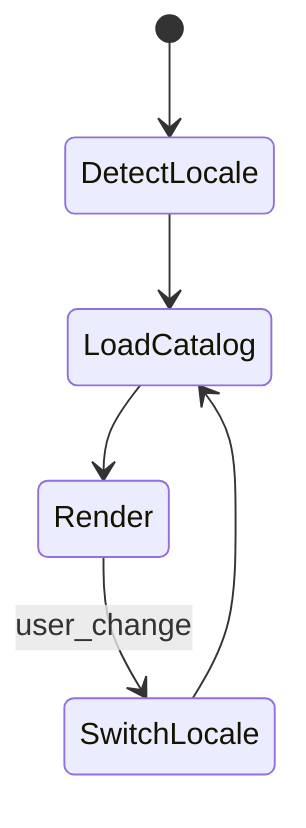
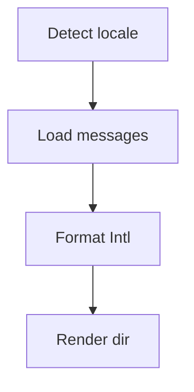
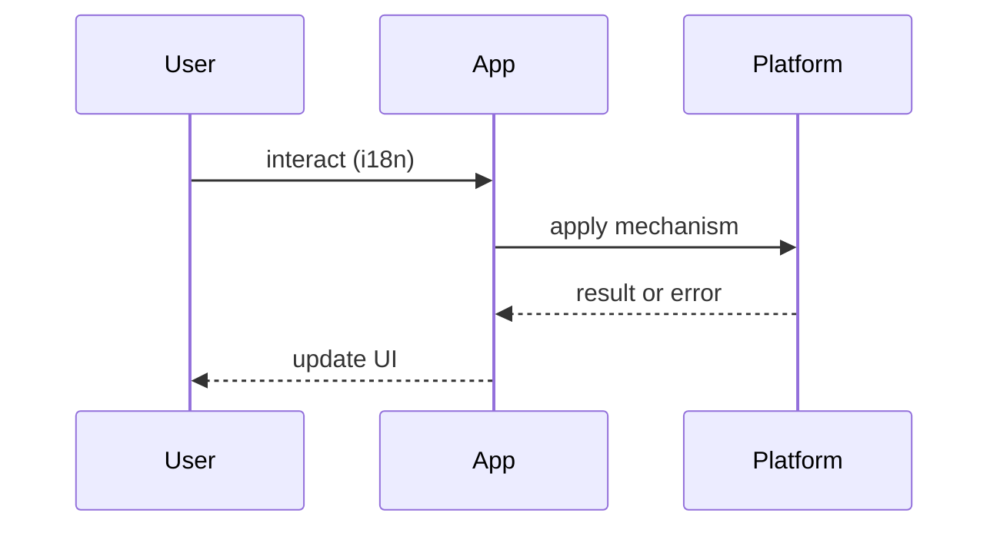

# Internationalized Apps

<TopicMeta />

<Prerequisites />

::: tip Published
This page meets the handbook **published** bar: deep explanation, ≥10 common mistakes, and official references. Further engine-level errata welcome via PR.
:::

## Introduction

**Internationalized Apps** separate translatable copy and locale-aware formatting from application logic so the product can serve many languages and regions. Internationalization (i18n) is the architecture; localization (l10n) is the content.

Related: [/05-css/](/05-css/), [/11-nextjs/](/11-nextjs/).

## Why does it exist?

Hard-coded English strings and `toLocaleString` sprinkled randomly do not scale. Poor i18n breaks layouts (German length), RTL mirroring, and legal date/currency expectations.

## Historical Background

gettext → ICU MessageFormat → modern libraries (FormatJS, i18next) and framework routing (`next-intl`, App Router locales). Browser `Intl` APIs standardized formatting.

## Mental Model

**Locale + catalog + formatting**:

- Locale from URL/cookie/Accept-Language  
- Messages from catalogs with ICU plurals/selects  
- Numbers/dates/currency via `Intl`  
- Layout direction via `dir` and logical CSS

## Internal Workflow

1. Extract messages  
2. Choose locale detection + routing  
3. Translate with context  
4. Pseudo-loc in CI  
5. RTL + long-string QA

## Lifecycle



## Browser Perspective

`Intl` + `document.documentElement.lang/dir`. Prefer logical properties (`margin-inline-start`).

## JavaScript Engine Perspective

Large catalogs impact parse cost — split by route/namespace.

## React Perspective

Keep locale in context; avoid string concat for sentences.

## Next.js Perspective

Built-in i18n routing patterns; render locale on the server for SEO.

## Server Perspective

Locale-aware emails and OG tags too.

## Network Perspective

Cache catalogs aggressively; HTML may vary by locale (`Vary`).

## Memory Perspective

Do not load all locales at once on the client.

## Performance

Split catalogs; SSR correct locale to avoid flash of wrong language.

## Production Example

A global SaaS uses `/en/`, `/de/` routes, ICU messages, and pseudo-loc in CI. Currency formatting always uses `Intl.NumberFormat` with explicit currency codes.

## Code Examples

```ts
const price = new Intl.NumberFormat(locale, { style: 'currency', currency: 'EUR' }).format(19)

// ICU-style plural (library-specific API)
t('cart.items', { count })
```

```html
<html lang="ar" dir="rtl">
```

## Diagrams





## Common Mistakes

1. Concatenating translated sentence fragments
2. Forgetting RTL mirroring
3. Using JS date string parsing for display
4. Shipping one giant catalog to every page
5. Machine-translating without linguistic QA
6. Locale flash on first paint
7. Missing a production edge case for 21-frontend-system-design.internationalized-apps (#1)
8. Missing a production edge case for 21-frontend-system-design.internationalized-apps (#2)
9. Missing a production edge case for 21-frontend-system-design.internationalized-apps (#3)
10. Missing a production edge case for 21-frontend-system-design.internationalized-apps (#4)


## Best Practices

- ICU MessageFormat for plurals
- Logical CSS properties
- Pseudo-localization in CI
- Locale in the URL for public pages

## Anti-patterns

- Flags-as-language switchers exclusively (languages ≠ countries)
- Hard-coded `mm/dd/yyyy` everywhere

## Comparison

| Approach | SEO | Flexibility |
| --- | --- | --- |
| URL locale prefix | Strong | Common |
| Cookie only | Weak | Easy to mis-cache |
| Subdomain per locale | Strong | Ops cost |

## Interview Questions

### Easy

**Q:** Difference between i18n and l10n?

**A:** i18n prepares the software; l10n supplies locale-specific translations and assets.

### Medium

**Q:** Why avoid string concatenation for UI copy?

**A:** Word order differs by language; translators need full sentences with placeholders.

### Hard

**Q:** How do you internationalize a date picker and an RTL layout together?

**A:** Locale-aware calendars, `Intl`, logical CSS, mirrored navigation, and QA with pseudo-loc + real RTL locales.

## Summary

- Catalogs + Intl + locale routing
- No sentence concatenation
- Logical CSS for RTL
- Pseudo-loc catches layout bugs

## References

- [ECMA-402 Intl](https://tc39.es/ecma402/)
- [ICU MessageFormat](https://unicode-org.github.io/icu/userguide/format_parse/messages/)
- [W3C — Internationalization](https://www.w3.org/International/)

<RelatedTopics />


Prev: [`21-frontend-system-design.multi-tenant-ui`](/21-frontend-system-design/multi-tenant-ui/) · Next: [`21-frontend-system-design.designing-design-systems`](/21-frontend-system-design/designing-design-systems/)
