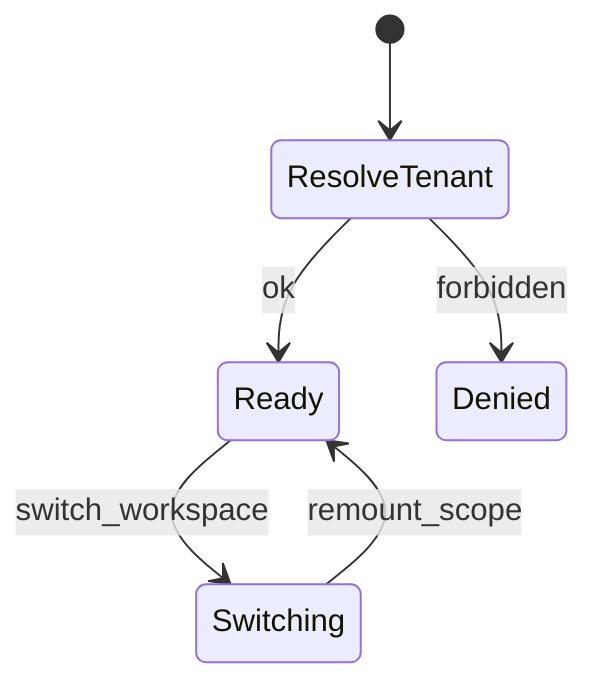
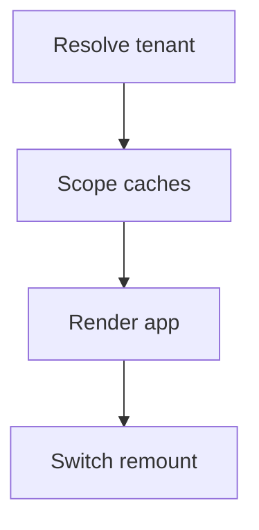
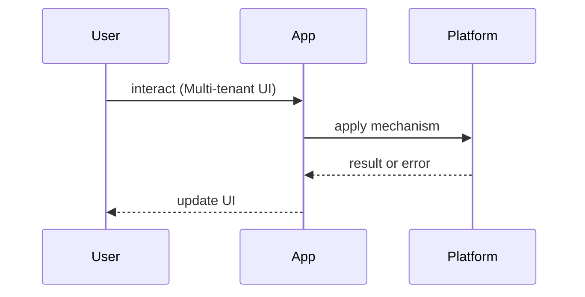

# Multi-Tenant UI

<TopicMeta />

<Prerequisites />

::: tip Published
This page meets the handbook **published** bar: deep explanation, ≥10 common mistakes, and official references. Further engine-level errata welcome via PR.
:::

## Introduction

**Multi-Tenant UI** serves many organizations (tenants) from one application while preventing data bleed and supporting tenant-specific branding/config. Isolation is a security property that the UI must respect, not only the API.

Related: [/17-security/](/17-security/), [/21-frontend-system-design/caching-strategies/](/21-frontend-system-design/caching-strategies/).

## Why does it exist?

SaaS economics demand shared apps. A single wrong cache key or global store can show Tenant A’s data to Tenant B — a career-ending class of bug.

## Historical Background

From subdomain-per-tenant classic SaaS to path-based tenancy and modern “workspace switchers” inside one origin. Edge middleware now often resolves tenant before render.

## Mental Model

**Tenant context is ambient but explicit**: every fetch, cache key, and route guard carries `tenantId`. Visual theming is cosmetic; authorization is server-enforced; the UI fails closed on missing context.

## Internal Workflow

1. Resolve tenant (subdomain / path / header / switcher)  
2. Load tenant config/theme  
3. Scope all client caches  
4. Guard navigation on membership  
5. Test cross-tenant cache contamination

## Lifecycle



## Browser Perspective

Storage partitioning: clear or namespace `localStorage`/IDB by tenant. Prefer not storing sensitive cross-tenant data locally.

## JavaScript Engine Perspective

Not applicable.

## React Perspective

Remount trees on tenant switch (`key={tenantId}`) to drop residual state.

## Next.js Perspective

Middleware tenant resolution; never cache HTML across tenants at CDN without vary keys.

## Server Perspective

Authz must verify membership on every request.

## Network Perspective

CDN keys include tenant; `Cache-Control: private` for tenant HTML.

## Memory Perspective

Flush query caches on switch.

## Performance

Tenant theme tokens should be small CSS variables, not full CSS rebuilds per page.

## Production Example

A B2B app uses `/:workspaceSlug/...` routes, query keys `[workspaceId, 'projects']`, and remounts the app shell on switch. CDN caches only hashed public assets.

## Code Examples

```tsx
const TenantContext = createContext<{ tenantId: string } | null>(null)

export function TenantScope({ tenantId, children }: { tenantId: string; children: React.ReactNode }) {
  return (
    <TenantContext.Provider value={{ tenantId }} key={tenantId}>
      {children}
    </TenantContext.Provider>
  )
}

// queryKey: [tenantId, 'invoices']
```

## Diagrams





## Common Mistakes

1. Global query caches without tenant keys
2. CDN caching personalized tenant pages publicly
3. Client-only “hiding” of other tenants’ nav items as security
4. Leaking tenant ids into third-party analytics without policy
5. Not remounting on workspace switch
6. Shared `localStorage` keys across tenants
7. Missing a production edge case for 21-frontend-system-design.multi-tenant-ui (#1)
8. Missing a production edge case for 21-frontend-system-design.multi-tenant-ui (#2)
9. Missing a production edge case for 21-frontend-system-design.multi-tenant-ui (#3)
10. Missing a production edge case for 21-frontend-system-design.multi-tenant-ui (#4)


## Best Practices

- Tenant id in every cache key
- Fail closed without tenant context
- Server authz always
- Remount on switch

## Anti-patterns

- Singleton stores that survive tenant switches
- Theming forks that duplicate whole apps per tenant

## Comparison

| Tenancy UX | Pros | Cons |
| --- | --- | --- |
| Subdomain | Clear isolation cues | Cookie/DNS complexity |
| Path slug | Simple DNS | Harder hard-isolation |
| Switcher | Power users | Easy to leak state |

## Interview Questions

### Easy

**Q:** What is the #1 frontend multi-tenant bug?

**A:** Serving or caching Tenant A data in Tenant B’s session — usually bad cache keys or missing remounts.

### Medium

**Q:** How should CDN caching work for tenant HTML?

**A:** Private or tenant-varied keys; never public shared cache for authenticated HTML.

### Hard

**Q:** Design a workspace switcher that cannot leak React Query data.

**A:** Include tenant in keys, `queryClient.clear()` or scoped clients, remount with `key`, namespace storage, re-auth tokens.

## Summary

- Tenant context everywhere
- Cache keys include tenant
- Server authz is real security
- Remount on switch

## References

- [OWASP — Multi-tenant security considerations](https://owasp.org/)
- [MDN — Cache-Control](https://developer.mozilla.org/en-US/docs/Web/HTTP/Headers/Cache-Control)

<RelatedTopics />


Prev: [`21-frontend-system-design.upload-pipelines`](/21-frontend-system-design/upload-pipelines/) · Next: [`21-frontend-system-design.internationalized-apps`](/21-frontend-system-design/internationalized-apps/)
