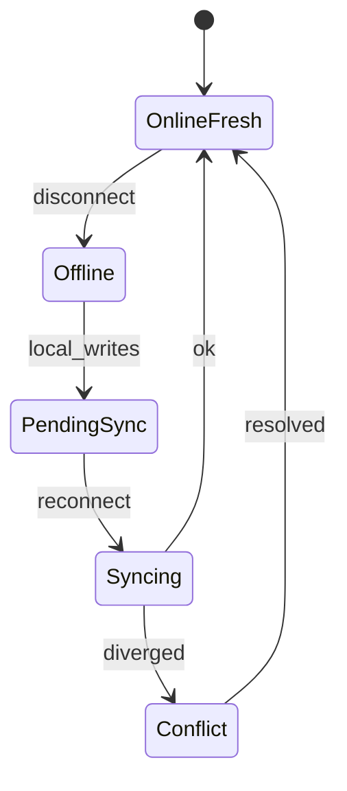
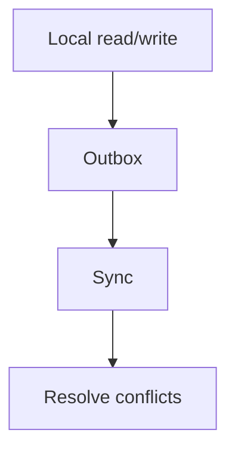
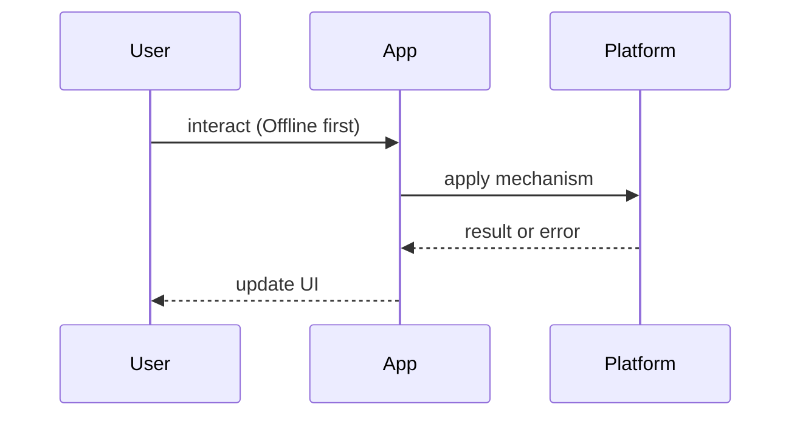

# Offline First

<TopicMeta />

<Prerequisites />

::: tip Published
This page meets the handbook **published** bar: deep explanation, ≥10 common mistakes, and official references. Further engine-level errata welcome via PR.
:::

## Introduction

**Offline First** means the client can read and often write against local data, then synchronize when connectivity returns. It is a product architecture choice, not only a service worker checkbox.

Deep platform pieces live in [/23-pwa-and-offline/pwa-overview/](/23-pwa-and-offline/pwa-overview/) and [/09-browser-apis/indexeddb/](/09-browser-apis/indexeddb/).

## Why does it exist?

Networks fail in elevators, subways, and flaky LTE. Field/sales/note-taking products cannot freeze. Even “online” apps benefit from resilient local caches. Offline-first forces you to confront sync and conflict early instead of pretending HTTP always works.

## Historical Background

From CouchDB/PouchDB and early HTML5 offline app caches to modern Cache API + IndexedDB + background sync. CRDTs and OT powered collaborative editors; most business apps use simpler last-write-wins or server merge.

## Mental Model

**Local truth + outbox**:

- Reads prefer local store  
- Writes append to an outbox queue  
- Sync worker drains outbox, applies remote changes  
- Conflicts resolved by policy  

UX must show sync state: offline, pending, synced, conflict.

## Internal Workflow

1. Pick domains that must work offline  
2. Choose storage (IDB) + cache shell (SW)  
3. Define sync protocol and conflict policy  
4. Surface offline UX ([/23-pwa-and-offline/offline-ux/](/23-pwa-and-offline/offline-ux/))  
5. Test airplane mode + multi-device edits

## Lifecycle



## Browser Perspective

Service workers intercept GETs; IndexedDB holds structured data; Background Sync / periodic sync may drain queues (support varies).

## JavaScript Engine Perspective

Large IDB reads on the main thread jank — use workers/async batches.

## React Perspective

UI subscribes to local stores; treat network as an effect, not the render source.

## Next.js Perspective

SSR/RSC assume connectivity at request time; offline-first behavior is primarily a client concern after hydration.

## Server Perspective

Expose sync endpoints that accept batches and return authoritative revisions.

## Network Perspective

Design for intermittent connectivity, not just high latency.

## Memory Perspective

Bound local datasets; paginate large offline collections.

## Performance

First load still needs a cacheable shell. Sync should be incremental (cursors/revisions), not full database dumps.

## Production Example

A field-inspection app stores forms in IDB, queues photo uploads, and syncs when online. Conflicts on the same inspection show a merge screen rather than silent overwrite.

## Code Examples

```ts
type OutboxItem = { id: string; path: string; body: unknown; ts: number }

async function enqueue(item: OutboxItem) {
  await idb.put('outbox', item)
  await idb.put('entities', applyLocal(item))
}

async function drainOutbox() {
  for (const item of await idb.getAll('outbox')) {
    await fetch(item.path, { method: 'POST', body: JSON.stringify(item.body) })
    await idb.delete('outbox', item.id)
  }
}
```

## Diagrams





## Common Mistakes

1. Assuming service worker caching alone is offline-first
2. Silent last-write-wins on important records
3. Blocking UI until sync completes
4. Storing secrets in IDB without threat modeling
5. Never testing multi-tab offline writes
6. Infinite sync loops on permanent 4xx errors
7. Missing a production edge case for 21-frontend-system-design.offline-first (#1)
8. Missing a production edge case for 21-frontend-system-design.offline-first (#2)
9. Missing a production edge case for 21-frontend-system-design.offline-first (#3)
10. Missing a production edge case for 21-frontend-system-design.offline-first (#4)


## Best Practices

- Visible sync status
- Idempotent mutation ids
- Incremental sync
- Clear conflict UX for human-critical data

## Anti-patterns

- Fake offline mode that only greys buttons
- Replacing entire local DB on every sync

## Comparison

| Model | Offline writes | Complexity |
| --- | --- | --- |
| Cache-only reads | No | Low |
| Outbox + server merge | Yes | Medium |
| CRDT collaboration | Yes | High |

## Interview Questions

### Easy

**Q:** What does offline-first mean?

**A:** The app remains useful using local data and queues changes until sync — not merely showing an offline banner.

### Medium

**Q:** Which browser APIs underpin offline-first web apps?

**A:** Service Workers + Cache Storage for assets/GETs, IndexedDB for structured data, optionally Background Sync. See [/09-browser-apis/service-workers/](/09-browser-apis/service-workers/).

### Hard

**Q:** How do you design conflict resolution for shared notes?

**A:** Explain revision vectors or CRDTs, UX for unmergeable fields, and why blind LWW fails. Point to collaborative editing trade-offs.

## Summary

- Local source of truth + outbox
- Conflict policy is product design
- SW cache ≠ full offline-first
- Show sync state honestly

## References

- [web.dev — Offline UX](https://web.dev/articles/offline-ux)
- [MDN — Service Worker API](https://developer.mozilla.org/en-US/docs/Web/API/Service_Worker_API)
- [MDN — IndexedDB](https://developer.mozilla.org/en-US/docs/Web/API/IndexedDB_API)

<RelatedTopics />


Prev: [`21-frontend-system-design.optimistic-ui`](/21-frontend-system-design/optimistic-ui/) · Next: [`21-frontend-system-design.infinite-scroll`](/21-frontend-system-design/infinite-scroll/)
