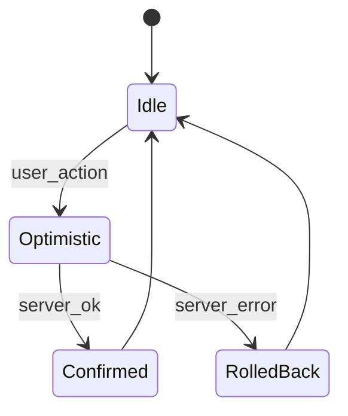
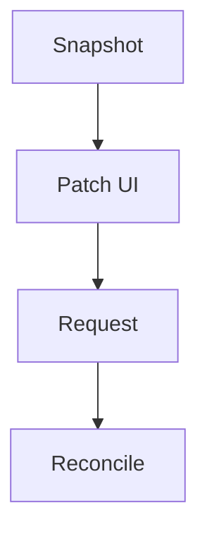
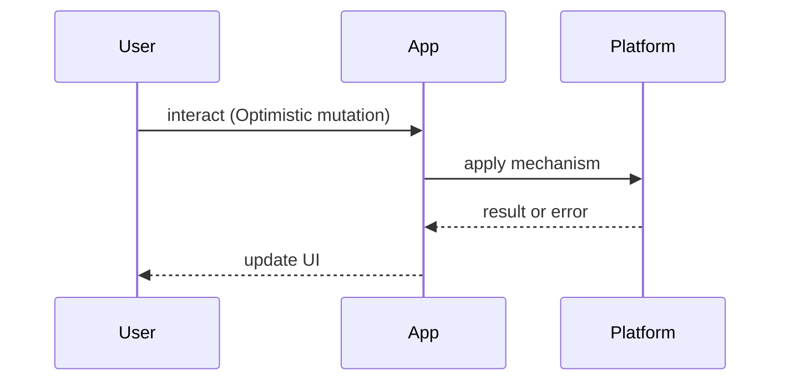

# Optimistic UI

<TopicMeta />

<Prerequisites />

::: tip Published
This page meets the handbook **published** bar: deep explanation, ≥10 common mistakes, and official references. Further engine-level errata welcome via PR.
:::

## Introduction

**Optimistic UI** applies a predicted result to the interface immediately, then confirms or rolls back when the network responds. Done well, apps feel instant; done poorly, they lie.

Related: [/06-javascript/async-await/](/06-javascript/async-await/), [/10-react/hooks/](/10-react/hooks/), [/21-frontend-system-design/offline-first/](/21-frontend-system-design/offline-first/).

## Why does it exist?

Round trips are slow on mobile networks. Waiting for every like, star, or checklist toggle trains users that the app is laggy. Optimistic updates buy perceived performance — but only if failure paths are honest and state converges.

## Historical Background

Optimistic techniques matured with SPA clients and offline-capable apps (early Meteor, Relay/Apollo mutations, Redux optimistic middleware). Modern libraries expose `onMutate`/`onError`/`onSettled` hooks as the standard shape.

## Mental Model

Treat optimism as a **transaction**:

1. Snapshot prior state  
2. Apply optimistic patch + track `mutationId`  
3. Send request  
4. On success: reconcile with server truth (replace temp ids)  
5. On failure: rollback snapshot + surface error  

Never leave “ghost” entities without a recovery path.

## Internal Workflow

1. Decide if the action is safe to predict (idempotent toggles ≫ payments)  
2. Implement snapshot/patch/rollback  
3. Serialize conflicting mutations on the same entity  
4. Merge server response as source of truth  
5. Add telemetry for rollback rate

## Lifecycle



## Browser Perspective

Optimism is pure client state until the response returns. Offline + optimism needs a queue (see Background Sync / offline-first).

## JavaScript Engine Perspective

Patches should be cheap; deep-cloning huge trees per keystroke will jank.

## React Perspective

Use mutation lifecycles in data libraries or reducers. Avoid fighting React with manual DOM toggles.

## Next.js Perspective

Server Actions can still pair with optimistic Client Component UI via `useOptimistic` — keep server authoritative.

## Server Perspective

APIs should be idempotent where possible; return canonical records for reconciliation.

## Network Perspective

Timeouts and retries must not double-apply non-idempotent side effects.

## Memory Perspective

Retain snapshots only for in-flight mutations; GC after settle.

## Performance

Optimism improves INP/perceived latency. Watch rollback storms under high error rates — they destroy trust faster than spinners.

## Production Example

A social app optimistically toggles likes and increments counts; on 409 Conflict it refetches the post. Payments never optimistically mark “paid” — only “submitting.”

## Code Examples

```ts
async function toggleLike(postId: string) {
  const prev = queryClient.getQueryData(['post', postId])
  queryClient.setQueryData(['post', postId], (p: any) => ({
    ...p,
    liked: !p.liked,
    likes: p.likes + (p.liked ? -1 : 1),
  }))
  try {
    await api.like(postId)
  } catch (e) {
    queryClient.setQueryData(['post', postId], prev)
    toast.error('Could not update like')
  }
}
```

## Diagrams





## Common Mistakes

1. Optimistically completing payments or irreversible deletes
2. No rollback on failure
3. Using client-generated ids forever without swapping to server ids
4. Parallel conflicting mutations without ordering
5. Hiding errors so users think the write succeeded
6. Optimism without offline queue when offline is common
7. Missing a production edge case for 21-frontend-system-design.optimistic-ui (#1)
8. Missing a production edge case for 21-frontend-system-design.optimistic-ui (#2)
9. Missing a production edge case for 21-frontend-system-design.optimistic-ui (#3)
10. Missing a production edge case for 21-frontend-system-design.optimistic-ui (#4)


## Best Practices

- Snapshot before patch
- Prefer idempotent APIs
- Reconcile with server payloads
- Reserve optimism for low-risk, high-frequency actions

## Anti-patterns

- Fake success toasts before the network returns
- Global mutable flags instead of per-mutation tracking

## Comparison

| Approach | Feel | Safety |
| --- | --- | --- |
| Wait for server | Honest lag | Highest |
| Optimistic + rollback | Instant | High if disciplined |
| Fire-and-forget | Instant | Unsafe |

## Interview Questions

### Easy

**Q:** What is optimistic UI?

**A:** Update UI assuming success, then confirm or roll back when the server responds.

### Medium

**Q:** When would you refuse optimism?

**A:** Money movement, legal consent, destructive bulk ops, or any case where false confirmation is worse than waiting.

### Hard

**Q:** How do optimistic updates interact with offline-first sync?

**A:** Queue mutations with ids, apply local patches, replay with conflict rules (LWW, CRDT, or server merge). See [/21-frontend-system-design/offline-first/](/21-frontend-system-design/offline-first/).

## Summary

- Optimism is a transaction with rollback
- Server remains source of truth
- Not for high-stakes side effects
- Measure rollback rate

## References

- [React — useOptimistic](https://react.dev/reference/react/useOptimistic)
- [TanStack Query — Optimistic Updates](https://tanstack.com/query/latest/docs/framework/react/guides/optimistic-updates)

<RelatedTopics />


Prev: [`21-frontend-system-design.caching-strategies`](/21-frontend-system-design/caching-strategies/) · Next: [`21-frontend-system-design.offline-first`](/21-frontend-system-design/offline-first/)
