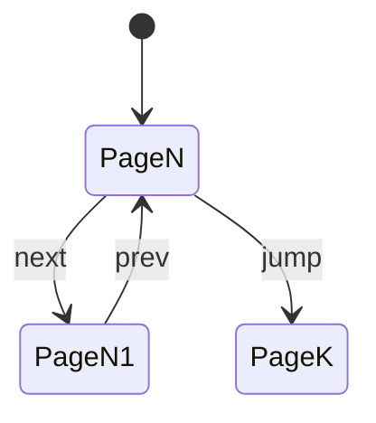
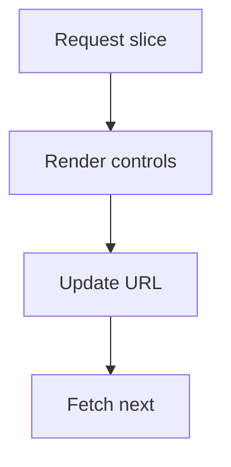
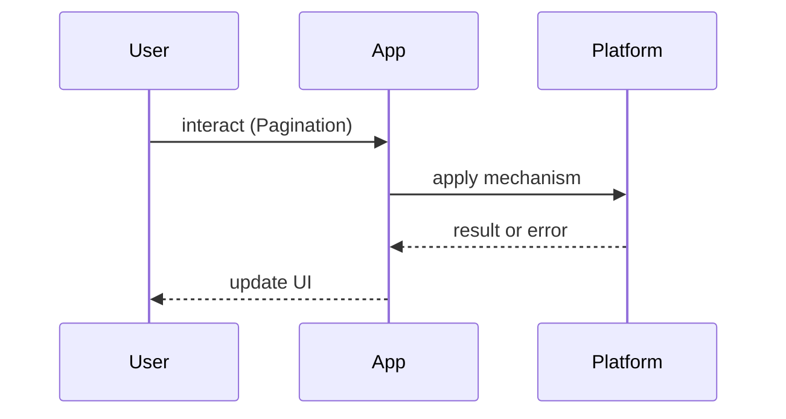

# Pagination

<TopicMeta />

<Prerequisites />

::: tip Published
This page meets the handbook **published** bar: deep explanation, ≥10 common mistakes, and official references. Further engine-level errata welcome via PR.
:::

## Introduction

**Pagination** splits large collections into pages so clients and databases stay bounded. UI pagination (numbered pages, next/prev) and API pagination (offset/limit vs cursors) must be designed together.

Related: [/21-frontend-system-design/infinite-scroll/](/21-frontend-system-design/infinite-scroll/), [/02-internet/rest/](/02-internet/rest/).

## Why does it exist?

Unbounded lists destroy latency, memory, and DB plans. Pagination is the basic contract for scalable list UX — admin tables, search results, and APIs alike.

## Historical Background

SQL `LIMIT/OFFSET` dominated early web apps; deep offsets degrade. Cursor/keyset pagination and GraphQL connections (edges/nodes) became the scalable default for feeds.

## Mental Model

A page is a **slice described by a continuation token** (or offset). Numbered UI can be emulated atop cursors with care, but true “jump to page 50” often needs offsets or approximate indexes.

## Internal Workflow

1. Choose offset vs cursor based on mutability and depth  
2. Define sort keys and stability  
3. Return `next`/`prev` metadata  
4. Build UI controls that cannot request invalid pages  
5. Preserve page state in the URL

## Lifecycle



## Browser Perspective

URL query params make pages shareable/bookmarkable.

## JavaScript Engine Perspective

Not applicable.

## React Perspective

Sync page state with the URL; avoid double-fetch in Strict Mode by using a data library.

## Next.js Perspective

Server Components can fetch a page directly from searchParams — excellent for SEO tables.

## Server Perspective

Index the sort keys used in cursors; avoid `OFFSET 100000`.

## Network Perspective

Smaller pages reduce TTFB variance; too-chatty pages increase RTT overhead.

## Memory Perspective

Do not keep every visited page forever without eviction.

## Performance

Prefer keyset pagination for infinite depth. Cache immutable pages briefly; personalized pages carefully.

## Production Example

An admin table uses `?page=3&pageSize=50` with offset for shallow jumps, while the customer activity feed uses opaque cursors.

## Code Examples

```ts
// Keyset / cursor style
type Page<T> = { items: T[]; nextCursor?: string }

async function listItems(cursor?: string, limit = 20): Promise<Page<Item>> {
  const res = await fetch(`/api/items?limit=${limit}${cursor ? `&cursor=${cursor}` : ''}`)
  return res.json()
}
```

## Diagrams





## Common Mistakes

1. Deep OFFSET on hot tables
2. Unstable sort (non-unique) causing duplicates/skips
3. UI page control not matching API
4. Losing filters when changing page
5. No total count strategy when UI needs it
6. Caching page 1 forever while data changes
7. Missing a production edge case for 21-frontend-system-design.pagination (#1)
8. Missing a production edge case for 21-frontend-system-design.pagination (#2)
9. Missing a production edge case for 21-frontend-system-design.pagination (#3)
10. Missing a production edge case for 21-frontend-system-design.pagination (#4)


## Best Practices

- Encode filters + page in the URL
- Document cursor opacity and expiry
- Unique sort tie-breakers (e.g. created_at, id)
- Disable next when no cursor

## Anti-patterns

- Fetching the entire dataset to paginate on the client “for simplicity”
- Random page sizes per request without defaults

## Comparison

| Style | Pros | Cons |
| --- | --- | --- |
| Offset | Jump to page N | Slow deep pages; drift |
| Cursor | Stable under inserts | Hard jump-to-page |
| Hybrid | Pragmatic UX | More API surface |

## Interview Questions

### Easy

**Q:** Why is OFFSET pagination problematic at depth?

**A:** Databases still scan/skip many rows; cost grows with offset. Cursors using indexed keys scale better.

### Medium

**Q:** How do you keep pagination stable when new rows insert at the top?

**A:** Use keyset cursors on a unique ordered key so “next” means “after this key,” not “skip N.”

### Hard

**Q:** Design pagination for search with relevance ranking.

**A:** Discuss search-after/point-in-time APIs, why naive offsets shuffle results, and caching of result windows.

## Summary

- Bound every list
- Cursors for feeds; offsets for shallow admin jumps
- Stable unique sort keys
- URL-sync page state

## References

- [MDN — HTTP range ideas / APIs vary](https://developer.mozilla.org/en-US/docs/Web/HTTP)
- [Slack engineering — cursors (general pattern articles)](https://slack.engineering/)
- [Relay GraphQL Connections](https://relay.dev/graphql/connections.htm)

<RelatedTopics />


Prev: [`21-frontend-system-design.infinite-scroll`](/21-frontend-system-design/infinite-scroll/) · Next: [`21-frontend-system-design.feature-flags`](/21-frontend-system-design/feature-flags/)
