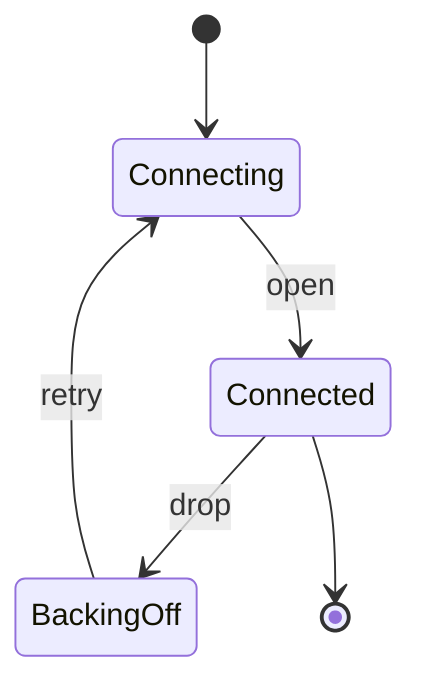
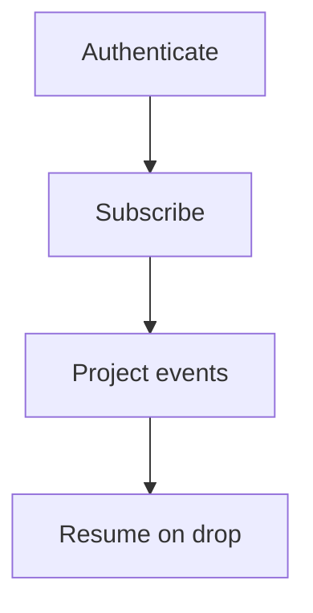
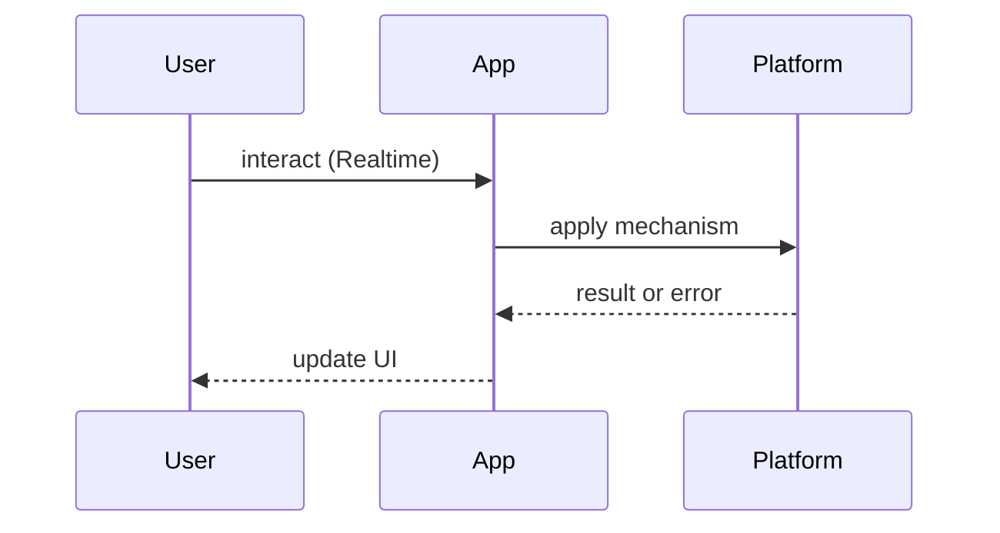

# Realtime Applications

<TopicMeta />

<Prerequisites />

::: tip Published
This page meets the handbook **published** bar: deep explanation, ≥10 common mistakes, and official references. Further engine-level errata welcome via PR.
:::

## Introduction

**Realtime Applications** push or stream updates so the UI reflects server state within seconds or milliseconds. Transport choices — WebSocket, SSE, HTTP polling — shape reliability and cost.

Prerequisite deep dive: [/02-internet/websocket/](/02-internet/websocket/), [/02-internet/sse/](/02-internet/sse/).

## Why does it exist?

Collaboration, trading, chat, logistics, and live dashboards cannot wait on refresh. Realtime is a product requirement that forces you to design sessions, fan-out, and failure recovery — not only `new WebSocket`.

## Historical Background

Long polling → SSE → WebSockets → multiplexed protocols (Socket.IO, MQTT over WS) → HTTP/2/3 streaming. Serverless edges added constraints on idle connections.

## Mental Model

**Subscription channels + local projection**:

- Server owns authoritative events  
- Client maintains a projection (normalized store)  
- Transport delivers ordered (or explicitly unordered) events  
- Reconnect must catch up via resume tokens / snapshots

## Internal Workflow

1. Pick transport (SSE for one-way; WS for bi-di)  
2. Auth the connection  
3. Define event schema + versioning  
4. Implement reconnect + backlog  
5. UI: presence, optimistic edits, conflict rules  
6. Load-test fan-out

## Lifecycle



## Browser Perspective

Browsers limit connections per origin; battery suffers with chatty sockets. Use Page Visibility to pause.

## JavaScript Engine Perspective

JSON parse on huge fan-in can block the main thread — batch or worker.

## React Perspective

Store events outside React when frequency is high; subscribe with selectors.

## Next.js Perspective

Prefer dedicated realtime services; serverless request handlers are poor long-lived socket hosts.

## Server Perspective

Horizontal scale needs pub/sub (Redis, Kafka, managed realtime). Sticky sessions are a smell if required everywhere.

## Network Perspective

Proxies idle-timeout sockets; heartbeats matter. TLS and auth refresh mid-session.

## Memory Perspective

Buffering unbounded events per client OOMs — apply backpressure.

## Performance

Coalesce UI updates (rAF), compress payloads, and avoid re-rendering entire trees per event.

## Production Example

A trading blotter uses authenticated WebSockets with resume tokens after reconnect; SSE powers one-way notification feeds for lighter dashboards.

## Code Examples

```ts
function connect(url: string, onEvent: (e: unknown) => void) {
  let ws: WebSocket
  let attempt = 0
  const open = () => {
    ws = new WebSocket(url)
    ws.onmessage = (m) => onEvent(JSON.parse(m.data))
    ws.onclose = () => {
      const delay = Math.min(30_000, 500 * 2 ** attempt++)
      setTimeout(open, delay)
    }
    ws.onopen = () => {
      attempt = 0
    }
  }
  open()
}
```

## Diagrams





## Common Mistakes

1. No exponential backoff on reconnect storms
2. Trusting client timestamps for ordering
3. Putting secrets in WS query strings logged everywhere
4. Re-rendering the whole app on every message
5. Assuming SSE/WS work identically behind all proxies
6. No catch-up strategy after reconnect
7. Missing a production edge case for 21-frontend-system-design.realtime-applications (#1)
8. Missing a production edge case for 21-frontend-system-design.realtime-applications (#2)
9. Missing a production edge case for 21-frontend-system-design.realtime-applications (#3)
10. Missing a production edge case for 21-frontend-system-design.realtime-applications (#4)


## Best Practices

- Resume tokens / snapshots
- Schema versioning
- Visibility-aware pausing
- Server-side fan-out via pub/sub

## Anti-patterns

- Polling every 100ms “because websockets are hard” at massive scale without need
- One giant multiplexed socket with no backpressure

## Comparison

| Transport | Direction | Notes |
| --- | --- | --- |
| Polling | Client→server | Simple; wasteful |
| SSE | Server→client | Great for feeds |
| WebSocket | Bi-di | Rich collaboration |

## Interview Questions

### Easy

**Q:** When prefer SSE over WebSocket?

**A:** One-way server push (notifications, feeds) with simpler infrastructure. See [/02-internet/sse/](/02-internet/sse/).

### Medium

**Q:** How do you authenticate WebSockets?

**A:** Short-lived tokens during the HTTP upgrade / first message; refresh strategy; never long-lived secrets in query logs.

### Hard

**Q:** Design catch-up after a mobile client sleeps for 30 minutes.

**A:** On resume, send last event id / revision; server replays backlog or sends a snapshot + diff; UI shows “catching up.”

## Summary

- Choose transport by directionality
- Reconnect + catch-up are mandatory
- Project events into local state carefully
- Backpressure or die

## References

- [MDN — WebSocket](https://developer.mozilla.org/en-US/docs/Web/API/WebSocket)
- [MDN — Server-sent events](https://developer.mozilla.org/en-US/docs/Web/API/Server-sent_events)
- [WHATWG — HTML living standard (event streams)](https://html.spec.whatwg.org/multipage/server-sent-events.html)

<RelatedTopics />


Prev: [`21-frontend-system-design.feature-flags`](/21-frontend-system-design/feature-flags/) · Next: [`21-frontend-system-design.search-ui`](/21-frontend-system-design/search-ui/)
