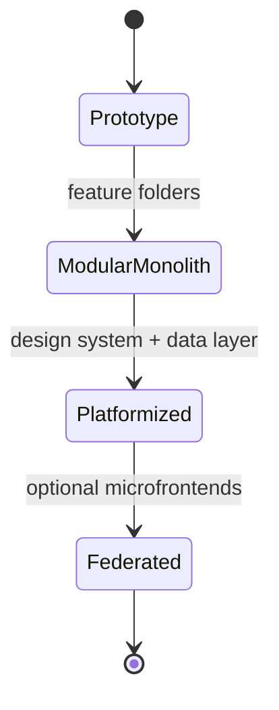
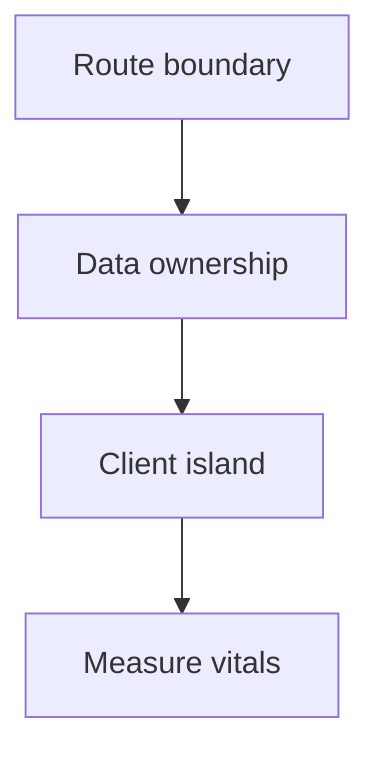
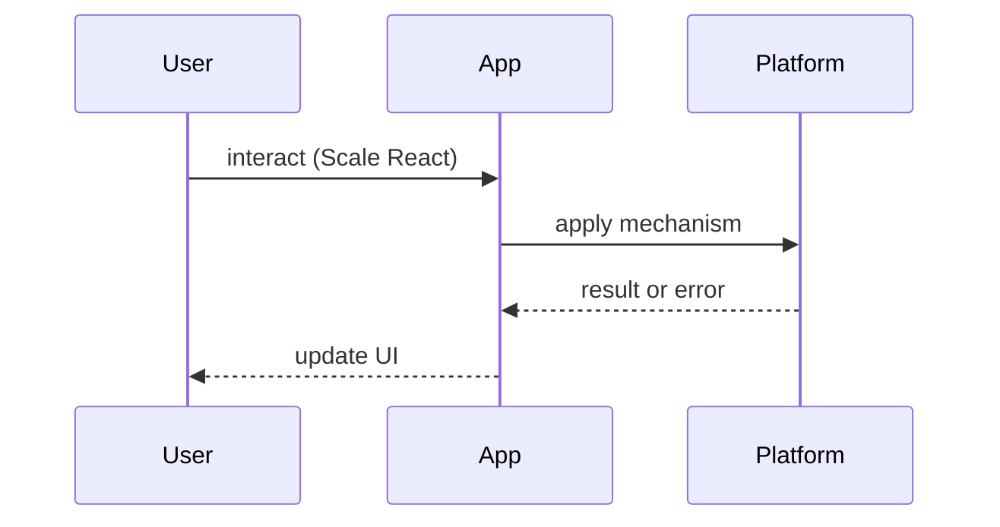

# Scaling React Applications

<TopicMeta />

<Prerequisites />

::: tip Published
This page meets the handbook **published** bar: deep explanation, ≥10 common mistakes, and official references. Further engine-level errata welcome via PR.
:::

## Introduction

**Scaling React Applications** is the craft of keeping a React product correct, fast, and changeable as features, teams, and data volume grow. Scaling is not “more folders” — it is clear ownership of state, rendering cost, module boundaries, and delivery pipelines.

This page focuses on product-scale frontend design. For React primitives see [/10-react/philosophy/](/10-react/philosophy/), [/10-react/hooks/](/10-react/hooks/), and [/08-jsx-and-react-runtime/fiber/](/08-jsx-and-react-runtime/fiber/).

## Why does it exist?

Small React apps hide structural debt. At scale you hit: unbounded client bundles, prop-drilling forests, global stores that invalidate half the tree, and teams that cannot ship without merge conflicts.

Without an explicit scaling model, teams compensate with premature micro-frontends, over-memoization, or a single “god store.” The goal is predictable change cost as headcount and surface area grow.

## Historical Background

Early React apps were often SPA monoliths with Redux at the root. Concurrent Mode, Server Components, and route-based frameworks (Next.js App Router) shifted the default: push data fetching and composition toward the server, keep client islands interactive, and treat the route as the primary code-split boundary.

The industry learned that “scale React” usually means scale *product architecture*, not invent a new React API.

## Mental Model

Hold four layers:

1. **Delivery units** — routes / feature packages that can build, test, and lazy-load independently
2. **State ownership** — server/cache state vs UI state vs URL state (see [/15-architecture/url-as-state/](/15-architecture/url-as-state/))
3. **Render budget** — which updates must be synchronous; which can be concurrent/deferred
4. **Team boundaries** — who owns a feature folder, design-system tokens, and shared utilities

If a change requires touching three unrelated features, your boundaries are wrong.

## Internal Workflow

1. **Map critical journeys** — checkout, feed, admin — and their data dependencies  
2. **Choose rendering strategy** per route (CSR / SSR / RSC / static) — [/12-rendering/ssr/](/12-rendering/ssr/)  
3. **Partition state** — remote cache (TanStack Query), URL, local UI, rare global session  
4. **Enforce import rules** — features do not import each other’s internals  
5. **Budget bundles & waterfalls** — route splits, `React.lazy`, streaming  
6. **Instrument** — Web Vitals + React Profiler on top journeys

## Lifecycle



Most products should stay a **modular monolith** far longer than slides suggest. Federate only when org structure demands independent deploy.

## Browser Perspective

Scaling shows up as main-thread time, long tasks, and memory from retained component trees. Use Performance panel + Coverage; treat hydration and large client graphs as first-class costs.

## JavaScript Engine Perspective

Hot paths that allocate per render amplify GC. Prefer stable object identities for props when children are expensive; measure before wrapping everything in `memo`.

## React Perspective

React scales when updates are localized. Context for rarely changing values; selectors or external stores for high-frequency data. Concurrent features (`useTransition`, `useDeferredValue`) protect interaction responsiveness.

## Next.js Perspective

App Router scaling = Server Components by default, Client Components at interactivity leaves, caching awareness (Full Route / Data / Router caches), and avoiding accidental client boundaries high in the tree.

## Server Perspective

TTFB and RSC payload size become product metrics. Colocate data access with routes; ban N+1 waterfalls in nested server trees.

## Network Perspective

HTTP/2+/CDN for assets; BFF or RSC to collapse chattiness. Caching strategies belong in [/21-frontend-system-design/caching-strategies/](/21-frontend-system-design/caching-strategies/).

## Memory Perspective

Detached listeners, unbounded query caches, and virtualized lists that never unmount rows are the usual leaks. Cap cache sizes; dispose subscriptions in effects.

## Performance

Track LCP/INP/CLS on key routes, JS transferred per navigation, and React commit durations. Optimization order: remove work → split work → defer work → memoize. Over-memoization is a scaling anti-pattern.

## Production Example

A marketplace team moved from a single Redux store to route modules + TanStack Query for server state and URL for filters. Bundle per checkout route dropped ~40%, and feature PRs stopped colliding on store shape. They kept a thin session provider for auth only.

## Code Examples

```tsx
// Feature boundary: public API only
// features/checkout/index.ts
export { CheckoutPage } from './CheckoutPage'

// App shell imports the public surface, not internals
import { CheckoutPage } from '@/features/checkout'

export default function Page() {
  return <CheckoutPage />
}
```

```tsx
// Localize high-frequency UI state; keep server state in a cache library
function FilterBar({ onChange }: { onChange: (q: string) => void }) {
  const [q, setQ] = useState('')
  return (
    <input
      value={q}
      onChange={(e) => {
        setQ(e.target.value)
        onChange(e.target.value)
      }}
    />
  )
}
```

## Diagrams





## Common Mistakes

1. Putting all remote data in one global Redux/Context store “for consistency”
2. Marking huge trees `"use client"` in Next.js and wondering why bundles explode
3. Micro-frontends before a modular monolith is stable
4. Memoizing every component instead of fixing state ownership
5. Sharing deep relative imports across features (no public API)
6. Ignoring route-level code splitting until Lighthouse fails in prod
7. Missing a production edge case for 21-frontend-system-design.scaling-react-applications (#1)
8. Missing a production edge case for 21-frontend-system-design.scaling-react-applications (#2)
9. Missing a production edge case for 21-frontend-system-design.scaling-react-applications (#3)
10. Missing a production edge case for 21-frontend-system-design.scaling-react-applications (#4)


## Best Practices

- Feature folders with explicit public exports
- Server/cache state separate from ephemeral UI state
- URL as the source of truth for shareable filters
- Performance budgets on critical routes in CI
- Design-system tokens owned by one platform team

## Anti-patterns

- God context providers wrapping the entire app
- Copy-pasting data-fetch hooks that each invent caching
- “Shared utils” dumping ground that creates cycles

## Comparison

| Approach | When it fits | Cost |
| --- | --- | --- |
| Modular monolith | Most products | Discipline on imports |
| Micro-frontends | Independent deploy/org | Integration + UX seams |
| Mega SPA + global store | Tiny apps | Collapses at scale |

## Interview Questions

### Easy

**Q:** What usually breaks first when a React app “scales”?

**A:** Bundle size/navigation cost, tangled global state, and unclear feature ownership — not the React reconciler itself. Link answers to [/10-react/components/](/10-react/components/) and route splitting.

### Medium

**Q:** How do you decide what belongs in Context vs a server-state library vs the URL?

**A:** Context: low-frequency ambient values (theme, locale). Server-state library: remote data with cache/invalidation. URL: shareable/bookmarkable UI state. See [/15-architecture/state-management/](/15-architecture/state-management/).

### Hard

**Q:** Design a scaling plan for a 50-engineer React org shipping one consumer web app.

**A:** Modular monolith by domain, platform DS + data kit, route ownership, CI bundle budgets, RSC/SSR where TTFB matters, measure vitals. Defer federation until deploy coupling is the bottleneck.

## Summary

- Scale boundaries and ownership before frameworks
- Separate server, URL, and UI state
- Prefer modular monoliths; federate last
- Measure journeys; avoid memo folklore

## References

- [React docs — Thinking in React](https://react.dev/learn/thinking-in-react)
- [React docs — Escape Hatches](https://react.dev/learn/escape-hatches)
- [Next.js App Router](https://nextjs.org/docs/app)

<RelatedTopics />


Next: [`21-frontend-system-design.caching-strategies`](/21-frontend-system-design/caching-strategies/)
