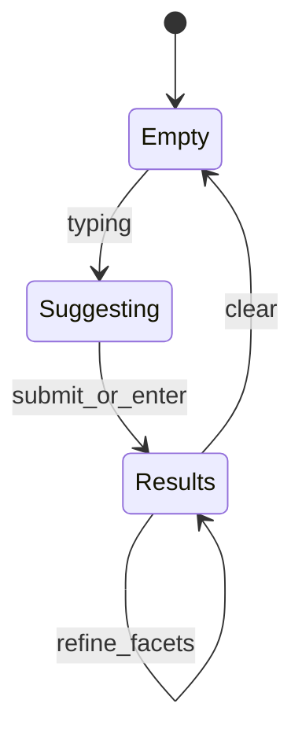
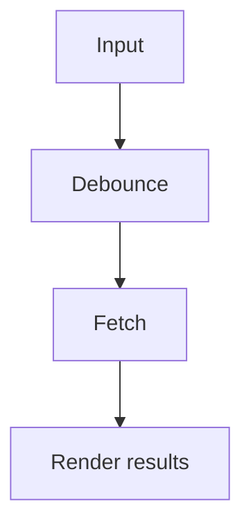
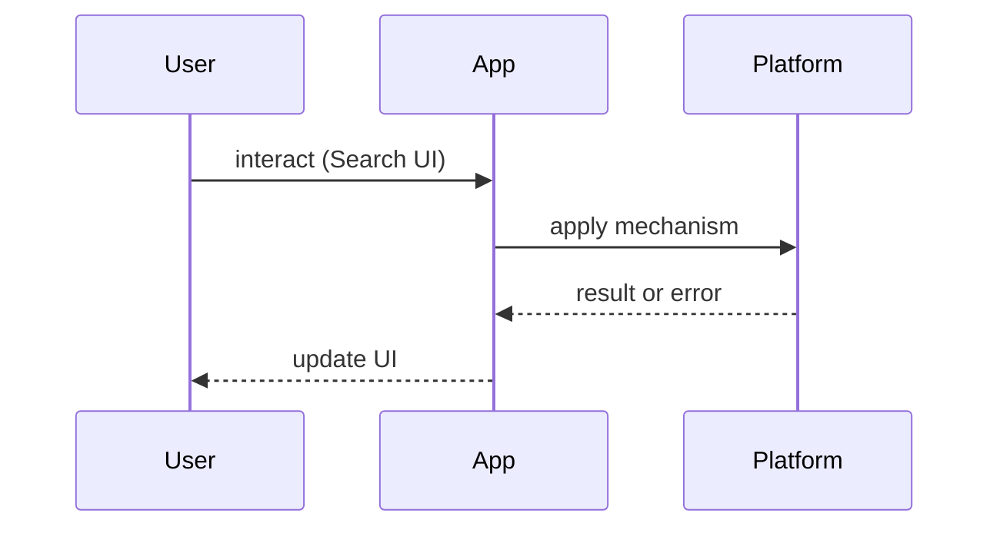

# Search UI

<TopicMeta />

<Prerequisites />

::: tip Published
This page meets the handbook **published** bar: deep explanation, ≥10 common mistakes, and official references. Further engine-level errata welcome via PR.
:::

## Introduction

**Search UI** is the product surface for finding items: query box, suggestions, results, facets, and zero-result recovery. Backend relevance matters, but frontend design determines whether users trust and complete search.

Related: [/21-frontend-system-design/pagination/](/21-frontend-system-design/pagination/), [/18-accessibility/](/18-accessibility/).

## Why does it exist?

Search is often the highest-intent path in commerce and docs. Slow, flickery, or inaccessible search leaks revenue and support load.

## Historical Background

From full page reloads to live suggest (AJAX) to vector/semantic search UIs. Pattern libraries standardized combobox/listbox ARIA patterns.

## Mental Model

**Query → intent → results → refinement**:

- Debounced query input  
- Optional typeahead  
- Results list with stable ranking cues  
- Facets/filters as URL state  
- Analytics on abandons and zero-results

## Internal Workflow

1. Define latency SLO for typeahead vs full search  
2. Debounce + cancel in-flight (`AbortController`)  
3. Encode q/filters in URL  
4. Build a11y combobox/listbox  
5. Instrument zero-result rates

## Lifecycle



## Browser Perspective

IME composition matters for CJK — do not search mid-composition incorrectly.

## JavaScript Engine Perspective

Highlighting large HTML strings can be costly; sanitize carefully.

## React Perspective

Abort stale requests; keep controlled inputs snappy with transitions for result swaps.

## Next.js Perspective

Server-render result pages for SEO when search is public; typeahead remains client.

## Server Perspective

Relevance, typo tolerance, and permissions filtering belong server-side.

## Network Perspective

Cancel outdated fetches; coalesce identical queries.

## Memory Perspective

Cache recent queries carefully (privacy!).

## Performance

Debounce ~150–300ms for typeahead; show stale results with a refreshing indicator rather than blanking.

## Production Example

A docs site uses edge search for typeahead (<100ms p95) and full result pages with facets in the URL. Zero-result pages suggest alternatives.

## Code Examples

```ts
function useSearch(q: string) {
  const [data, setData] = useState<Result[]>([])
  useEffect(() => {
    if (!q) return
    const ctrl = new AbortController()
    const t = setTimeout(async () => {
      const res = await fetch(`/api/search?q=${encodeURIComponent(q)}`, { signal: ctrl.signal })
      setData(await res.json())
    }, 200)
    return () => {
      clearTimeout(t)
      ctrl.abort()
    }
  }, [q])
  return data
}
```

## Diagrams





## Common Mistakes

1. Firing a request per keystroke without debounce/abort
2. Blanking results on every fetch (layout jump)
3. Inaccessible custom comboboxes
4. Putting PII queries into third-party analytics raw
5. Client-only filtering of huge catalogs
6. Ignoring empty-state design
7. Missing a production edge case for 21-frontend-system-design.search-ui (#1)
8. Missing a production edge case for 21-frontend-system-design.search-ui (#2)
9. Missing a production edge case for 21-frontend-system-design.search-ui (#3)
10. Missing a production edge case for 21-frontend-system-design.search-ui (#4)


## Best Practices

- URL-synced filters
- AbortController for races
- ARIA combobox pattern
- Highlight matches safely (no XSS)

## Anti-patterns

- Search-as-you-type that blocks the main thread with huge local indexes without workers
- Auto-redirecting on single result without consent

## Comparison

| Mode | Latency feel | Cost |
| --- | --- | --- |
| Submit-only | Lower load | Less magical |
| Typeahead | Snappy | More QPS |
| Hybrid | Balanced | Common |

## Interview Questions

### Easy

**Q:** Why debounce search inputs?

**A:** Reduce request storms and wait for intentional query tokens; pair with abort of stale requests ([/06-javascript/abortcontroller/](/06-javascript/abortcontroller/)).

### Medium

**Q:** How should facets interact with the URL?

**A:** Serializable query params so results are shareable/back-button friendly — [/15-architecture/url-as-state/](/15-architecture/url-as-state/).

### Hard

**Q:** Design search for a multi-tenant app with permissioned documents.

**A:** All queries authorized server-side; never rely on client filtering; cache keys include tenant+acl version; audit zero-result vs true empty.

## Summary

- Debounce + abort + URL state
- A11y combobox matters
- Empty states are product design
- Relevance is server-side

## References

- [WAI-ARIA APG — Combobox](https://www.w3.org/WAI/ARIA/apg/patterns/combobox/)
- [MDN — AbortController](https://developer.mozilla.org/en-US/docs/Web/API/AbortController)

<RelatedTopics />


Prev: [`21-frontend-system-design.realtime-applications`](/21-frontend-system-design/realtime-applications/) · Next: [`21-frontend-system-design.upload-pipelines`](/21-frontend-system-design/upload-pipelines/)
