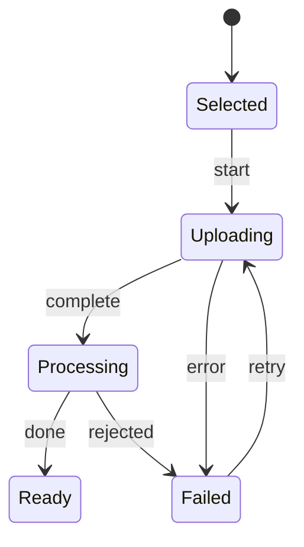
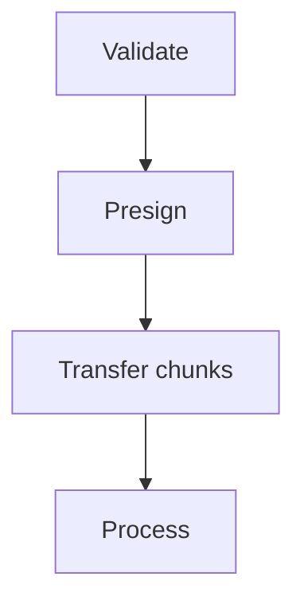
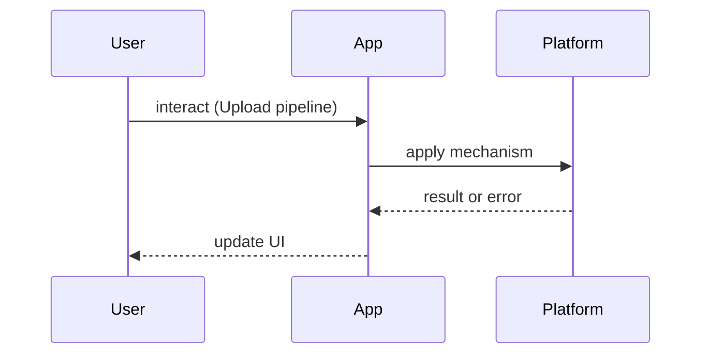

# Upload Pipelines

<TopicMeta />

<Prerequisites />

::: tip Published
This page meets the handbook **published** bar: deep explanation, ≥10 common mistakes, and official references. Further engine-level errata welcome via PR.
:::

## Introduction

**Upload Pipelines** move user files from device to durable storage with progress, retries, and security checks. A production pipeline is more than `<input type="file">` + `fetch`.

Related: [/09-browser-apis/file-api/](/09-browser-apis/file-api/), [/09-browser-apis/streams-api/](/09-browser-apis/streams-api/).

## Why does it exist?

Large media fails on flaky networks; naive uploads timeout and corrupt UX. Security needs type/size validation and server-side scanning. Direct-to-object-storage uploads reduce origin load.

## Historical Background

Multipart form posts → XHR progress events → chunked/resumable protocols (TUS) → presigned S3/GCS uploads from the browser.

## Mental Model

**Validate → authorize → transfer → process → confirm**:

Client validates UX constraints; server enforces. Prefer presigned direct upload; then async processing (transcode, scan) with job status UI.

## Internal Workflow

1. Capture File/Blob + metadata  
2. Validate size/MIME (client hint + server truth)  
3. Request upload credentials/slots  
4. Chunk + retry with progress  
5. Complete multipart; poll processing  
6. Surface final CDN URL

## Lifecycle



## Browser Perspective

File API, drag/drop, `showOpenFilePicker` (where supported). Mobile camera capture via `capture` attributes.

## JavaScript Engine Perspective

Reading huge files into memory as ArrayBuffers will crash tabs — stream/chunk.

## React Perspective

Keep progress in state; cancel with AbortController; do not block the UI thread.

## Next.js Perspective

API routes should mint short-lived presigned URLs, not proxy gigabytes through Node.

## Server Perspective

Antivirus, MIME sniffing, authz, and virus quarantine queues.

## Network Perspective

Resumable chunks beat single PUT on mobile. Watch CORS on object storage.

## Memory Perspective

Revoke object URLs; avoid retaining full file copies.

## Performance

Parallelize a few chunks; too many stalls mobile radios. Compress images client-side when quality allows.

## Production Example

A video platform requests a multipart upload id, PUTs parts with retry, then shows transcoding progress via realtime job events.

## Code Examples

```ts
async function uploadDirect(file: File) {
  const { url, fields } = await fetch('/api/presign', { method: 'POST' }).then((r) => r.json())
  const body = new FormData()
  Object.entries(fields).forEach(([k, v]) => body.append(k, v as string))
  body.append('file', file)
  const res = await fetch(url, { method: 'POST', body })
  if (!res.ok) throw new Error('upload failed')
}
```

## Diagrams





## Common Mistakes

1. Trusting client MIME/size checks alone
2. Proxying large files through the app server
3. No resume on flaky networks
4. Leaving object URLs unrevoked
5. Accepting executable types into public buckets
6. No progress or cancel UX
7. Missing a production edge case for 21-frontend-system-design.upload-pipelines (#1)
8. Missing a production edge case for 21-frontend-system-design.upload-pipelines (#2)
9. Missing a production edge case for 21-frontend-system-design.upload-pipelines (#3)
10. Missing a production edge case for 21-frontend-system-design.upload-pipelines (#4)


## Best Practices

- Presigned direct-to-storage
- Server-side validation + scan
- Chunked resumable uploads
- Clear virus-reject messaging

## Anti-patterns

- Base64-encoding files into JSON APIs
- Eternal public ACLs on upload buckets

## Comparison

| Path | Pros | Cons |
| --- | --- | --- |
| Through origin | Simple auth | Costly/timeouts |
| Presigned direct | Scales | CORS + policy setup |
| TUS resumable | Best mobile | Protocol complexity |

## Interview Questions

### Easy

**Q:** Why use presigned uploads?

**A:** Browsers upload directly to object storage; your servers mint short-lived credentials instead of carrying bytes.

### Medium

**Q:** How do you show reliable progress?

**A:** Use XHR/`fetch` upload progress or per-chunk completion percentages; never invent fake progress bars that complete early.

### Hard

**Q:** Design a resumable multi-GB upload for mobile.

**A:** Chunk with checksums, persist progress in IDB, retry with backoff, complete multipart, then async virus scan + processing status channel.

## Summary

- Validate on both sides
- Direct-to-storage when large
- Chunk + resume
- Async process after bytes land

## References

- [MDN — Using files from web applications](https://developer.mozilla.org/en-US/docs/Web/API/File_API/Using_files_from_web_applications)
- [TUS resumable upload protocol](https://tus.io/)
- [AWS S3 multipart upload](https://docs.aws.amazon.com/AmazonS3/latest/userguide/mpuoverview.html)

<RelatedTopics />


Prev: [`21-frontend-system-design.search-ui`](/21-frontend-system-design/search-ui/) · Next: [`21-frontend-system-design.multi-tenant-ui`](/21-frontend-system-design/multi-tenant-ui/)
