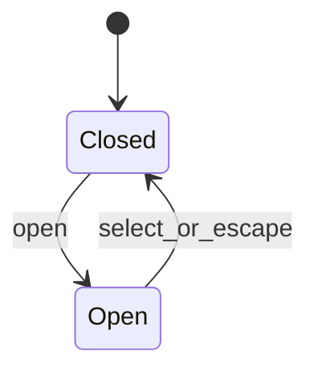
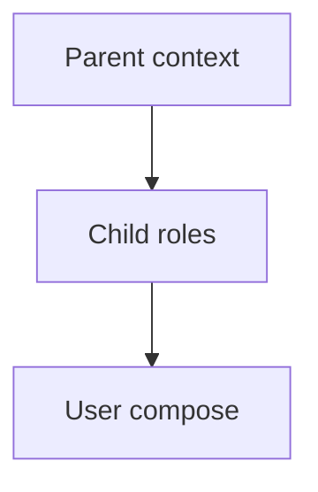
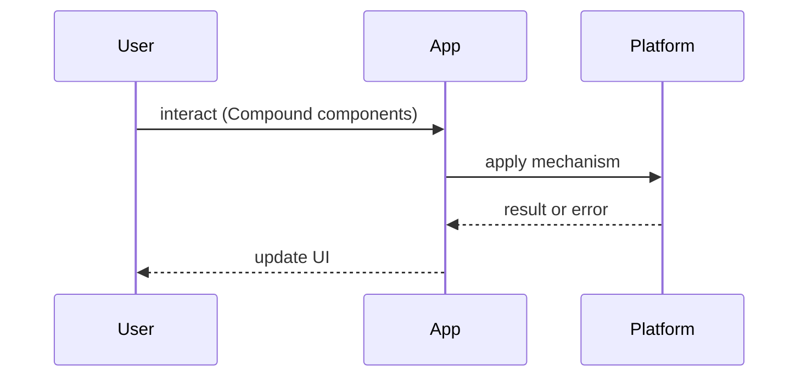

# Compound Components

<TopicMeta />

<Prerequisites />

::: tip Published
This page meets the handbook **published** bar: deep explanation, ≥10 common mistakes, and official references. Further engine-level errata welcome via PR.
:::

## Introduction

**Compound Components** expose a parent plus specialized children that coordinate through shared context (or React’s implicit children API). Classic examples: `<Select>` + `<Select.Option>`, tabs, accordion.

## Why does it exist?

Boolean props (`showIcon`, `isCompact`, …) explode. Composition lets callers arrange pieces while the parent owns state and a11y wiring.

## Historical Background

Seen in early React Reach UI / Downshift / Headless UI. Inspired by HTML’s cooperative elements (`<select>/<option>`).

## Mental Model

Parent provides **context**: value, setters, ids. Children consume and render roles. Callers compose the tree; the library preserves accessibility contracts.

## Internal Workflow

1. Define parent state + context  
2. Assign ARIA roles/ids  
3. Export named children  
4. Document composition rules  
5. Test keyboard flows

## Lifecycle



## Browser Perspective

Mirror native semantics where possible; use APG patterns.

## JavaScript Engine Perspective

Not applicable.

## React Perspective

Context for shared state; stable ids via `useId`.

## Next.js Perspective

Most compounds are Client Components when interactive.

## Server Perspective

Not applicable.

## Network Perspective

Not applicable.

## Memory Perspective

Context value identity — memoize providers carefully.

## Performance

Split context for frequent vs rare updates if children re-render too often.

## Production Example

A design system Dialog exports `Dialog.Root/Trigger/Panel/Close` with focus traps and labeled titles.

## Code Examples

```tsx
const TabsCtx = createContext<{ value: string; set: (v: string) => void } | null>(null)

export function Tabs({ value, onChange, children }: TabsProps) {
  return <TabsCtx.Provider value={{ value, set: onChange }}>{children}</TabsCtx.Provider>
}
Tabs.Panel = function Panel({ when, children }: { when: string; children: React.ReactNode }) {
  const ctx = useContext(TabsCtx)!
  if (ctx.value !== when) return null
  return <div role="tabpanel">{children}</div>
}
```

## Diagrams





## Common Mistakes

1. No keyboard/ARIA support
2. Requiring brittle child order without documentation
3. Giant context values causing re-renders
4. Overusing compounds for simple static markup
5. Forcing children to be direct only without `Children` utilities when needed
6. Missing `useId` for label associations
7. Missing a production edge case for 22-design-patterns.compound-components (#1)
8. Missing a production edge case for 22-design-patterns.compound-components (#2)
9. Missing a production edge case for 22-design-patterns.compound-components (#3)
10. Missing a production edge case for 22-design-patterns.compound-components (#4)


## Best Practices

- Follow WAI-ARIA APG
- Keep presentational freedom for callers
- Export a clear public composition API

## Anti-patterns

- Boolean soup instead of composition
- Context that leaks internal implementation names

## Comparison

| API style | Flexibility | Safety |
| --- | --- | --- |
| Config object | Low | High |
| Compound | High | Medium |
| Render prop | High | Medium |

## Interview Questions

### Easy

**Q:** What problem do compound components solve?

**A:** Flexible composition of related UI pieces without exploding prop APIs.

### Medium

**Q:** How do children share state?

**A:** Typically React context from the parent — see [/10-react/context/](/10-react/context/).

### Hard

**Q:** How do you keep a11y correct when callers reorder children?

**A:** Generate ids, wire ARIA attributes in primitives, test roles regardless of visual order, document required children.

## Summary

- Parent owns state; children compose UI
- Context wires the compound
- A11y is part of the API
- Prefer over boolean soup

## References

- [WAI-ARIA APG](https://www.w3.org/WAI/ARIA/apg/)
- [React — useId](https://react.dev/reference/react/useId)

<RelatedTopics />


Prev: [`22-design-patterns.hooks-patterns`](/22-design-patterns/hooks-patterns/) · Next: [`22-design-patterns.render-props`](/22-design-patterns/render-props/)
