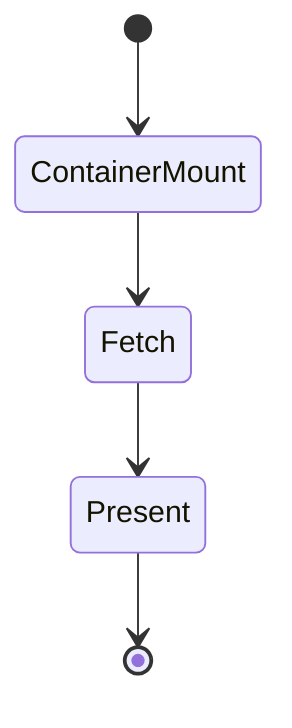
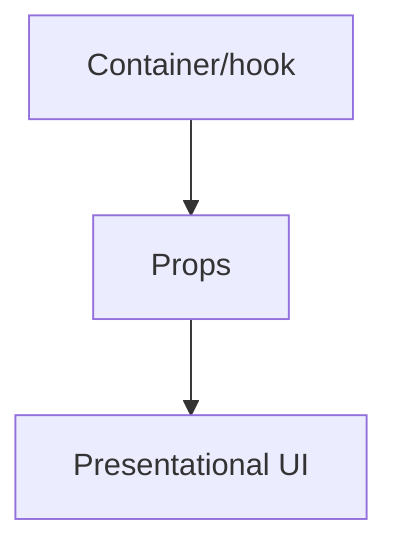
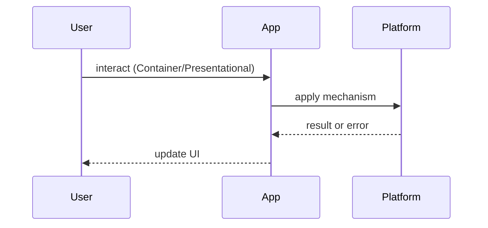

# Container / Presentational

<TopicMeta />

<Prerequisites />

::: tip Published
This page meets the handbook **published** bar: deep explanation, ≥10 common mistakes, and official references. Further engine-level errata welcome via PR.
:::

## Introduction

The **Container / Presentational** pattern separates components that fetch/wire data from components that only render props. Hooks blurred the need for rigid class-container hierarchies, but the *idea* remains useful.

## Why does it exist?

Mixing fetch, subscriptions, and markup makes reuse and visual testing hard. Presentational components become your design-system-friendly surface.

## Historical Background

Popularized by Dan Abramov’s “Presentational and Container Components” (2015). Later guidance softened: hooks colocate data with UI when coupling is natural.

## Mental Model

**Presentational**: props in, events out, no store knowledge. **Container**: chooses data sources and passes props. Today a custom hook often *is* the container.

## Internal Workflow

1. Identify pure UI  
2. Extract data into a hook or thin container  
3. Keep presentational components storybookable  
4. Avoid passing the entire store

## Lifecycle



## Browser Perspective

Not applicable.

## JavaScript Engine Perspective

Not applicable.

## React Perspective

Prefer hooks over HOCs for containers. Server Components can be “containers” that pass serializable props to client presentational children.

## Next.js Perspective

RSC as server containers + client presentational islands is a modern incarnation.

## Server Perspective

Not applicable.

## Network Perspective

Containers own fetching and caching policies.

## Memory Perspective

Not applicable.

## Performance

Presentational purity helps memoization boundaries — but fix state ownership first.

## Production Example

Design system Button/Table stay presentational; route-level pages compose hooks and pass data down.

## Code Examples

```tsx
function UserCardView({ name, bio }: { name: string; bio: string }) {
  return (
    <article>
      <h2>{name}</h2>
      <p>{bio}</p>
    </article>
  )
}

function UserCard({ id }: { id: string }) {
  const { data } = useUser(id)
  if (!data) return <Skeleton />
  return <UserCardView name={data.name} bio={data.bio} />
}
```

## Diagrams





## Common Mistakes

1. Religiously splitting every component into two files
2. Presentational components that secretly read context stores
3. Containers that still contain markup forests
4. Prop-drilling twenty fields instead of a view-model object
5. Testing only containers and never visuals
6. Ignoring RSC as a container option
7. Missing a production edge case for 22-design-patterns.container-presentational (#1)
8. Missing a production edge case for 22-design-patterns.container-presentational (#2)
9. Missing a production edge case for 22-design-patterns.container-presentational (#3)
10. Missing a production edge case for 22-design-patterns.container-presentational (#4)


## Best Practices

- Hooks as containers when colocated
- Storybook presentational components
- Serializable props across server/client boundaries

## Anti-patterns

- Copy-paste containers per page with no shared hooks

## Comparison

| Approach | Reuse | Ceremony |
| --- | --- | --- |
| Rigid container classes | Medium | High |
| Hooks + presentational | High | Low |
| All-in-one components | Low | Lowest short-term |

## Interview Questions

### Easy

**Q:** What is a presentational component?

**A:** A component that renders from props/callbacks and does not fetch or own external store subscriptions.

### Medium

**Q:** Why did hooks change this pattern?

**A:** Data logic can live in hooks beside UI without separate container classes — see [/22-design-patterns/hooks-patterns/](/22-design-patterns/hooks-patterns/).

### Hard

**Q:** How does this map to React Server Components?

**A:** Server Components fetch and pass props; Client Components handle interaction — a deployment-aware container/presentational split.

## Summary

- Separate data wiring from pure UI when it helps
- Hooks often replace container classes
- RSC is a modern container
- Avoid ceremony for its own sake

## References

- [Dan Abramov — Presentational and Container Components](https://medium.com/@dan_abramov/smart-and-dumb-components-7ca2f9a7c7d0)
- [React — Reusing Logic with Custom Hooks](https://react.dev/learn/reusing-logic-with-custom-hooks)

<RelatedTopics />


Prev: [`22-design-patterns.mvc-mvp-mvvm`](/22-design-patterns/mvc-mvp-mvvm/) · Next: [`22-design-patterns.hooks-patterns`](/22-design-patterns/hooks-patterns/)
