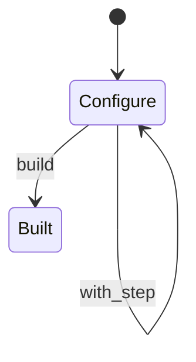
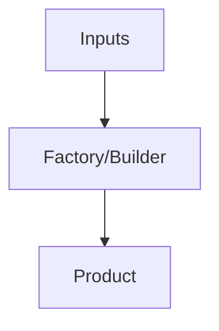
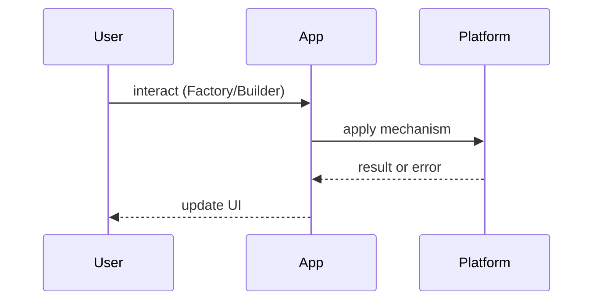

# Factory and Builder

<TopicMeta />

<Prerequisites />

::: tip Published
This page meets the handbook **published** bar: deep explanation, ≥10 common mistakes, and official references. Further engine-level errata welcome via PR.
:::

## Introduction

**Factory** functions create objects without exposing construction complexity; **Builders** assemble complex objects step-by-step. In TS/JS they appear as helpers, not heavyweight class hierarchies.

## Why does it exist?

Scattered constructors with 12 optional params are error-prone. Factories centralize defaults; builders clarify multi-step setup (especially tests).

## Historical Background

GoF creational patterns → JS factory functions (often preferred over `new`) → fluent builders in test kits and query builders.

## Mental Model

Factory: `createX(input) → X`. Builder: `builder().withA().withB().build()`. Prefer simple object literals until complexity hurts.

## Internal Workflow

1. Spot complex construction  
2. Extract factory with defaults  
3. Add builder only for many optional steps  
4. Keep builders immutable or clearly mutable

## Lifecycle



## Browser Perspective

Not applicable.

## JavaScript Engine Perspective

Not applicable.

## React Perspective

Factories create initial state or test elements; avoid builders for JSX — composition is enough.

## Next.js Perspective

Not applicable.

## Server Perspective

Not applicable.

## Network Perspective

Not applicable.

## Memory Perspective

Not applicable.

## Performance

Negligible vs correctness/clarity.

## Production Example

`createTestUser({ role: 'admin' })` factory standardizes fixtures; URL builders ensure encoding.

## Code Examples

```ts
type User = { id: string; role: 'user' | 'admin'; name: string }

export function createUser(partial: Partial<User> & { id: string }): User {
  return { role: 'user', name: 'Anonymous', ...partial }
}

class QueryBuilder {
  private parts: string[] = []
  where(clause: string) {
    this.parts.push(clause)
    return this
  }
  build() {
    return this.parts.join(' AND ')
  }
}
```

## Diagrams





## Common Mistakes

1. Builders for two-field objects
2. Factories that hide important side effects
3. Mutable builder reused after build unexpectedly
4. Class explosion copying Java idioms into TS
5. Test factories that produce unrealistic data
6. No validation inside factories for invariants
7. Missing a production edge case for 22-design-patterns.factory-and-builder (#1)
8. Missing a production edge case for 22-design-patterns.factory-and-builder (#2)
9. Missing a production edge case for 22-design-patterns.factory-and-builder (#3)
10. Missing a production edge case for 22-design-patterns.factory-and-builder (#4)


## Best Practices

- Factories for defaults + invariants
- Builders for many optional steps
- Prefer simple functions in JS

## Anti-patterns

- AbstractFactoryAbstractBase for a single product

## Comparison

| | Steps | Best for |
| --- | --- | --- |
| Constructor | One | Simple |
| Factory | One | Defaults/invariants |
| Builder | Many | Complex optional config |

## Interview Questions

### Easy

**Q:** Factory vs constructor?

**A:** Factories can return different implementations, reuse pools, or enforce defaults without `new` ceremony.

### Medium

**Q:** When is a builder worth it in TypeScript?

**A:** Many optional fields with validation between steps, or readable test setup — otherwise use `Partial` + factory.

### Hard

**Q:** How do factories interact with DI and testing?

**A:** Inject collaborators into factories; in tests, swap factories or pass fakes rather than mocking constructors globally.

## Summary

- Factories centralize creation
- Builders help multi-step config
- Don’t over-Java your TS
- Great for test fixtures

## References

- [Refactoring Guru — Factory Method](https://refactoring.guru/design-patterns/factory-method)
- [Refactoring Guru — Builder](https://refactoring.guru/design-patterns/builder)

<RelatedTopics />


Prev: [`22-design-patterns.module-pattern`](/22-design-patterns/module-pattern/) · Next: [`22-design-patterns.when-patterns-hurt`](/22-design-patterns/when-patterns-hurt/)
