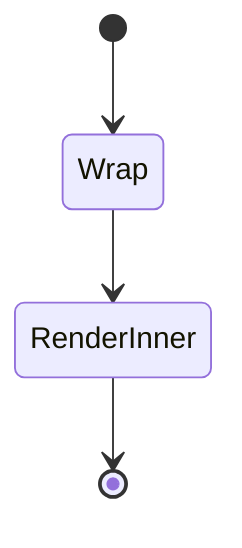
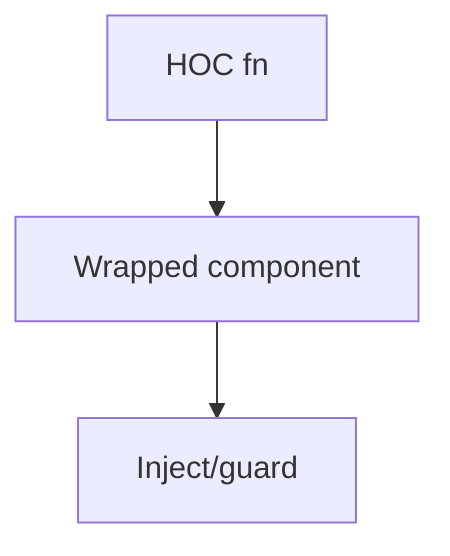
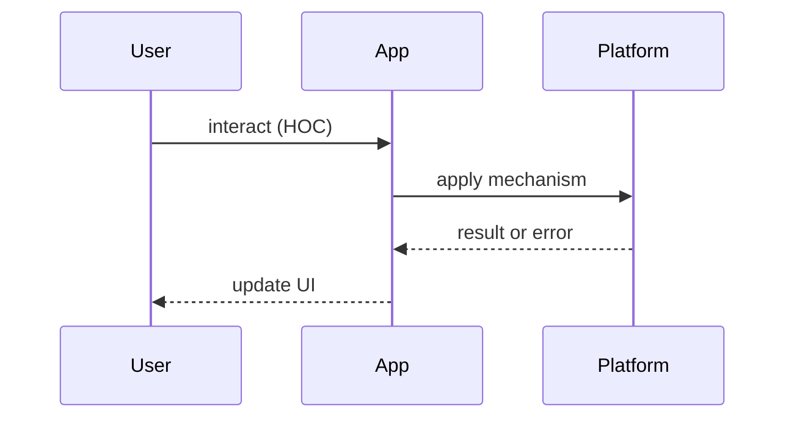

# Higher-Order Components

<TopicMeta />

<Prerequisites />

::: tip Published
This page meets the handbook **published** bar: deep explanation, ≥10 common mistakes, and official references. Further engine-level errata welcome via PR.
:::

## Introduction

A **Higher-Order Component (HOC)** is a function that takes a component and returns a new enhanced component. Dominant before hooks; still appears in legacy code and some libraries.

## Why does it exist?

Classes could not compose stateful logic cleanly. HOCs added auth gates, data fetching, and theming — along with wrapper hell and static prop collisions.

## Historical Background

Popularized with React Redux `connect`, `withRouter`, recompose. Hooks and render props reduced need; Redux now recommends hooks APIs.

## Mental Model

`withX(Component) => Wrapped`. The wrapper injects props or guards rendering. Compose carefully; prefer hooks for new logic.

## Internal Workflow

1. Identify cross-cutting behavior  
2. Prefer a hook  
3. If HOC required, forward refs/props/`displayName`  
4. Avoid stacking many HOCs

## Lifecycle



## Browser Perspective

Not applicable.

## JavaScript Engine Perspective

Not applicable.

## React Perspective

Forward refs with `forwardRef`; hoist statics when needed. Hooks replace most HOCs.

## Next.js Perspective

Not applicable.

## Server Perspective

Not applicable.

## Network Perspective

Not applicable.

## Memory Perspective

Not applicable.

## Performance

Extra layers add noise in DevTools; rarely a real perf issue vs re-renders.

## Production Example

Legacy `withAuth(Page)` remains; new pages call `useAuth()` and `<Navigate>`.

## Code Examples

```tsx
function withAuth<P extends object>(Comp: React.ComponentType<P>) {
  return function Authed(props: P) {
    const { user } = useAuth()
    if (!user) return <LoginRedirect />
    return <Comp {...props} />
  }
}
```

## Diagrams





## Common Mistakes

1. Not forwarding refs
2. Prop name collisions
3. Composing 8 HOCs
4. Using HOCs for new code when a hook suffices
5. Losing `displayName` making DevTools opaque
6. Mutating the original component prototype
7. Missing a production edge case for 22-design-patterns.hoc (#1)
8. Missing a production edge case for 22-design-patterns.hoc (#2)
9. Missing a production edge case for 22-design-patterns.hoc (#3)
10. Missing a production edge case for 22-design-patterns.hoc (#4)


## Best Practices

- Prefer hooks
- Set `displayName`
- Forward unknown props

## Anti-patterns

- HOC that secretly reads globals without documenting injected props

## Comparison

| | Indirection | Modern default |
| --- | --- | --- |
| HOC | High | No |
| Render props | Medium | Rare |
| Hooks | Low | Yes |

## Interview Questions

### Easy

**Q:** Define an HOC.

**A:** A function that takes a component and returns an enhanced component.

### Medium

**Q:** Why did React Redux move from connect HOCs to hooks?

**A:** Better composition, TypeScript DX, and less wrapping — see [/15-architecture/redux/](/15-architecture/redux/).

### Hard

**Q:** How do you migrate a withX HOC safely?

**A:** Implement `useX`, reimplement HOC as thin wrapper over the hook, migrate callers incrementally, then deprecate.

## Summary

- HOC wraps components for reuse
- Hooks replaced most use cases
- Forward refs and displayName
- Avoid wrapper pyramids

## References

- [React — Higher-Order Components](https://reactjs.org/docs/higher-order-components.html) (legacy docs)
- [Redux — Hooks](https://react-redux.js.org/api/hooks)

<RelatedTopics />


Prev: [`22-design-patterns.render-props`](/22-design-patterns/render-props/) · Next: [`22-design-patterns.provider-pattern`](/22-design-patterns/provider-pattern/)
