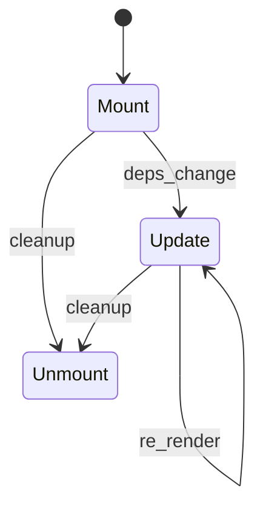
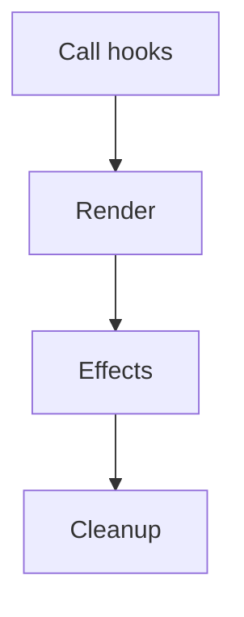
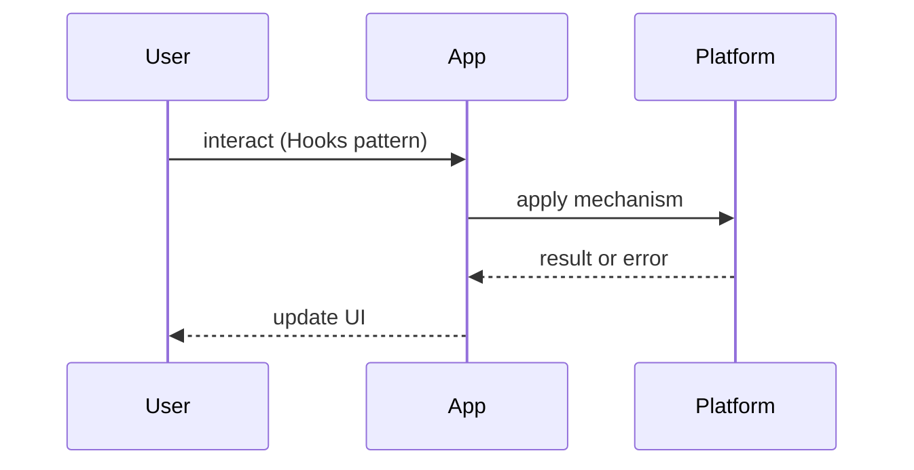

# Hooks Patterns

<TopicMeta />

<Prerequisites />

::: tip Published
This page meets the handbook **published** bar: deep explanation, ≥10 common mistakes, and official references. Further engine-level errata welcome via PR.
:::

## Introduction

**Hooks Patterns** are conventions for building reusable React logic with functions like `useState`, `useEffect`, and custom hooks. Canonical primitives: [/10-react/hooks/](/10-react/hooks/), [/10-react/effects-vs-events/](/10-react/effects-vs-events/).

## Why does it exist?

HOCs and render props composed awkwardly. Hooks made reuse feel natural — and made effect soup a new failure mode. Patterns keep hooks predictable.

## Historical Background

Hooks shipped in React 16.8 (2019), replacing many class patterns. Community patterns: `usePrevious`, data hooks, `useSyncExternalStore` for stores.

## Mental Model

A custom hook is a **reusable stateful API**: inputs → reactive values/callbacks. Rules of Hooks preserve call order; effects are escape hatches, not the data model.

## Internal Workflow

1. Extract repeated stateful logic  
2. Design a minimal return API  
3. Prefer deriving over syncing state in effects  
4. Test via components or hook testing utils  
5. Document dependencies and cleanup

## Lifecycle



## Browser Perspective

Effects schedule after paint; layout effects before paint — know which you need.

## JavaScript Engine Perspective

Closures capture values; stale closures are the classic bug — [/06-javascript/closures/](/06-javascript/closures/).

## React Perspective

Follow Rules of Hooks; use `useSyncExternalStore` for external stores.

## Next.js Perspective

Hooks only in Client Components.

## Server Perspective

Not applicable.

## Network Perspective

Data hooks should cancel/abort.

## Memory Perspective

Clean up listeners/timers in effect cleanups.

## Performance

Avoid setting state in effects that echo props. Prefer `useMemo` only when measured (or rely on React Compiler where enabled).

## Production Example

A codebase standardizes `useQuery`-style data hooks and bans `useEffect` for transforming props into state without review.

## Code Examples

```ts
function useDebounced<T>(value: T, ms: number): T {
  const [v, setV] = useState(value)
  useEffect(() => {
    const id = setTimeout(() => setV(value), ms)
    return () => clearTimeout(id)
  }, [value, ms])
  return v
}
```

## Diagrams





## Common Mistakes

1. Syncing props to state via effects by default
2. Missing effect cleanups
3. Conditional hook calls
4. Returning unstable object identities every render from hooks without need
5. Fetching in effects without ignoring stale responses
6. Giant “god hooks” that do everything
7. Missing a production edge case for 22-design-patterns.hooks-patterns (#1)
8. Missing a production edge case for 22-design-patterns.hooks-patterns (#2)
9. Missing a production edge case for 22-design-patterns.hooks-patterns (#3)
10. Missing a production edge case for 22-design-patterns.hooks-patterns (#4)


## Best Practices

- Name hooks `useX` with clear return types
- Derive data during render when possible
- Abort async work
- Keep hooks composable and small

## Anti-patterns

- `useEffect` as a substitute for event handlers
- HOC + hook hybrids that obscure data flow

## Comparison

| Reuse style | Composes? | Notes |
| --- | --- | --- |
| HOC | Awkward | Legacy |
| Render props | Verbose | Still useful rarely |
| Hooks | Excellent | Default |

## Interview Questions

### Easy

**Q:** What are the Rules of Hooks?

**A:** Only call hooks at the top level of React functions, and only from React functions/custom hooks — preserving call order.

### Medium

**Q:** When is an effect the wrong tool?

**A:** When you are transforming props/state for render or responding to a specific event — see [/10-react/effects-vs-events/](/10-react/effects-vs-events/).

### Hard

**Q:** How do you subscribe to an external store correctly?

**A:** `useSyncExternalStore` with getSnapshot/subscribe to avoid tearing; do not ad-hoc `useEffect` + `useState` for shared stores.

## Summary

- Hooks reuse stateful logic
- Effects are escape hatches
- Watch stale closures & cleanups
- Prefer small composable hooks

## References

- [React — Hooks reference](https://react.dev/reference/react)
- [React — Reusing Logic with Custom Hooks](https://react.dev/learn/reusing-logic-with-custom-hooks)

<RelatedTopics />


Prev: [`22-design-patterns.container-presentational`](/22-design-patterns/container-presentational/) · Next: [`22-design-patterns.compound-components`](/22-design-patterns/compound-components/)
