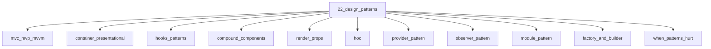

# Design Patterns

## Scope

Patterns used in frontend codebases — and when they hurt

## Prerequisites

See the learning paths and each topic's prerequisites in the registry.

## Topics in order

- [MVC, MVP, MVVM](/22-design-patterns/mvc-mvp-mvvm/) — mid, ~30 min
- [Container / Presentational](/22-design-patterns/container-presentational/) — junior, ~25 min
- [Hooks Patterns](/22-design-patterns/hooks-patterns/) — mid, ~30 min
- [Compound Components](/22-design-patterns/compound-components/) — mid, ~30 min
- [Render Props](/22-design-patterns/render-props/) — mid, ~25 min
- [Higher-Order Components](/22-design-patterns/hoc/) — mid, ~25 min
- [Provider Pattern](/22-design-patterns/provider-pattern/) — junior, ~25 min
- [Observer Pattern](/22-design-patterns/observer-pattern/) — mid, ~25 min
- [Module Pattern](/22-design-patterns/module-pattern/) — junior, ~20 min
- [Factory and Builder](/22-design-patterns/factory-and-builder/) — mid, ~25 min
- [When Patterns Hurt](/22-design-patterns/when-patterns-hurt/) — mid, ~25 min

## Module knowledge graph

## Suggested learning paths

Browse [Learning Paths](/learning-paths/).
