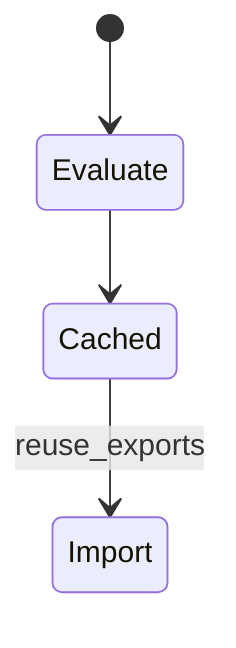
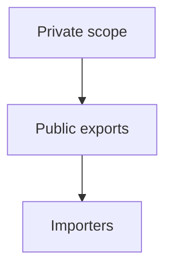
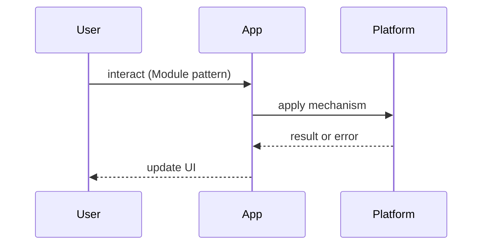

# Module Pattern

<TopicMeta />

<Prerequisites />

::: tip Published
This page meets the handbook **published** bar: deep explanation, ≥10 common mistakes, and official references. Further engine-level errata welcome via PR.
:::

## Introduction

The **Module Pattern** hides private details and exports a public API. In modern JS, **ES modules** are the language-standard form; historically IIFEs simulated privacy.

See [/06-javascript/modules/](/06-javascript/modules/) and [/06-javascript/es-modules/](/06-javascript/es-modules/).

## Why does it exist?

Global scripts collide. Modules give file-scoped privacy, clear dependencies, and toolable graphs for bundlers.

## Historical Background

IIFEs → CommonJS/AMD → ES modules (standardized) → bundlers understanding static `import`/`export`.

## Mental Model

File scope is private; exports are the API surface. Singletons emerge naturally from module evaluation caching.

## Internal Workflow

1. Put secrets/helpers at module scope  
2. Export minimal API  
3. Avoid exporting mutable bags casually  
4. Prefer explicit DI for testability when needed

## Lifecycle



## Browser Perspective

Type=module scripts defer by default; see [/04-html/module-scripts/](/04-html/module-scripts/).

## JavaScript Engine Perspective

Modules have their own environment records; circular imports need care.

## React Perspective

Module singletons can hold stores — still need React bindings.

## Next.js Perspective

Be aware of server vs client module graphs and `"use client"` boundaries.

## Server Perspective

Node module cache is process-wide — careful with request-scoped state.

## Network Perspective

Not applicable.

## Memory Perspective

Module singletons live for process lifetime.

## Performance

Static ESM enables tree-shaking; CommonJS is harder to shake.

## Production Example

A design-tokens module exports functions only; private color math stays unexported.

## Code Examples

```ts
// classic IIFE (historical)
const counter = (() => {
  let n = 0
  return {
    inc: () => ++n,
    value: () => n,
  }
})()

// modern ESM
let n = 0
export const inc = () => ++n
export const value = () => n
```

## Diagrams





## Common Mistakes

1. Storing request-specific data in server module scope
2. Circular import spaghetti
3. Deep barrel files killing tree-shaking
4. Mutating exported objects as an API
5. Assuming IIFE privacy in modern ESM without understanding scope
6. Side effects at import time unexpectedly
7. Missing a production edge case for 22-design-patterns.module-pattern (#1)
8. Missing a production edge case for 22-design-patterns.module-pattern (#2)
9. Missing a production edge case for 22-design-patterns.module-pattern (#3)
10. Missing a production edge case for 22-design-patterns.module-pattern (#4)


## Best Practices

- Minimal exports
- Side-effect-free modules when possible
- ESM over ad-hoc globals

## Anti-patterns

- World-writable exported mutable state

## Comparison

| Form | Privacy | Tooling |
| --- | --- | --- |
| Globals | None | Bad |
| IIFE module | Closure | Legacy |
| ESM | File scope | Excellent |

## Interview Questions

### Easy

**Q:** What is the module pattern?

**A:** Encapsulate private state/functions and expose a limited public API — today via ES modules.

### Medium

**Q:** Why can module singletons be dangerous on the server?

**A:** They are shared across requests in a long-lived Node process — easy to leak user data across tenants.

### Hard

**Q:** How do circular ESM imports behave?

**A:** Live bindings may be in temporal dead zones until evaluation finishes — design acyclic graphs or lazy access.

## Summary

- Modules encapsulate
- ESM is the standard
- Mind server singleton scope
- Export minimally

## References

- [MDN — JavaScript modules](https://developer.mozilla.org/en-US/docs/Web/JavaScript/Guide/Modules)
- [ECMAScript modules — TC39](https://tc39.es/ecma262/)

<RelatedTopics />


Prev: [`22-design-patterns.observer-pattern`](/22-design-patterns/observer-pattern/) · Next: [`22-design-patterns.factory-and-builder`](/22-design-patterns/factory-and-builder/)
