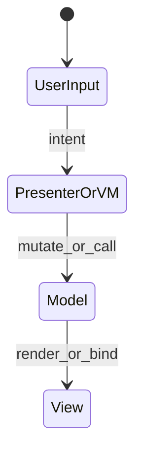
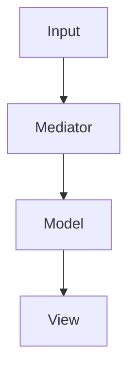
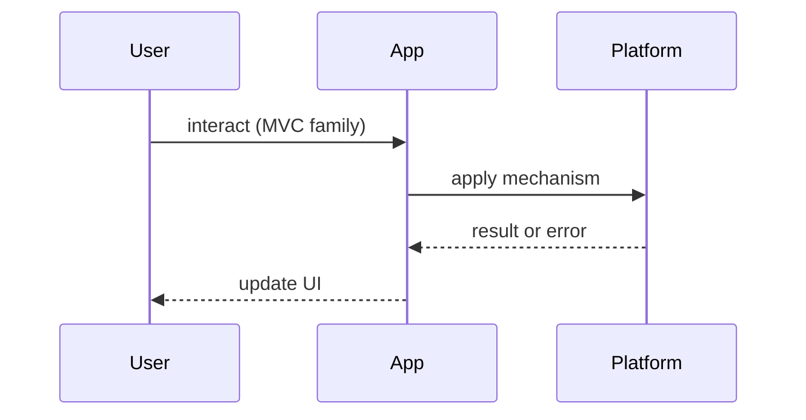

# MVC, MVP, MVVM

<TopicMeta />

<Prerequisites />

::: tip Published
This page meets the handbook **published** bar: deep explanation, ≥10 common mistakes, and official references. Further engine-level errata welcome via PR.
:::

## Introduction

**MVC, MVP, and MVVM** are classic ways to separate UI rendering from application state and user input. You will meet them in interviews and legacy apps; modern React is closer to “view as a function of state” than textbook MVC.

Related: [/10-react/philosophy/](/10-react/philosophy/), [/15-architecture/state-management/](/15-architecture/state-management/).

## Why does it exist?

As UIs grew past page scripts, mixing DOM updates with business rules created untestable blobs. These patterns name the boundaries — even when frameworks blur the lines.

## Historical Background

MVC originated in Smalltalk; web variants (Rails, early AngularJS MVVM/knockout, Android MVP) adapted it. SPAs reintroduced the debate; React popularized unidirectional data flow instead of classic observers everywhere.

## Mental Model

| Pattern | View knows model? | Who updates view |
| --- | --- | --- |
| MVC | Often yes | Controller + observers |
| MVP | No (passive view) | Presenter |
| MVVM | Via bindings | ViewModel |

In React, components are views; hooks/stores act like ViewModels; controllers are event handlers and server actions.

## Internal Workflow

1. Identify UI surface (View)  
2. Isolate domain state/rules  
3. Choose who mediates input  
4. Prefer unidirectional updates in new code  
5. Document where legacy MVP/MVVM still lives

## Lifecycle



## Browser Perspective

Classic MVC often manipulated the DOM directly; today’s VDOM/frameworks batch updates.

## JavaScript Engine Perspective

Not applicable.

## React Perspective

Unidirectional flow reduces the dual-binding bugs common in MVVM.

## Next.js Perspective

Server Components push “model access” server-side; Client Components remain interactive views.

## Server Perspective

MVC on the server (Rails) is different from SPA MVC — do not conflate.

## Network Perspective

Not applicable.

## Memory Perspective

Long-lived presenters/VMs can retain views — dispose on unmount.

## Performance

Fine-grained MVVM bindings can over-update; React’s coarse re-render + concurrent features are a different performance model.

## Production Example

A team migrating Knockout MVVM to React rewrote ViewModels into hooks + query caches, keeping domain validators intact.

## Code Examples

```ts
// MVP-ish sketch (presenter drives a passive view interface)
type View = { showItems(items: Item[]): void; showError(msg: string): void }

class ListPresenter {
  constructor(private view: View, private api: API) {}
  async load() {
    try {
      this.view.showItems(await this.api.list())
    } catch {
      this.view.showError('Failed to load')
    }
  }
}
```

## Diagrams





## Common Mistakes

1. Equating React with classic MVC controllers
2. Two-way binding everything until data cycles appear
3. Fat views with business rules
4. Presenters that import framework UI widgets tightly
5. Rewriting working MVP into trendy patterns without need
6. Ignoring testability when “just using hooks”
7. Missing a production edge case for 22-design-patterns.mvc-mvp-mvvm (#1)
8. Missing a production edge case for 22-design-patterns.mvc-mvp-mvvm (#2)
9. Missing a production edge case for 22-design-patterns.mvc-mvp-mvvm (#3)
10. Missing a production edge case for 22-design-patterns.mvc-mvp-mvvm (#4)


## Best Practices

- Name boundaries even in React apps
- Keep domain logic framework-agnostic when valuable
- Prefer unidirectional data flow for new SPAs

## Anti-patterns

- God ViewModel
- Controller that talks to the database and the DOM

## Comparison

| | Testability | Binding complexity |
| --- | --- | --- |
| MVC | Medium | Medium |
| MVP | High (passive view) | Low |
| MVVM | Medium | High |
| React uni-directional | High | Low–medium |

## Interview Questions

### Easy

**Q:** Difference between MVC and MVP?

**A:** MVP uses a Presenter with a passive View; MVC Views often know more about the Model and may observe it directly.

### Medium

**Q:** Is React MVVM?

**A:** Not strictly. React is closer to functional views over state. Hooks/stores resemble ViewModels, but data flow is usually unidirectional — see [/10-react/philosophy/](/10-react/philosophy/).

### Hard

**Q:** When would you still introduce Presenters in a React codebase?

**A:** Complex non-React UI surfaces, shared logic across native/web, or legacy test contracts — otherwise hooks + pure functions suffice.

## Summary

- Patterns separate view vs rules
- React ≠ textbook MVC
- Unidirectional flow is the modern default
- Use pattern names precisely in interviews

## References

- [Martin Fowler — GUI Architectures](https://martinfowler.com/eaaDev/uiArchs.html)
- [React — Thinking in React](https://react.dev/learn/thinking-in-react)

<RelatedTopics />


Next: [`22-design-patterns.container-presentational`](/22-design-patterns/container-presentational/)
