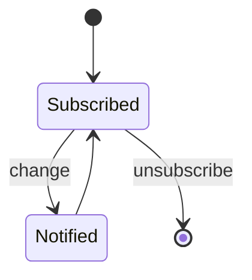
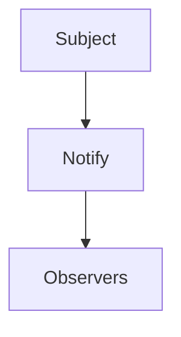
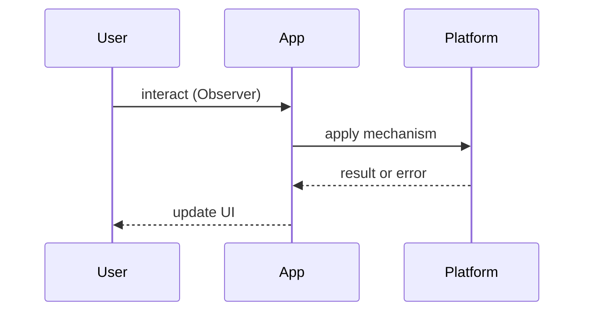

# Observer Pattern

<TopicMeta />

<Prerequisites />

::: tip Published
This page meets the handbook **published** bar: deep explanation, ≥10 common mistakes, and official references. Further engine-level errata welcome via PR.
:::

## Introduction

The **Observer Pattern** lets subjects notify dependents when state changes. DOM events, RxJS streams, and `useSyncExternalStore` subscriptions are all observer variants.

## Why does it exist?

Polling is wasteful; tight coupling is brittle. Observers decouple producers of change from consumers.

## Historical Background

GoF Observer → MVC observers → JS events/EventEmitter → reactive streams. React moved from implicit observables (MobX) debates to explicit subscriptions with concurrent safety.

## Mental Model

**Subject** keeps a list of **observers**; `notify` fans out. Always allow unsubscribe to avoid leaks.

## Internal Workflow

1. Define event/subscription API  
2. Register observers  
3. Notify on change  
4. Unsubscribe on teardown  
5. Guard against re-entrancy

## Lifecycle



## Browser Perspective

addEventListener is observer. IntersectionObserver/MutationObserver specialize it.

## JavaScript Engine Perspective

Not applicable.

## React Perspective

External stores must integrate via `useSyncExternalStore` for concurrent correctness.

## Next.js Perspective

Not applicable.

## Server Perspective

Not applicable.

## Network Perspective

SSE/WebSocket clients are observers of server events — [/21-frontend-system-design/realtime-applications/](/21-frontend-system-design/realtime-applications/).

## Memory Perspective

Forgotten unsubscribes leak.

## Performance

Fan-out to thousands of observers can jank — batch notifications.

## Production Example

A prices store notifies widgets; React bindings use `useSyncExternalStore(store.subscribe, store.getSnapshot)`.

## Code Examples

```ts
type Listener = () => void
function createStore<T>(initial: T) {
  let state = initial
  const listeners = new Set<Listener>()
  return {
    getSnapshot: () => state,
    subscribe: (l: Listener) => {
      listeners.add(l)
      return () => listeners.delete(l)
    },
    set(next: T) {
      state = next
      listeners.forEach((l) => l())
    },
  }
}
```

## Diagrams





## Common Mistakes

1. No unsubscribe path
2. Notifying during inconsistent half-updates
3. Subscribing in render without cleanup
4. Using ad-hoc forceUpdate hacks in React 18+
5. Observer lists mutated while iterating unsafely
6. Overusing globals for every event
7. Missing a production edge case for 22-design-patterns.observer-pattern (#1)
8. Missing a production edge case for 22-design-patterns.observer-pattern (#2)
9. Missing a production edge case for 22-design-patterns.observer-pattern (#3)
10. Missing a production edge case for 22-design-patterns.observer-pattern (#4)


## Best Practices

- Always return unsubscribe
- Snapshot + subscribe for React
- Batch notifications

## Anti-patterns

- Silent catch inside observers that hide failures

## Comparison

| Mechanism | Coupling | Notes |
| --- | --- | --- |
| Callbacks | High | Simple |
| Observer/pub-sub | Low | Need lifecycle |
| Polling | None | Wasteful |

## Interview Questions

### Easy

**Q:** What is the observer pattern?

**A:** Subjects notify subscribed observers of changes; subscribers can detach.

### Medium

**Q:** How does it show up in the browser?

**A:** DOM events, MutationObserver, etc. — [/03-browser/event-loop/](/03-browser/event-loop/) for dispatch timing.

### Hard

**Q:** Why is useSyncExternalStore important?

**A:** It integrates external observers with concurrent rendering without UI tearing.

## Summary

- Subscribe/notify/unsubscribe
- DOM and stores use it
- Prevent leaks
- React: useSyncExternalStore

## References

- [React — useSyncExternalStore](https://react.dev/reference/react/useSyncExternalStore)
- [MDN — EventTarget.addEventListener](https://developer.mozilla.org/en-US/docs/Web/API/EventTarget/addEventListener)

<RelatedTopics />


Prev: [`22-design-patterns.provider-pattern`](/22-design-patterns/provider-pattern/) · Next: [`22-design-patterns.module-pattern`](/22-design-patterns/module-pattern/)
