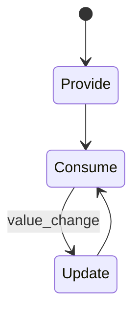
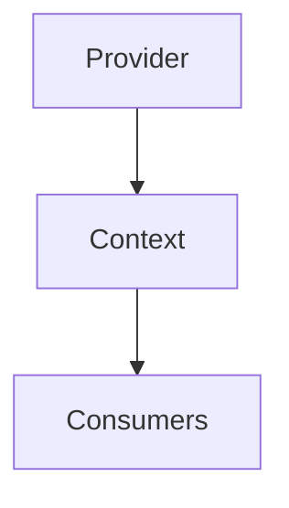
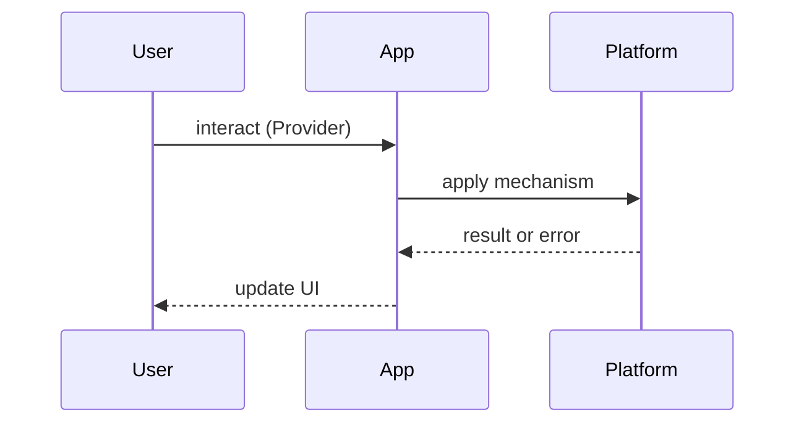

# Provider Pattern

<TopicMeta />

<Prerequisites />

::: tip Published
This page meets the handbook **published** bar: deep explanation, ≥10 common mistakes, and official references. Further engine-level errata welcome via PR.
:::

## Introduction

The **Provider Pattern** places a value on context so deep children can read it without prop drilling. Core API: [/10-react/context/](/10-react/context/).

## Why does it exist?

Threading theme/locale/auth through every layer is noise. Providers create controlled ambient dependency injection for UI trees.

## Historical Background

Legacy `contextTypes` → official Context API (16.3) → concurrent-safe patterns with `useContext` + split contexts.

## Mental Model

Provider publishes a value; consumers subscribe. Treat context as **dependency injection**, not a global app database for high-frequency state.

## Internal Workflow

1. Create context + typed default/null  
2. Provide near the subtree that needs it  
3. Consume via hooks  
4. Split contexts by update rate  
5. Remount/reset when identity boundaries change

## Lifecycle



## Browser Perspective

Not applicable.

## JavaScript Engine Perspective

Not applicable.

## React Perspective

Changing provider value re-renders all consumers. Memoize value objects; split contexts.

## Next.js Perspective

Auth/theme providers typically client-side; pass serializable preferences from server when possible.

## Server Perspective

Not applicable.

## Network Perspective

Not applicable.

## Memory Perspective

Providers retained at root keep values alive for app lifetime — fine for session, bad for huge caches.

## Performance

Do not put rapidly changing values (mouse coords) in wide providers.

## Production Example

`AuthProvider` + `ThemeProvider` at the shell; feature flags via a dedicated provider bootstrapped from edge config.

## Code Examples

```tsx
const ThemeCtx = createContext<'light' | 'dark'>('light')

export function ThemeProvider({ children }: { children: React.ReactNode }) {
  const [theme, setTheme] = useState<'light' | 'dark'>('light')
  const value = useMemo(() => theme, [theme])
  return <ThemeCtx.Provider value={value}>{children}</ThemeCtx.Provider>
}
```

## Diagrams





## Common Mistakes

1. Using context as a Redux replacement for all state
2. New object value every render without need
3. Providers wrapping too high for niche data
4. Missing null checks when context absent
5. High-frequency updates through a mega-provider
6. Forgetting to remount on tenant/user switch
7. Missing a production edge case for 22-design-patterns.provider-pattern (#1)
8. Missing a production edge case for 22-design-patterns.provider-pattern (#2)
9. Missing a production edge case for 22-design-patterns.provider-pattern (#3)
10. Missing a production edge case for 22-design-patterns.provider-pattern (#4)


## Best Practices

- Narrow providers
- Stable values
- Custom hooks as the only public consume API

## Anti-patterns

- God provider with twenty unrelated fields

## Comparison

| Ambient API | Good for | Bad for |
| --- | --- | --- |
| Props | Explicit local | Deep drilling |
| Context provider | Rare ambient | Hot state |
| External store | Hot shared | Simple theme |

## Interview Questions

### Easy

**Q:** What problem does the provider pattern solve?

**A:** Share ambient values without prop drilling — [/10-react/context/](/10-react/context/).

### Medium

**Q:** Why split contexts?

**A:** So high-frequency updates do not re-render unrelated consumers.

### Hard

**Q:** How do providers interact with SSR/hydration?

**A:** Initial value must match server render; theme from cookie/header prevents mismatch flicker.

## Summary

- Context DI for ambient values
- Not a global store for everything
- Stability and split contexts matter
- Custom hooks as API

## References

- [React — Passing Data Deeply with Context](https://react.dev/learn/passing-data-deeply-with-context)
- [React — useContext](https://react.dev/reference/react/useContext)

<RelatedTopics />


Prev: [`22-design-patterns.hoc`](/22-design-patterns/hoc/) · Next: [`22-design-patterns.observer-pattern`](/22-design-patterns/observer-pattern/)
