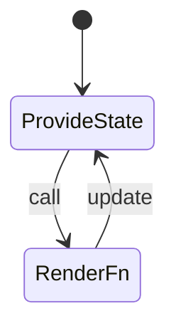
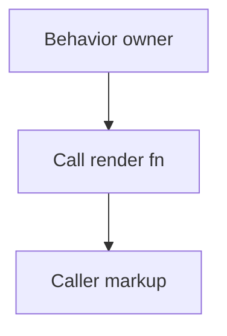
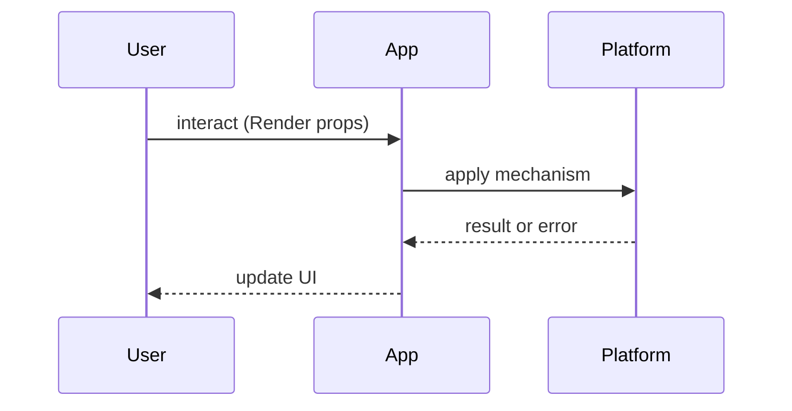

# Render Props

<TopicMeta />

<Prerequisites />

::: tip Published
This page meets the handbook **published** bar: deep explanation, ≥10 common mistakes, and official references. Further engine-level errata welcome via PR.
:::

## Introduction

The **Render Props** pattern passes a function that returns React elements, giving the parent control of behavior and the caller control of rendering. Overlapped by hooks, still appears in libraries and interviews.

## Why does it exist?

Before hooks, render props (and HOCs) were primary reuse tools. They still shine when a library must invert control of rendering without dictating markup.

## Historical Background

Popular in React Router v4, Downshift, Formik early APIs. Hooks reduced verbosity for app code; headless libraries sometimes still expose render props.

## Mental Model

**Behavior component** calls `children(state)` or `render(state)`. Caller decides DOM. Equivalent custom hook: return `state` and let caller render.

## Internal Workflow

1. Encapsulate behavior  
2. Expose state via function prop  
3. Prefer hooks for new internal APIs  
4. Keep render props at library boundaries if needed

## Lifecycle



## Browser Perspective

Not applicable.

## JavaScript Engine Perspective

Not applicable.

## React Perspective

Be careful with inline render functions breaking `memo` children; hooks usually compose cleaner.

## Next.js Perspective

Not applicable.

## Server Perspective

Not applicable.

## Network Perspective

Not applicable.

## Memory Perspective

Not applicable.

## Performance

Inline functions create new identities each render — often fine, but know when it hurts memoized subtrees.

## Production Example

A legacy Mouse tracker still uses render props; new code wraps it in a `useMouse` hook façade.

## Code Examples

```tsx
function Mouse({ children }: { children: (p: { x: number; y: number }) => React.ReactNode }) {
  const [p, setP] = useState({ x: 0, y: 0 })
  useEffect(() => {
    const onMove = (e: MouseEvent) => setP({ x: e.clientX, y: e.clientY })
    window.addEventListener('mousemove', onMove)
    return () => window.removeEventListener('mousemove', onMove)
  }, [])
  return <>{children(p)}</>
}
```

## Diagrams





## Common Mistakes

1. Nesting render props into callback hell
2. Using render props for every reuse after hooks exist
3. Unstable function identities causing perf issues without measurement
4. Mixing HOC + render props unnecessarily
5. Forgetting TypeScript generics on render fns
6. Putting side effects inside the render callback carelessly
7. Missing a production edge case for 22-design-patterns.render-props (#1)
8. Missing a production edge case for 22-design-patterns.render-props (#2)
9. Missing a production edge case for 22-design-patterns.render-props (#3)
10. Missing a production edge case for 22-design-patterns.render-props (#4)


## Best Practices

- Prefer hooks for app-level reuse
- Use render props when inversion of rendering control is required
- Type the render argument

## Anti-patterns

- Render-prop pyramids six levels deep

## Comparison

| Pattern | Verbosity | Composes |
| --- | --- | --- |
| HOC | Medium | Name collisions |
| Render props | High | Good |
| Hooks | Low | Best |

## Interview Questions

### Easy

**Q:** What is a render prop?

**A:** A prop whose value is a function that returns React nodes, receiving state from the provider component.

### Medium

**Q:** Why were hooks preferred over render props for reuse?

**A:** Less nesting, better composition, clearer types — see [/22-design-patterns/hooks-patterns/](/22-design-patterns/hooks-patterns/).

### Hard

**Q:** When would you still design a render prop API today?

**A:** Headless libraries needing full markup control, or migrating gradually from class-era APIs without breaking callers.

## Summary

- Function-as-child shares behavior
- Hooks supersede most app usage
- Still valid at library boundaries
- Mind nesting and types

## References

- [React — Render Props](https://react.dev/reference/react/Children#alternate-render-props) (historical pattern discussions in community docs)
- [React — Custom Hooks](https://react.dev/learn/reusing-logic-with-custom-hooks)

<RelatedTopics />


Prev: [`22-design-patterns.compound-components`](/22-design-patterns/compound-components/) · Next: [`22-design-patterns.hoc`](/22-design-patterns/hoc/)
