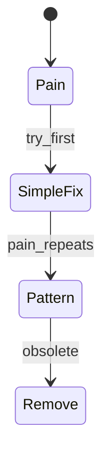
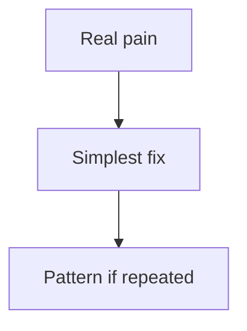
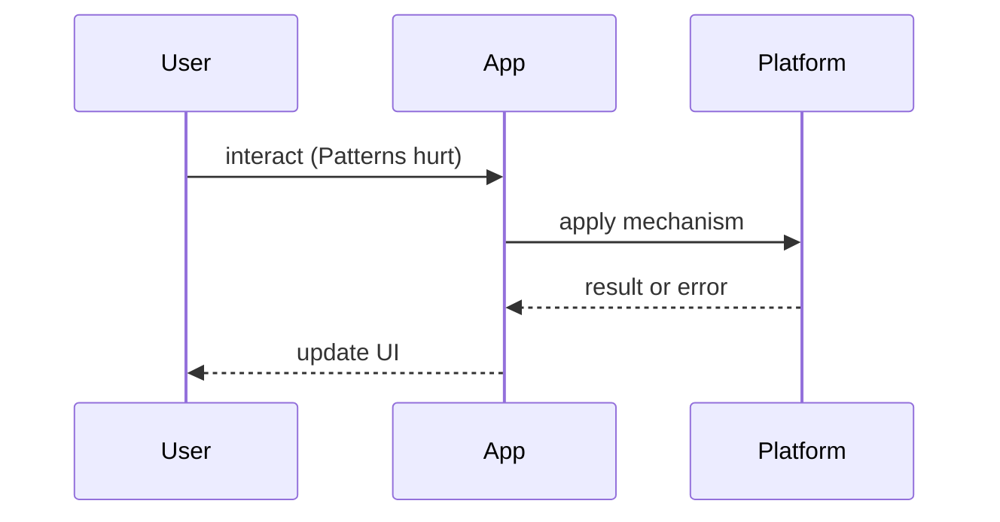

# When Patterns Hurt

<TopicMeta />

<Prerequisites />

::: tip Published
This page meets the handbook **published** bar: deep explanation, ≥10 common mistakes, and official references. Further engine-level errata welcome via PR.
:::

## Introduction

**When Patterns Hurt** is the meta-topic: patterns are tools, not trophies. Applying HOC + builder + abstract factory + mega provider to a three-page app creates drag.

## Why does it exist?

Junior-to-mid codebases often “enterprise” themselves after reading pattern catalogs. The cost is onboarding time, indirection, and fear of change — without reliability gains.

## Historical Background

GoF patterns predate modern languages with first-class functions. Many classic OO patterns are one-liners in JS. React’s own history shows HOCs → hooks as a simplification arc.

## Mental Model

A pattern must buy at least one of: **clearer intent**, **safer changes**, **better test seams**, **measured performance**. If it only buys prestige, delete it.

## Internal Workflow

1. State the concrete pain  
2. Consider the simplest fix  
3. Introduce a pattern only when pain repeats  
4. Document the invariant  
5. Schedule removal when the pain leaves

## Lifecycle



## Browser Perspective

Not applicable.

## JavaScript Engine Perspective

Not applicable.

## React Perspective

Prefer boring React before architecture astronautics — [/10-react/philosophy/](/10-react/philosophy/).

## Next.js Perspective

Framework conventions beat custom frameworks-in-a-framework.

## Server Perspective

Not applicable.

## Network Perspective

Not applicable.

## Memory Perspective

Not applicable.

## Performance

Indirection rarely helps runtime perf; it often hurts human perf.

## Production Example

A squad deleted three HOC layers and one DI container around form state; bug rate dropped because stack traces became readable again.

## Code Examples

```ts
// Hurtful: abstract factory for buttons
// Better: a Button component with variants

// Hurtful: premature micro-frontend
// Better: modular monolith folders until deploy coupling hurts
```

## Diagrams





## Common Mistakes

1. Pattern-driven development without a problem
2. Copying Java enterprise layers into React
3. Keeping flags/HOCs/providers forever
4. Abstracting before the second real use case
5. Treating interview pattern names as architecture requirements
6. Confusing consistency with ceremonial sameness
7. Missing a production edge case for 22-design-patterns.when-patterns-hurt (#1)
8. Missing a production edge case for 22-design-patterns.when-patterns-hurt (#2)
9. Missing a production edge case for 22-design-patterns.when-patterns-hurt (#3)
10. Missing a production edge case for 22-design-patterns.when-patterns-hurt (#4)


## Best Practices

- Rule of three before abstraction
- Delete obsolete patterns
- Prefer language/framework features
- Measure complexity in review (files touched per change)

## Anti-patterns

- Architecture diagrams with more boxes than user journeys

## Comparison

| Signal | Healthy pattern | Harmful pattern |
| --- | --- | --- |
| Onboarding | Faster | Slower |
| Change cost | Lower | Higher |
| Bugs | Fewer boundary bugs | More wiring bugs |

## Interview Questions

### Easy

**Q:** Can design patterns be harmful?

**A:** Yes — when they add indirection without reducing real pain.

### Medium

**Q:** Give a React example of a pattern that often hurts today.

**A:** Deep HOC stacks or mega Context for all state — replace with hooks and proper state ownership.

### Hard

**Q:** How do you decide to introduce vs remove a pattern in a mature codebase?

**A:** Track repeated pain, cost of change, and whether the pattern still pays rent; remove when the original constraint is gone.

## Summary

- Patterns must pay rent
- Simplest fix first
- Delete obsolete indirection
- Human performance counts

## References

- [Sandi Metz — The Wrong Abstraction](https://sandimetz.com/blog/2016/1/20/the-wrong-abstraction)
- [Martin Fowler — YAGNI](https://martinfowler.com/bliki/Yagni.html)

<RelatedTopics />


Prev: [`22-design-patterns.factory-and-builder`](/22-design-patterns/factory-and-builder/)
